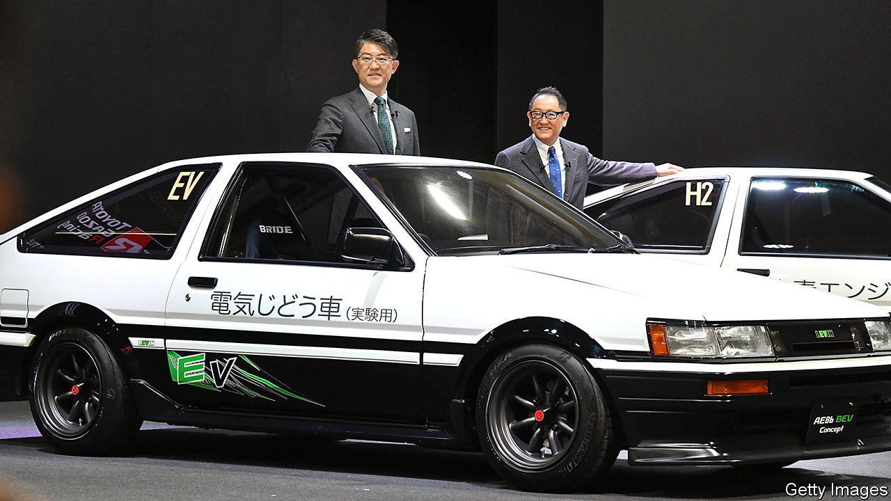
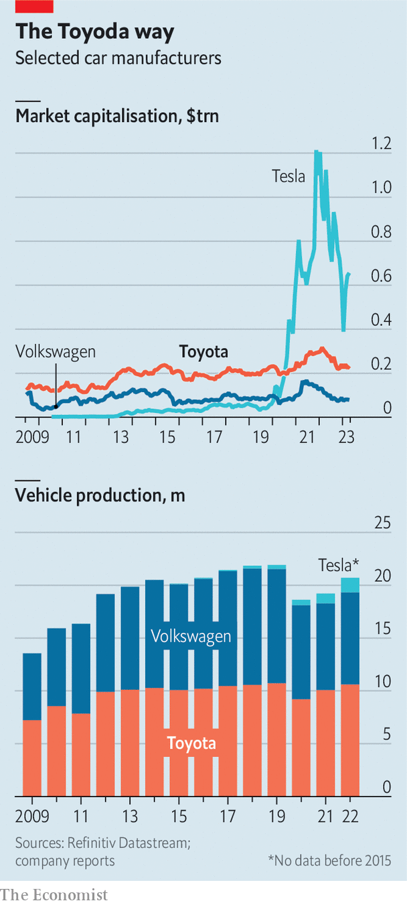

###### Toyota after Toyoda

# Toyota gets a new hand at the wheel 

##### The Japanese car giant has some catching up to do 

 

> Apr 5th 2023 

 


On April 1st, after nearly 14 years as boss of Toyota, Toyoda Akio handed the wheel to his successor. Sato Koji, formerly chief engineer of the Japanese carmaker’s premium brand, Lexus, has his work cut out. Toyota continues to produce more vehicles than any other firm. Its market value is almost three times as high as its closest rival in terms of output, Volkswagen. But it came late to battery-electric vehicles, having bet that hydrogen was the answer to zero-emission driving. Meanwhile firms like Tesla have thrived, ushering in more electric-vehicle startups. Other established carmakers, Volkswagen chief among them, have quickened the pace of electrification. All that has left Toyota in the dust. In 2022 its total battery-EV sales ranked 24th in the sector.■


