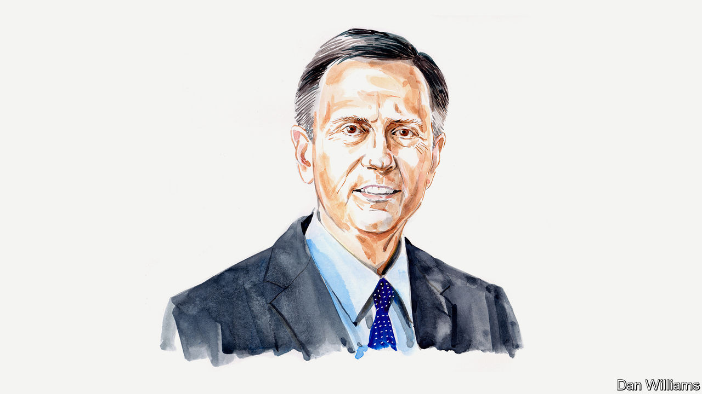

###### American inflation

# The Fed may not get inflation down to 2%, says Richard Clarida 

##### The former vice-chair of America’s central bank considers the competing goals of economic policy 

 

> Apr 4th 2023 

AS THE Federal Reserve and other central banks have raised interest rates to fight inflation, they have increased the cost of borrowing for governments. Yet many central banks operate in countries where governments run large budget deficits even as they are more indebted, relative to GDP, than at any time since the second world war. High debts have understandably led to worries about “fiscal dominance”, the fear that parlous public finances could constrain the ability—or willingness—of the Fed and other central banks to sustain interest rates at the levels required to hit their inflation targets. Recent fragility in American banks, flowing in part from their exposure to interest-rate risk on vast holdings of government debt, has exacerbated the fear that there are unresolvable tensions in American economic policy.

Similar contradictions were present as the Fed, led by Paul Volcker, fought inflation in the 1980s. Owing to President Ronald Reagan’s tax cuts and desire to spend more on defence, monetary policy was tight while fiscal policy was loose. The combination pushed up the dollar as foreign investors piled into America’s high-yielding government debt—even though policymakers saw excessive currency appreciation as undesirable. In the end Volcker got his disinflation, Reagan got his defence build-up and foreign investors got their Treasuries. 

Today’s disinflation has only just started. Though the White House got the fiscal stimulus it wanted, the Fed has not got the 2% annual inflation rate it wants.

The Fed’s struggles to return quickly to 2% have directed attention to the so-called “fiscal theory of the price level”. According to this view, the Fed has played only a minor role in the surge in America’s inflation since the pandemic. The logic is as follows. The huge increase in government debt issued since 2020 to pay for $6trn of pandemic and post-pandemic spending made it impossible for the Fed to get the inflation rate it wanted. Instead, prices adjusted to make the government’s debt sustainable. If investors believed that future taxes would not be raised, nor spending cut, to pay for pandemic spending, the only other way for the government-debt market to clear was for inflation to reduce its real value. The economy got in one burst the inflation necessary to pay off pandemic debts. In turn, that will allow inflation to return to 2%—albeit with prices permanently higher than before the pandemic. 

Those who blame the Fed for inflation might respond that the central bank purchased trillions of dollars of Treasury bonds between March 2020 and March 2022. Wasn’t the Fed, not the market, financing the government—and therefore unleashing inflation? Indeed, for a long time quantitative easing (QE) appeared to be a “free lunch” for the government. The Fed’s purchases were financed by the creation of bank reserves which pay a floating rate of interest very close to those on Treasury bills. At the time QE was happening, these rates were very close to zero. Consider the Fed and the Treasury as a single entity, and the effect of QE was to replace the higher interest payments on the long-maturity bonds the Fed was buying with lower interest payments on the reserves it issued to buy the bonds. 

But while QE may have looked like a free lunch when short-term interest rates were close to zero, it did not last. To reduce inflation, the Fed has pushed the short-term interest rate it pays on reserves above the yields on the bonds it bought during previous QE programmes. Whereas in the first decade the Fed remitted hundreds of billions of dollars of QE profits to the Treasury, it has now suspended all such payments. They will remain suspended for as long as it takes to recoup the cumulative shortfall between the earnings on its assets and interest payments on its reserve liabilities. 

In other words, QE is not a free lunch. If QE “works”—something many dispute—it is not by reducing the stock of government debt, but by changing its maturity structure. In doing so it can lower, at least for a time, the interest rate the Treasury pays on long-dated bonds. But it does not make debt disappear, and so does not undermine the fiscal theory of the price level as an explanation for recent inflation.

Regardless of the extent to which fiscal policy is to blame for the surge in America’s aggregate demand, it is essential also to factor in aggregate supply. The Fed and other forecasters in 2021 initially got post-pandemic aggregate supply wrong. Broad-based price inflation began to surge in the second half of 2021 when the level of real GDP was running two percentage points below the Congressional Budget Office’s estimate of potential output. Broad-based wage inflation took off when the unemployment rate reached 5%, a percentage point above the Fed’s estimate of the level consistent with its 2% inflation objective. 

Because the Fed got aggregate supply wrong, the monetary-policy stance in place when post-pandemic supply constraints began to bite in the second half of 2021 was too loose. As Jerome Powell, the Fed’s chair, has indicated, although the Fed can’t do anything to boost aggregate supply it can curtail aggregate demand to bring it in line with supply. In March 2022 it began to do this, by raising interest rates.

I believe that Mr Powell’s Fed, like Volcker’s, will eventually get the inflation rate it wants. But it is likely to be something more like “two point something” than “two point zero”, even as the Fed aims for the latter in its public forecasts. Monetary policy operates with a delay, and that is likely to be factored in as the Fed decides when to stop tightening monetary policy and, once inflation reaches “two point something”, when to cut. 

The Fed will keep pursuing price stability until the job is done. But by raising short-term interest rates and keeping them at restrictive levels for some time, the “fixed-for-floating” interest-rate swap embedded in previous QE programmes is likely to remain costly for some time. This will be true not only for the Fed—and hence the Treasury—but also for American commercial banks that hold a lot of long-maturity, low-coupon government bonds. As long as the Fed has to keep rates at restrictive levels to reduce inflation, neither taxpayers nor banks, having placed their bets, can escape the costs of higher interest rates.■

_______________


