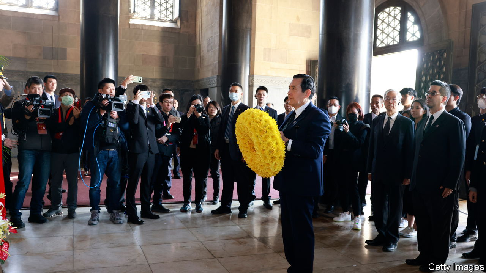

###### China and Taiwan

# Ethnic terminology bedevils Taiwan-China relations 

##### A former Taiwanese president’s use of it raises hackles on the island 

 

> Apr 5th 2023 

On both sides of the Taiwan Strait this week, people have been observing the Qingming festival by sweeping the tombs of their ancestors. Many Taiwanese think it only natural that Ma Ying-jeou, their former president, used a trip to the mainland to visit his grandfather’s tomb in Hunan province for such a ceremony. But many object to the way that Mr Ma has also been waxing lyrical about the shared ancestry of Taiwanese and mainlanders. In Taiwan, supporters of the ruling Democratic Progressive Party (his own party is the Kuomintang or KMT) say his words smack of support for unification. 

The mainland and Taiwan share a “common inheritance of blood, language, history and culture”, Mr Ma told Song Tao, China’s head of Taiwan affairs, during his unprecedented 12-day trip which ends on April 7th. He has also said that people on both sides of the strait are “descendants of the Yan and Huang emperors”, the mythical ancestors of ethnic-Han people, who form more than 90% of China’s population, and of Taiwan’s.

Most Taiwanese are descendants of people who migrated from the mainland over the past few hundred years, and who have retained many features of their ancestral culture. But such matters touch on highly sensitive politics. China stresses the importance of these ethnic bonds: in its view, they reinforce its claim to the island. Many Taiwanese prefer to emphasise what makes them different. 

One of Mr Ma’s ethnic terms has drawn particular attention back home: . It can mean “Chinese ethnicities” (including everyone from Uyghurs to Han), or “Chinese nation” in the sense of a culturally bound people. Mr Ma called on the mainland and Taiwan to work together to “revitalise the He said people on both sides of the strait were members of this group. 

He was drawing on terminology used by Sun Yat-sen, who was the first president of the Republic of China—now exiled to Taiwan—after its founding in 1912 (Mr Ma is pictured in Nanjing, paying homage to him). Mr Sun’s aim then was to form a single Chinese race, “melding” other ethnic groups with the dominant Han. The term today is much loved by China’s president, Xi Jinping, who talks of his mission to secure the “great rejuvenation of the ”. Increasingly, that is looking like an effort to step up Han dominance. 

The gap between Chinese and Taiwanese understandings of such terms is one reason why Taiwanese increasingly reject identity with the mainland. The KMT’s authoritarian past is another. Having fled to Taiwan, the party suppressed local languages, purged dissidents and made people call themselves or ChineseTo the KMT, the term implied membership of a political state encompassing Taiwan as well as mainland China, with all of that territory notionally under KMT rule. To the Communist Party it means the same, only with the Communists in charge. 

Since then, the term  has become so much more associated with Communist China that just 2.7% of Taiwanese identify only as , versus 61% as Taiwanese and 33% as both, according to polls by National Chengchi University. That is a radical change from 1992, when such polling started. Back then, far more identified as  and far fewer as Taiwanese. Democratisation allowed suppressed local cultures to emerge. It also let Taiwanese rethink their history and relationship with the state. “Here, the state’s role is to protect human rights. But over there, it is to pursue racial glory,” Joyce Yen, a Taiwanese writer, has observed. 

Taiwanese still embrace much of Chinese culture. But they worry that strands of it, evident over millennia, may foster authoritarianism. Taiwan’s concept of has already diverged from that in the mainland, said Ms Yen in 2019. Many Taiwanese no longer see their ancestral culture as a basis for claiming membership of a nation. In Taiwan, Mr Ma’s ethnic references sound anachronistic. He is asserting an outdated vision of a unified China based on or ethnicityThe Taiwanese have already moved on to embrace or democracy. ■


