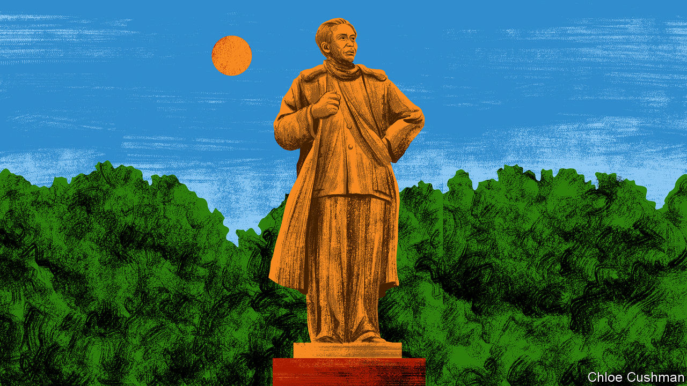

###### Chaguan

# Why Xi Jinping is not another Chairman Mao 

##### He is a strongman who wants to harness, not blow up, China’s deep state 

 

> Apr 5th 2023 

EACH time President Xi Jinping grabs more powers, critics compare China’s leader to Chairman Mao Zedong, whose one-man rule led the country to disaster. Those grumblers may underestimate Mr Xi’s ambitions. Rather often, the charge that Mr Xi is emulating Mao—a despot whose campaigns of political terror and deranged economic policies left tens of millions dead—is a prediction that China’s leader is storing up trouble for himself, by weakening norms and institutions that might helpfully check and balance his authority. Such doomsayers are drawing lessons from Mao’s unhappy end. Over the two decades before his death in 1976, absolute power and a cult of personality left the Great Helmsman increasingly isolated and paranoid: a tyrant alienated from his most capable revolutionary comrades, military commanders and aides, many of whom were purged or driven to their deaths.

In Mr Xi’s case, those predicting doom tot up the numerous enemies he has made in his first decade as the Communist Party’s boss. They note persistent anti-corruption campaigns that have ensnared hundreds of thousands of officials, including the heads of giant state-owned firms, police and other security chiefs, army generals and members of the party’s ruling Politburo. The same doubters point to Xi-era regulatory clampdowns and policy changes that have left China’s business sector in a funk and driven billionaires, entrepreneurs, creative artists and other useful talents to flee the country. To all this, bearish sorts would add last December’s abrupt, fatally ill-planned abandonment of covid-19 controls. Elites in cities like Beijing, ever alive to changing political winds, shudder when they hear Mao-era slogans revived. They wince when officials call Mr Xi the “party core” and “people’s leader”, or urge all 97m party members to study Xi Jinping Thought. 

An announcement last month set nerves jangling. Officials unveiled a party-wide plan for “promoting investigation and research”, which will see officials sent to “grassroots units”, down to individual businesses, schools or villages. Once on the ground, officials are to listen to the masses and contemplate whether, in their own work, they have drifted into “formalism”, party jargon for only pretending to heed Mr Xi’s instructions. To educated Chinese, the echoes are loud of an earlier campaign to promote investigation and research, launched in 1960-61 as senior leaders were sent to their home towns to investigate “errors” in the Great Leap Forward, Mao’s calamitous movement to collectivise farming and industry, which killed millions in a man-made famine.

In 1961 Mao had lost the trust of many senior colleagues. Sending some of them on investigation tours gave him political cover to reverse the worst policies of his Great Leap Forward. Soon, though, he was bent on revenge. In 1966 he mobilised the masses to attack and overthrow party officials and other authority figures. China calls that frenzied, bloody decade the Cultural Revolution. Modern Americans might term it Mao’s “campaign against the deep state”, says Professor Andrew Walder of Stanford University.

The analogy is helpful for outsiders pondering Mr Xi’s approach to power. To call Mr Xi a second Mao is misleading. Mao was a radical, willing to blow up an establishment he distrusted. Scornful of the notion that internal party discipline could reform arrogant bureaucrats, he chose to chasten cadres with violent class struggle, imposed from below by the mob. In contrast, Mr Xi is a career politician who calls on party members to self-purify, under the supervision of fearsome internal-discipline inspectors. He believes in top-down control, not chaos. He has worked to extend his party’s reach into every corner of the economy and society. He has built a vast apparatus of censorship, surveillance and propaganda to control the masses, not to unleash them. Put another way, Mr Xi wants to be more than a Mao-style strongman. He also wants to wield power through the deep state.

For evidence, consider Mr Xi’s praise for Liu Shaoqi, China’s one-time president and a man whom Mao came to loathe as, in Professor Walder’s words, “the head of the deep state”. Liu was a hardline, Moscow-trained organiser of underground party cells and guerrilla units before the revolution, and a ruthless enforcer of party discipline after it. He fell out with Mao as the Great Leap Forward’s disasters became undeniable. Liu confronted his leader behind closed doors after meeting starving farmers in his home region in the central province of Hunan in 1961. For his pains, Liu was purged and tormented during the Cultural Revolution, and rehabilitated only after Mao’s death.

Personalised rule or a strong party? Xi’s answer: both

Liu’s tour of Hunan is commemorated today in the village of Tianhua. Old photographs in an exhibition hall show him coaxing the truth from nervous farmers. A mud-walled farm office where he stayed has been restored. Yang Yi, the curator, shows a door resting on two benches which the then-president of China supposedly used as his bed, after arriving undercover as a simple inspector (a lorry that arrived with soft furnishings was shooed away). Mr Xi mentioned the same hard bed in a speech in 2018 that hailed Liu as a shining example of a party cadre seeking “truth through facts”. That phrase adorns the entrance to the site, which drew 300,000 officials, schoolchildren, soldiers and other visitors in the last year before covid-19. The Tianhua exhibition twists history to portray Mao and Liu as allies, jointly investigating the masses’ suffering. Asked about Liu’s lonely death in a detention site in 1969, Mr Yang blames not Mao but his acolytes known as the Gang of Four.

Such claims of unity are bad history, but politically revealing. As Professor Walder notes, Mr Xi uses Maoist symbols, but in his obsession with discipline, grassroots party-building, and with officials being tempered by hardship, he sounds like Liu. Xi-style governance combines one-man rule with nominally strong party institutions. A big test involves truth-telling. Can underlings inform Mr Xi when he is wrong? If not, disasters surely await.■


