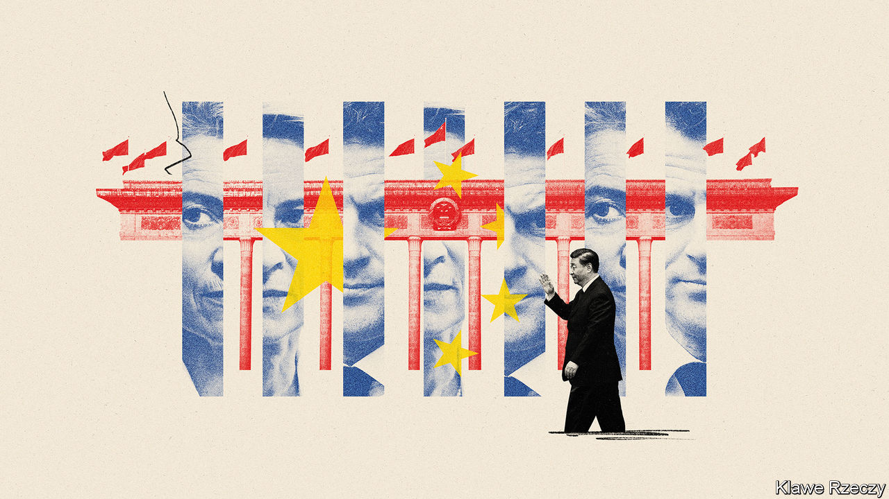

###### Europe and China

# Will Xi Jinping outsmart Emmanuel Macron? 

##### The war in Ukraine is at the top of the agenda in Beijing 

 

> Apr 4th 2023 

Emmanuel Macron, France’s president, had hoped that his visit to China this week would demonstrate European unity and support for his efforts to  with the world’s second-largest economy. To underline the , he invited Ursula von der Leyen, the president of the European Commission, to join him on the visit from April 5th to 7th. The pair would speak with “a unified voice”, Mr Macron said.

The joint visit may instead highlight tension in Europe over how to handle China, given its  with America and  during the war in Ukraine. Across much of the continent, public attitudes towards China have hardened and policy is stiffening too, in part because of American pressure. 

And yet many European governments and firms are keen to rebuild economic relations with China as it emerges from three years of isolation caused by its draconian curbs on covid-19. They also remain deeply wary of American efforts to contain China militarily and . 

Mr Macron, making his first visit to China since 2019, and Mrs von der Leyen, on her inaugural trip there in her current role, will still stage a show of unity during trilateral meetings in Beijing on April 6th. In particular, they are expected to urge Mr Xi to make clear that China will not supply  to Russia, and push him to do more to try to end the war in Ukraine.

In a show of Western cohesion on the eve of his departure, Mr Macron spoke to America’s president, Joe Biden. The two expressed a “common desire to engage China and accelerate an end to the war in Ukraine”. Mrs von der Leyen, meanwhile, talked to Ukraine’s president, Volodymyr Zelensky. She said the EU wanted “a just peace that respects Ukraine’s sovereignty and territorial integrity.”

In Beijing, Mr Macron and Mrs von der Leyen may echo Western calls for restraint over , a self-governing island that China claims. Its president, Tsai Ing-wen, was  the speaker of America’s House of Representatives, Kevin McCarthy, in Los Angeles on April 5th. China has threatened “resolute countermeasures”. It has not elaborated, but when the previous speaker, Nancy Pelosi, visited Taiwan in August, China fired missiles over the island and simulated a blockade.

As the European leaders’ visit progresses, however, their differences on China will become more apparent. Mr Macron will accompany Mr Xi on a visit to southern China where Mr Xi’s father pioneered market-opening reforms. Mr Macron is travelling with 53 French executives. Lots of business deals are expected. Mr Macron is no China dove. But he wants “strategic autonomy” for Europe, and France to be a “balancing power”. Unlike many American politicians, he does not seek to isolate or contain China. He sees it as a possible “game-changer” on Ukraine.

Mrs von der Leyen, by contrast, has already upset Chinese officials by laying out a more confrontational approach. In a speech on March 30th, she said Europe wanted to “de-risk” rather than “decouple” its relations with China. But she called for tighter controls on Europe’s technology trade with China. She also voiced scepticism about China’s peace plan for Ukraine, proposed in February. She said China’s stance on the war would be a “determining factor” in its ties with the EU. 

Some EU member-states consider Mrs von der Leyen too close to the Biden administration. But her speech reflected a change in attitudes towards China across much of Europe. That began before the war in Ukraine, as concern mounted over issues involving trade as well as China’s political influence and espionage operations. 

In 2019 the European Commission declared China a “systemic rival”. A shift towards viewing China warily has since accelerated, especially in eastern and central European countries where China has failed to deliver promised economic benefits. Most are now aligning closely with America as a result of the war in Ukraine. 

China seemed taken aback by the tone of Mrs von der Leyen’s speech. It “contained a lot of misrepresentation and misinterpretation of Chinese policies,” said Fu Cong, China’s ambassador to the EU. A letdown for China was her suggestion that the EU’s Comprehensive Agreement on Investment (CAI) with China should be reassessed. That deal was reached in 2020 but was shelved after China imposed sanctions on European entities and politicians in response to EU sanctions on Chinese officials involved in abusing human rights in Xinjiang. Chinese diplomats have recently suggested a simultaneous lifting of sanctions to revive the CAI.

The speech may have complicated Mr Macron’s plans. He had hoped to show the kind of unity that he engineered when Mr Xi went to Paris in 2019, when he made sure that German and EU leaders were there to join him. Last autumn Mr Macron wanted to make a joint trip to China with Olaf Scholz, Germany’s current chancellor. But Mr Scholz insisted on going alone. 

In theory, Mrs von der Leyen’s speech could still work to Mr Macron’s advantage by shifting public focus away from his efforts to revive commercial ties and by encouraging Mr Xi to make his visit a success. China increasingly sees Mr Macron as its main advocate within Europe, as Germany, its biggest economic partner, is consumed by a political debate over its China strategy. 

At the same time, with protests over his pension reforms continuing at home, Mr Macron faces more pressure to secure a meaningful Chinese commitment on Ukraine. It would need to go beyond a simple expression of opposition to nuclear threats or attacks, as Mr Xi conveyed to Mr Scholz. 

One possibility is for Mr Xi to make a personal pledge, similar to ones already given by some Chinese officials, to refrain from arming Russia. Another option is that Mr Xi schedules virtual talks with Mr Zelensky. Some foreign officials had expected those to happen soon after Mr Xi visited Moscow in March. 

Still, Mr Xi will avoid saying anything that undermines his relationship with Russia’s president, Vladimir Putin. When Spain’s prime minister, Pedro Sánchez, visited Beijing on March 30th and 31st, he urged Mr Xi to speak to Mr Zelensky and recommended the Ukrainian leader’s peace plan, which calls for the restoration his country’s pre-2014 borders. But there was no public response from China. 

If Mr Xi does give some ground on Ukraine, Mr Macron’s visit may well embolden Europeans who favour economic re-engagement with China and worry about getting too close to America—especially if Donald Trump wins the presidential election in 2024. It would not reverse the trend towards a tougher stance on China in Europe but it could limit the speed and scope of the change. It could also complicate Mr Biden’s efforts to keep Europe on board if, as expected, he further tightens restrictions on technology trade with China. 

If Mr Macron fails to extract at least a rhetorical Chinese concession on Ukraine, he may weaken the case for closer economic ties with China. He could also face more of the criticism that followed his failed efforts to talk Mr Putin out of going to war. Mr Xi will no doubt exploit any French signals about a willingness to re-engage economically, says Noah Barkin of Rhodium Group, a research firm. “The question is: will Macron be offering something without getting anything in return?” ■


