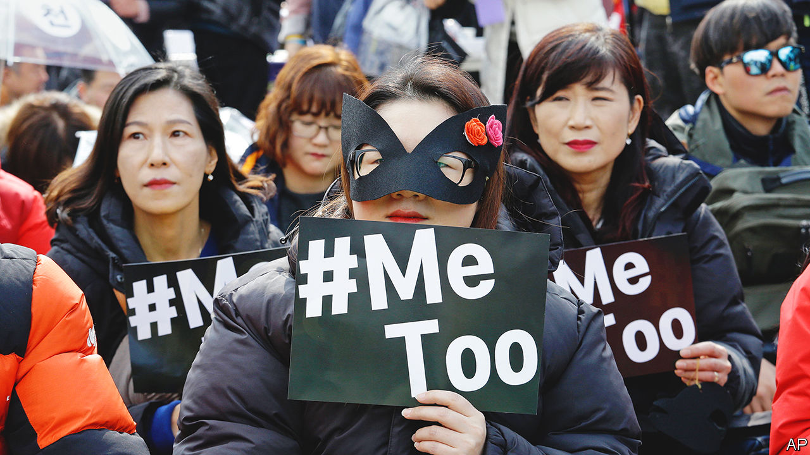

###### Feminism in South Korea

# Inside the fight against misogyny and patriarchy in South Korea 

##### In “Flowers of Fire”, Hawon Jung chronicles an urgent—and unfinished—campaign 

 

> Apr 5th 2023 

. By Hawon Jung. 

On a chilly morning in March 2018, women in South Korea were invited to a rally in the centre of Seoul, the capital, to share their stories of sexism. As the first speakers took to the stage, some of the #MeToo activists who had organised the event worried there would be too few participants to keep it going. They needn’t have. Woman after woman stepped up to recount experiences of discrimination, abuse or violence. The testimony lasted over 33 hours. One contributor, a mask concealing her identity but not her tears, explained: “I had to come here, to tell other women like me that they are not alone.”

The urge to tell stories as an act of compassion and support animates “Flowers of Fire”, an account of South Korea’s feminist movement between 2015 and 2021 by Hawon Jung. She chronicles both the enduring misogyny of South Korean society and the way its women have banded together to combat it. As in that #MeToo talkathon, each instance of sexism that she presents is powerful on its own; collectively, they are incendiary.

Drawing on her years of reporting for Agence France-Presse, the author skilfully merges personal memories with facts and statistics. In some ways, South Korean women are fortunate. They are richer, live longer and are far better educated than women in most other countries. Yet as Ms Jung shows, in their daily lives they must cope with  for such an advanced nation. 

They are treated as cooks, cleaners and “baby-making machines”. They are expected to be , and are subject to demeaning scrutiny if they fall short in either domain. They are routinely regarded as objects for male sexual gratification (“an army of tech-savvy Peeping Toms...secretly film women and girls in every imaginable public space, from subway stations to school bathrooms”). And they face intense pressure to meet unachievable beauty standards. One brokerage had nearly 20 dress rules for female staff, covering “everything from head to toe”, while men were told only to “avoid mismatched suits”.

Ms Jung describes the indignities women suffer in scrupulous detail. One interviewee gave up on her dream of becoming a television journalist because spycam footage of her changing after a shower was posted on a porn site, and she feared that if she became recognisable it would go viral. Another ditched a boyfriend after he invited her to dinner at his parents’ home and then nudged her to “wash the dirty dishes...like a good future daughter-in-law”.

Contrary to the stereotype that East Asian women are “innocent, passive and compliant creatures”, those in South Korea object furiously to all this. And the mismatch in expectations between Korean men and women has exacerbated the country’s demographic predicament. The fertility rate is : 0.78 babies per woman. Fearing a population implosion, the government is trying desperately to encourage births. But many women are on “marriage strike”, having given up on finding a man who doesn’t think “his penis would fall off if he steps into the kitchen”. In a survey of women in their 20s, nearly 60% said they would never wed.

Some Korean men have realised that the only way to change this is to help out more at home. But others have responded to the increased prominence of feminism by electing an overtly anti-feminist president, , who won power in 2022 by promising to abolish the ministry of gender equality. The battle of the sexes in South Korea is nowhere near a truce. ■


