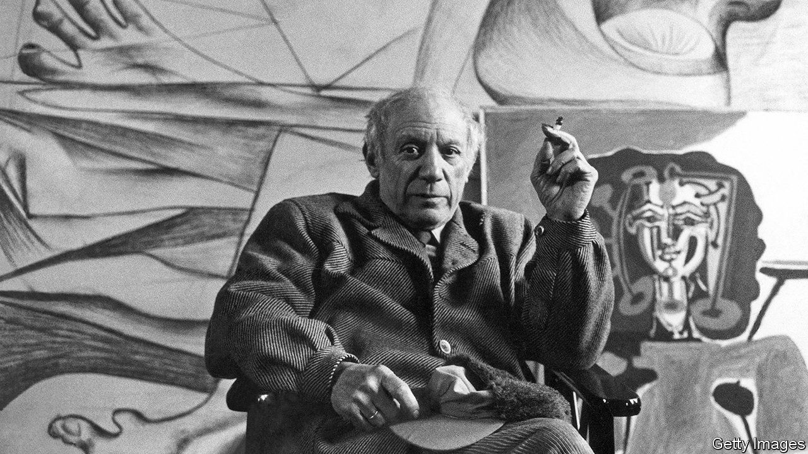

###### Back Story

# Picasso was a genius—and a beast. Can the two be separated? 

##### It’s the wrong question to ask, says “Monsters”, a provocative new book by Claire Dederer 

 

> Apr 5th 2023 

Look closely at “Woman with a Yellow Necklace”, a painting by Pablo Picasso of 1946. The woman is Françoise Gilot, his partner at the time. Notice, in particular, what appears to be a Marilyn-esque beauty spot on the figure’s left cheek. That mark is said to represent a cigarette burn, seared onto the sitter’s face during a row with the artist.

In his astonishing range and invention, Picasso—who died 50 years ago, on April 8th 1973—was among the 20th century’s greatest artists. He was also an abusive goat, with a nauseating fondness for much younger women (40 years younger in Ms Gilot’s case). “Once they were bled dry,” his granddaughter Marina wrote of his women, “he would dispose of them.” Two went on to kill themselves.

In “Monsters”, her new book, Claire Dederer identifies Picasso as an archetypal modern genius: an artist whose vices have been seen as excusable by-products of his vatic talent. Only men, she notes, are ever granted this licentious dispensation. Her book asks how she and readers today should feel about luminaries who “did or said something awful, and made something great”.

Even those who try to duck this problem can’t. Even for listeners bent on separating art and artist, “Age Ain’t Nothing but a Number”, a hip-hop track, will be tarnished by knowing its provenance. (It was written by , a convicted sex abuser, and sung by Aaliyah, who became his “wife” at 15.) Conversely, even those repulsed by Wagner’s anti-Semitism may find themselves stirred by “Ride of the Valkyries”. Often publishers, film bosses and other gatekeepers tackle this quandary on punters’ behalves.

The trouble, for most people, is where to draw the line, or rather several. The variables involved are all slippery and subjective. One is the gravity of the artists’ sins, a judgment liable to change over time. The same goes for views on their stature. Time itself is a factor. Today’s scandals will one day be ancient history; long-gone victims can be less compelling than living, weeping ones.  by dead artists—such as Picasso—can seem a punishment of yourself rather than of them.

Ms Dederer fantasises about a calculator that could weigh “the heinousness of the crime versus the greatness of the art”. In reality, she says, the dilemma is inevitable—and insoluble. Rewatching , she cannot but remember the gruesome sex offence committed by its director, Roman Polanski. A disgraced biography, in her apt metaphor, is a stain that cannot be wished away. And in this social-media-saturated age—when “everything is everyone’s business”—there is a lot of biography about.

At the same time, you cannot switch off the love you feel for art made by reprobates. Your leg still jiggles to “I Want You Back”, despite what you know about Michael Jackson’s proclivities. For all the disputed allegations against Woody Allen—and his marriage to his ex-partner’s daughter—“Annie Hall” is still funny.

No one is entirely a monster, Ms Dederer says by way of mitigation, both for stained virtuosos and angst-ridden fans. There is a bit of monstrosity in everyone, she adds, especially artists, for whom bloody-minded selfishness is useful. But her main argument for reconciling yourself to the art/artist question is that it is the wrong one to ask.

What difference does it really make, she writes, if you deprive a wicked genius of your cash or attention? Her case is couched in anti-capitalism; she thinks celebrity is generated and monetised by the system, which, like the house in a casino, wins whatever you choose to consume. You can doubt that reasoning but buy her conclusion: that renouncing Picasso, say, “is essentially meaningless as an ethical gesture”.

Art is important. Calling out abusers is valid and important too. But in the end, Ms Dederer argues, dust-ups over cancellations are a kind of shadow boxing. The key fights are over broader issues in society, or over private relationships and behaviour. “The way you consume art doesn’t make you a bad person, or a good one,” she counsels. “You’ll have to find some other way to accomplish that.” In the narrow realm of culture, this is consoling: “You are off the hook.”

Many shows and events will mark the  of Picasso’s death. Attend one, and you will encounter his revelatory vision—and, indivisibly, his misogyny, which courses through his sexualised contortions of female bodies. And, like it or not, if you come across “Woman with a Yellow Necklace”, you will see the cigarette burn.


