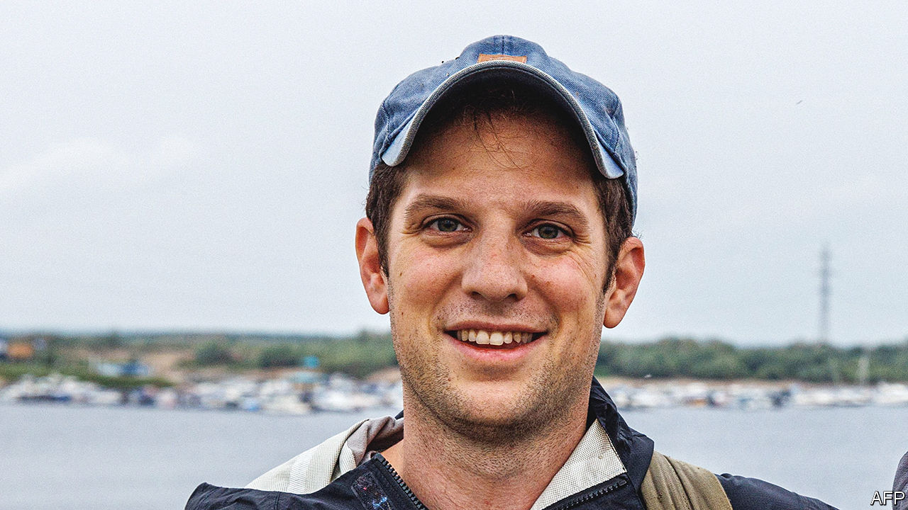

###### Press freedom

# Calls for Russia to free Evan Gershkovich fall on deaf ears 

##### The American journalist was arrested on spying charges 

 

> Apr 5th 2023 

On March 29th Evan Gershkovich, a correspondent for the , disappeared during a reporting trip to Yekaterinburg, Russia’s fourth-biggest city. The next day Russian security services revealed that they had arrested him on spying charges. That Mr Gershkovich, an American citizen, is fully accredited to report in Russia seems to have made no difference. The newspaper says it is deeply concerned for his safety. Despite appeals from President Joe Biden, the secretary-general of nato and many other governments, as well as newspapers across the world, there has been no contact with Mr Gershkovich, a talented reporter with a deep love of Russia. The arrest, the first of a Western journalist on espionage charges in Russia since the end of the cold war, will worsen already terrible relations between Russia and America. The Kremlin may intend to use Mr Gershkovich as a bargaining chip to secure the release of Russians imprisoned in America or Europe, but there is still no confirmation of this.■

