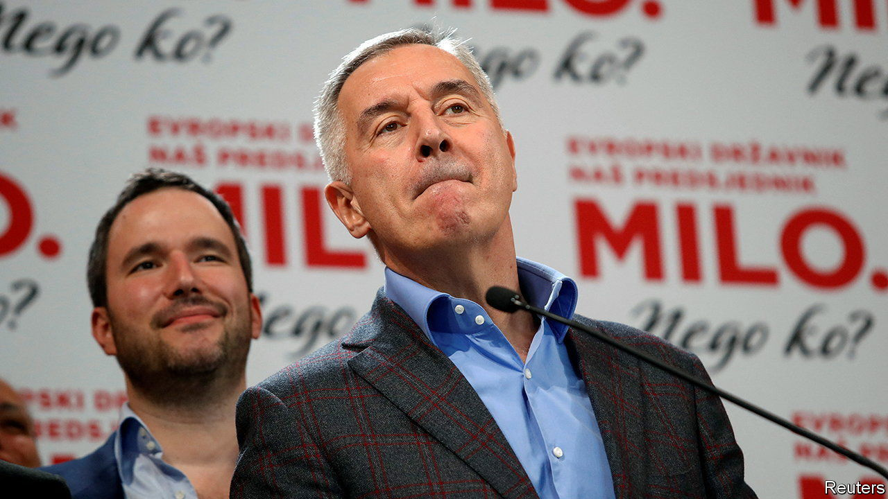

###### Falling off the black mountain

# Montenegro’s long-time boss is ousted 

##### After more than three decades in power, Milo Djukanovic had to go 

 

> Apr 5th 2023 

After a third of a century the blade had blunted. Nicknamed , “the razor”, because of his political sharpness, Milo Djukanovic finally lost the presidency of Montenegro on April 2nd, when he was resoundingly defeated in an election by Jakov Milatovic, a relative newcomer. Mr Djukanovic first tasted power in 1989, when Mr Milatovic was two years old. In 1991 he became prime minister. Until his party lost a general election in 2020 he was the undisputed master of Montenegro. 

Back in 1989 Mr Djukanovic, now 61, was a protégé of Serbia’s leader, Slobodan Milosevic. Two years later he cheer-led as Montenegrin units of what was still Yugoslavia’s army attacked the port of Dubrovnik, in neighbouring Croatia, which was breaking away. He then backed a referendum for Montenegrins to stay united with Serbia, as the last components of Yugoslavia. But in 1997, when protests against Mr Milosevic rocked Serbia, Mr Djukanovic turned coat, emerging as a Montenegrin nationalist. In 2006 he steered his country to independence. Montenegro joined NATO in 2017.

One of his successes was to keep his multi-ethnic country of 617,000 people at peace. But he was never able to heal the historic division between those who saw Montenegro’s identity and future as tied to Serbia and those who did not. He has also long been dogged by allegations of cronyism (which he has always denied). When he leaves the presidency next month he will lose immunity from prosecution, which his enemies may well call for.

Mr Milatovic, aged 36, an Oxford-educated former minister of the economy, was backed by pro-Serbian, pro-Russian parties—and by many on the other side of that gulf, too. “I think the vote was more anti-Djukanovic rather than pro-Milatovic,” says an analyst. 

All eyes are on the general election due in June. Mr Milatovic is a pragmatic centrist bent on mending the economy. His new party, Europe Now!, is expected to do well. He wants Montenegro to join the EU by 2028, which may be optimistic. He has said little about Ukraine and will be friendlier towards Serbia than Mr Djukanovic was. The government has more power than the president, so the next election may be the real harbinger of Montenegro’s future. ■

