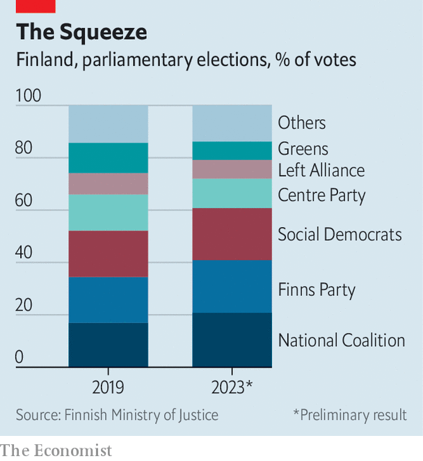

###### Reversion to form

# Sanna Marin concedes defeat in Finland 

##### The centre-right and hard right may now team up 

 

> Apr 3rd 2023 

IT BECAME THE defining image of the Finnish election campaign: , the Social Democratic prime minister, and Riikka Purra, leader of the hard-right Finns Party, wagging their fingers furiously at each other during a televised debate. Yet in the end the winner was neither Ms Marin nor Ms Purra, but the third candidate in the debate. Petteri Orpo’s centre-right National Coalition party narrowly won Finland’s general election on April 2nd, taking 20.8% of the vote to the Finns’ 20.1% and the Social Democrats’ 19.9%. Mr Orpo now faces the tricky task of forming a governing coalition. 

The 37-year-old Ms Marin, who has been prime minister since 2019, won international fame for her strong support for Ukraine and decisiveness in bringing : on April 4th it became the 31st member of the alliance. Although her image was coloured by an embarrassing leak last summer of home videos showing her dancing enthusiastically with friends (she took a drug test to squash rumours), Finns had come to take Ms Marin seriously after her solid handling of covid policy. “She came in as a young prime minister in a difficult situation, but she was very credible as a leader throughout the pandemic,” says Teija Tiilikainen, a political scientist.

 


Yet Ukraine and  were barely mentioned during the campaign, since almost all Finnish parties now agree on them. The National Coalition party is at least as firm on defence as the Social Democrats; two of its new MPs are former generals. And the Finns Party, unlike many hard-right populist outfits in Europe, has few traces of sympathy for Russia. It prefers scepticism towards the European Union and climate policy, and hostility to immigration.

The battle was mostly fought on other grounds. Fiscally conservative sorts, Finns worry about government debt, which rose to 75% of GDP during the pandemic. Rising defence spending will exacerbate that. Mr Orpo promised to bring the deficit down by cutting social spending; Ms Marin had promised to raise it.

The election displayed a new phenomenon for Finns: tactical voting. Both the Social Democrats and the National Coalition urged sympathetic supporters of smaller parties to pick them instead, in order to increase their chances of coming first and leading the government. As a result, big parties got bigger and most small ones shrank—the opposite of the trend of fragmentation observable in most other European democracies.

So while Ms Marin did reasonably well, increasing the Social Democrats’ vote share, the overall result was a shift to the right. In his search for a majority, Mr Orpo’s most straightforward choice would be to form a solidly right-wing government with Ms Purra. If that fails, he will have to try to create a centrist “red-blue” government with the Social Democrats. 

The policy implications of the hard-right option are hard to predict. The Finns Party has moderated its image somewhat. In 2019 one of its campaign advertisements depicted a fiery ancient monster rising up to avenge the Finnish people on their corrupt leaders. This year it pleaded for the country to burn domestic peat to alleviate energy shortages. 

On April 5th Ms Marin announced that she will be stepping down as leader of the Social Democrats in the autumn. Her party will need to bide its time and see how Mr Orpo’s negotiations work out. Should he fail to form a coalition, it may yet get a chance to try again. But Finland is losing its international figurehead. It was unusual for such a stoical country to have a flamboyant leader. Mr Orpo represents a reversion to the norm. ■

