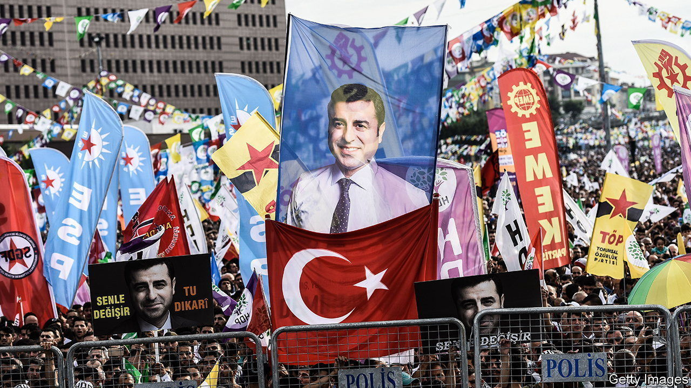

###### Kingmakers and scapegoats

# Turkey’s Kurds are joining the coalition to oust Erdogan 

##### They are persecuted outsiders—and influential powerbrokers 

 

> Apr 5th 2023 

NILUFER Elik Yilmaz’s tenure as mayor of Kiziltepe, a town in Turkey’s south-east, was short-lived. In November 2019, seven months after she was elected, Mrs Yilmaz, a member of the People’s Democratic Party, Turkey’s main Kurdish one, was ousted by the interior ministry and replaced by a government appointee. Weeks later, she was locked up on terrorist charges. Freed on parole over a year later, she was recently sentenced to more than six years in prison, pending appeal. Across the Kurdish south-east, stories like hers are the rule, not the exception. Of the 171 mayors elected on the HDP’s ticket in the past decade, some 154 have been dismissed or prevented from taking office. Dozens have been arrested. “This cycle has to end,” says Mrs Yilmaz. But that all depends on Turkey’s upcoming elections. 

Turks will elect parliament and president on the same day, May 14th. The outcome may hinge on the Kurds. Recent polls suggest that neither the governing coalition, composed of the Justice and Development (AK) party and the Nationalist Action Party (MHP), nor the main opposition bloc, the Nation Alliance, will be able to hold a parliamentary majority. The HDP can expect to take at least 10% of the vote, which could make its MPs kingmakers.

Its voters may play an even bigger role in the presidential poll. Instead of putting forward its own candidate, the HDP is backing the Nation Alliance’s contender, Kemal Kilicdaroglu, head of the Republican People’s Party (CHP), against Turkey’s president, Recep Tayyip Erdogan. The aim, says Selahattin Demirtas, the HDP’s former leader, writing from prison, “is to put an end to the Erdogan regime and give democratisation a chance”.

For Kurdish leaders to endorse a CHP leader for president right now shows just how badly Mr Erdogan and his AK have fallen out with the country’s biggest ethnic minority. For decades the CHP, the party of Turkey’s old secular establishment, denied that a separate Kurdish language and culture even existed. Well into the 2000s, the party still opposed any concessions. Mr Erdogan and his AK were much more accommodating, offering the Kurds new cultural rights, using appeals to Islam to win over Kurdish conservatives, and even launching peace talks with the Kurdistan Workers’ Party (PKK), an armed separatist group. This earned them a decent share of the Kurdish vote. 

Things began to change in 2015, when Mr Erdogan washed his hands of the peace talks and the PKK, emboldened by the success of its American-backed offshoot in Syria, launched an urban insurgency across the south-east. Mr Erdogan’s government responded with deadly force, then with a blanket crackdown against Kurdish nationalists, including the HDP, which most Turks consider the PKK’s political wing. Mr Demirtas and several other MPs, as well as hundreds of other HDP politicians and activists, were thrown behind bars on mostly trumped-up terrorism charges. Many Kurds believe the HDP’s earlier refusal to back Mr Erdogan’s plans for an executive presidency was another reason for the sweeping crackdown. 

The government has since turned even more hawkish, sacking Kurdish mayors en masse, in effect disfranchising millions of voters. It attacked the PKK and its affiliates in Syria and northern Iraq. “The AK has moved further away from the Kurds,” says Vahap Coskun, an academic. “And the CHP has moved closer.” What this spelled for Turkish politics became clear in the local elections of 2019, when Kurdish votes propelled CHP candidates to victories in mayoral races in Istanbul, Turkey’s largest city, and Ankara, the country’s capital.

The HDP and its voters are not just kingmakers but scapegoats. Mr Erdogan and his ministers, coddled by a complacent media, have pushed the HDP to the margins of politics. Leading news channels treat HDP politicians as untouchables. Dozens of HDP members face prison terms on charges dating back to 2014, when protests against the government’s policies in Syria erupted in the south-east.

A separate case, now before Turkey’s constitutional court, may see the party closed down and its leading members, including Mrs Yilmaz, banned from politics for several years. A verdict in this case may be reached as soon as April 11th. To sidestep a possible ban, the HDP recently decided to contest the coming elections under the banner of another party, the Green Left.

Over the years, by refusing to speak up for the Kurds or to speak with a single voice, the opposition was complicit in the government’s persecution of them. The CHP backed both the decision to strip HDP parliamentarians of immunity and its military operations in Syria. Now the doveish Mr Kilicdaroglu has at least expressed remorse about the CHP’s past mistakes and offered to work with the HDP if elected, making him the candidate most palatable to the Kurds, says Mr Coskun. But the CHP’s main alliance partner, the Good party, a group dominated by nationalists, takes a much harder line, refusing so much as to meet representatives of the HDP. 

Mr Erdogan is keen to deepen these cracks in the alliance, hoping to drive some nationalists away from the opposition and into his own camp. Ahead of the election, he has doubled down, claiming that by courting the HDP, which he denounces as a PKK front, the opposition has teamed up with terrorists. The opposition needs the HDP and its voters to win the presidency. Mr Erdogan needs them to pep up his scaremongering campaign. ■

