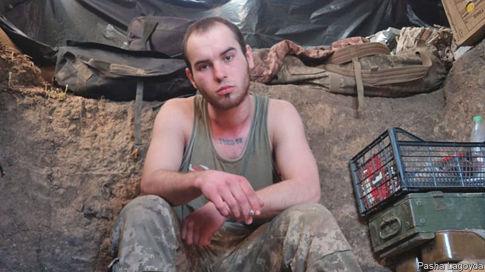

###### A battle yet to be won

# Ukraine’s gay soldiers fight Russia—and for their rights 

##### War changes everything, including attitudes to gay people 

 

> Apr 5th 2023 


When Pasha Lagoyda joined the Ukrainian army in 2021, he didn’t tell anyone he was gay. In his first weeks his room-mates at training camp found some “spicy texts”, as he puts it, and he was bullied. “There was aggression. They called me a faggot—all that stuff.”

As his fellow recruits got to know him better, the intimidation died down. Now Mr Lagoyda is serving on the front line and all the 180 people in his unit know he’s gay. He posts selfies looking fit in his camo fatigues with washboard abs and immaculate stubble. He is also a member of LGBTIQMilitary, an Instagram account that features lgbt people in military service. It even has a link to buy merch: mugs and cloth patches depicting an armoured unicorn breathing fire. “Wherever I serve,” says Mr Lagoyda, “everyone tells me: ‘Because you are here at war, in principle I have no right to call you gay or a faggot; you are just a person who is protecting us on an equal footing’.” 

He is not alone. Thousands of gay people are serving in the Ukrainian armed forces, often sporting a rainbow badge next to the Ukrainian blue and yellow on their uniform. LGBT groups have also been at the forefront of humanitarian volunteering. Their visibility has led to a sea-change in Ukrainian society. 

Homosexual sex was decriminalised after the Soviet Union broke up in 1991, but when Kyiv’s first Gay Pride parade was held in 2013 only a few dozen people were brave enough to ignore the threat of skinhead violence. Even after Ukraine’s revolution of 2014 and the reforms that followed, legislation protecting gay rights lagged behind. Despite years of campaigning, for example, parliament has still not amended Ukraine’s hate-crime laws to include acts against gay people. 

War changes everything. Last summer, the parliament finally ratified the Council of Europe’s Istanbul convention on violence against women, after a decade-long delay, caused by the objections of church groups to the use of “gender” in the text. It is now drafting a bill that would give same-sex couples the right to register civil partnerships, something that was unimaginable even a year ago.

Inna Sovsun, the MP who introduced the bill, says she was encouraged when a petition last summer calling for same-sex marriage to be legalised was signed by over 25,000 people, meeting the threshold for presidential consideration. Polls have shown that more than half of Ukrainians think gay and bisexual people should enjoy equal rights. Ukraine’s president, Volodymr Zelensky, has signalled support for a civil-partnership law, but his government has yet to make it a priority. 

Protecting the rights of gay people in the military gives a big push for the bill. Civil partnerships would let same-sex couples make medical decisions if a partner is wounded; if one is killed, the survivor would be able to bury him or her according to their wishes, inherit with the same tax advantages that marital spouses have, and receive state compensation for the loss. “It’s something many people dream about,” says Mr Lagoyda. “If something happens to me, God forbid, I want my boyfriend to be able come to the intensive care or take my body away.” 

Sofiia Lapina, head of Ukraine Pride, an activist group, argues that the shift in attitudes on gay issues partly reflects Ukrainian aspirations to be culturally and politically closer to Europe. It is also a way, she adds, for Ukrainians to oppose Vladimir Putin’s repressive Russia, which has outlawed “homosexual propaganda” and characterises the war in Ukraine as an existential battle against the West’s supposed promotion of gay marriage, rampant paedophilia and gender-neutral pronouns.

Ukrainian LGBT groups have documented how lesbian and gay people in Russian-occupied territories have been hunted down, raped, detained and humiliated. Tattoos of gay symbols are as much a red flag to Russian troops as Ukrainian tridents. Transgender people there are afraid to go out into the streets. Ms Lapina says “Ukrainians have begun to see more clearly that hate in any form—racism, homophobia—is basically Russian propaganda.” ■

