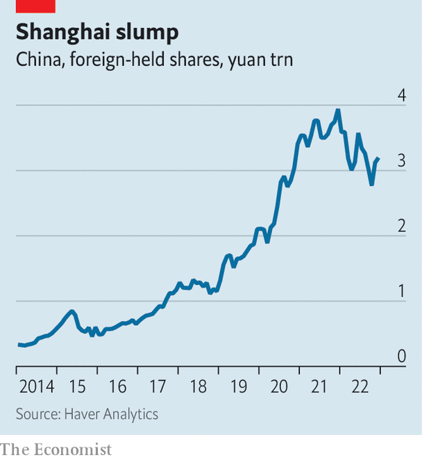

###### Post-zero-covid

# Chinese officials promise foreign investors greater access 

##### Believe it when you see it 

 

> Apr 5th 2023 

Foreign investors have been flooding into China over the past two weeks. For all but a few, it is their first trip in three years, since the country walled itself off from the outside world in a bid to exclude covid-19. Those who did enter during the height of China’s zero-covid mania spent weeks in quarantine, emerging to find a society under suffocating lockdowns. 

Unsurprisingly, the value of onshore stocks held by foreigners had fallen by December to 3.2trn yuan ($470m), about 4% of the total mainland market capitalisation—and down from 4.3% a year earlier, according to the most recent official data. Meanwhile, the value of Chinese private-equity deals collapsed by 53% last year compared with the one before, according to Bain &amp; Co, a consultancy. 

China’s leaders are now asking global investors to forget the past three years. Recent weeks have been spent hosting a reopening party which began with a high-level development forum in Beijing bringing in numerous executives, including Tim Cook of Apple, an American tech firm, and Ray Dalio of Bridgewater, an American investment firm. The festivities finished with the Boao Forum, sometimes called the “Davos of Asia”, on March 31st.

 


Here foreign investors heard Li Qiang, Xi Jinping’s newly promoted deputy, double down on promises of reform and opening. A read-out from the event reminded visitors that “China will open its door even wider to the world,” and that it welcomes investors to “share more of the dividends of China’s opening up and development”.

In mid-March Chinese regulators added more than 1,000 mainland-listed companies to a list that foreign investors can access through Stock Connect, which links Hong Kong-based investors to mainland stocks. It is the biggest reform to the system in many years, leaving about 90% of mainland bourses’ market capitalisation open to foreign investors. In their first three weeks, the changes alone ushered in $4bn of inflows. Analysts at Goldman Sachs, a bank, think they will eventually bring in $60bn in overseas capital if foreigners purchase a similar share of these stocks as they have of others in the scheme.

Another way foreigners can invest in Chinese firms is if they are listed abroad. Regulators are clarifying how overseas listing will work in future. Starting on March 31st, Chinese companies planning foreign listings must submit paperwork to local regulators within three days of filing for such a listing. “Variable-interest entities”, ownership structures used in most overseas listings to circumvent restrictions on foreign investments, have recently been recognised by authorities after years of ambiguity. Gavekal Dragonomics, a research firm, predicts that these rules will mean more onshore initial public offerings and fewer overseas ones. But, as an investor notes, by making things clear, the rules should reduce the regulatory risks that have dogged overseas listings.

How much will Beijing’s charm offensive shift sentiment? The country’s stockmarkets experienced strong inflows in January and Febuary, but the reopening boom has since faded. Foreign investors sold off $26bn in bonds in the first two months of the year. Big improvements in the months to come seem unlikely, says Ashish Agrawal of Barclays, a bank.

For many investors, travel to China has not helped shake off deep concerns about the direction of the country. A recent cabinet reshuffle has strengthened Mr Xi’s grip on power. Relations with America are at their lowest ebb in decades. Just as many investors were arriving in Beijing to attend the China Development Forum, Mr Xi was meeting Vladimir Putin in Moscow. 

Several investors with decades of experience in China say they are concerned by its growing opacity. Analysts outside the country find it increasingly hard to get hold of data that used to be publicly available. Firms that offer company-ownership information can no longer be accessed from overseas. In mid-March bond-pricing data disappeared from feeds provided by vendors. This forced traders in one of the world’s biggest fixed-income markets to frantically swap data via text messages. The suspension ended several days later without explanation, but not before trading volumes crashed by up to 60%. If officials’ promises about improved business conditions are to be believed, investors will need to be able to verify them. ■


