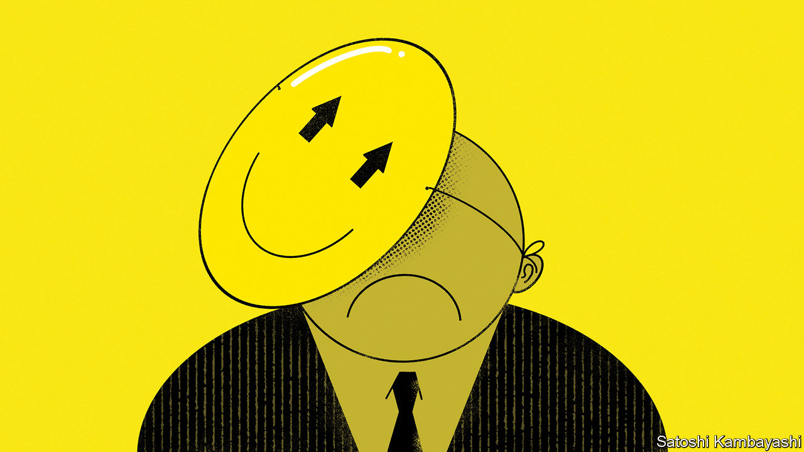

###### Buttonwood

# Stocks have shrugged off the banking turmoil. Haven’t they? 

##### Why the current buoyancy is deceptive 

 

> Apr 5th 2023 

Bank failures are usually bad for business. A sickly banking system will lend less and at higher interest rates to companies in need of capital. A credit crunch will crimp economic growth and therefore profits. On occasion, a bad bank can blow up the financial system, causing a cascade of pain. 

Investors know this. They have dumped stocks when banks have failed before. In May 1984, the month that Continental Illinois, a large bank in the Midwest, failed and was rescued by the Federal Reserve, the Dow Jones, then the leading index of American stocks, dropped by 6%. In September 2008, when Lehman Brothers, an investment bank, went bust, stocks slid by 10%. During the Depression, as one bank after another failed, the stockmarket shed 89% between its peak in September 1929 and its trough in July 1932. 

This time around things have been different. In March, a month in which three American banks failed, deposits fled small institutions across the country. A 167-year-old Swiss bank was forced by regulators into a hasty tie-up with a bigger rival. Yet the s&amp;p 500 index of American stocks gained 4%—a handsome return, well above the long-term monthly average of around 0.5%. Nor was the cheer confined to America: European stocks rallied by 3%. 

The happiest interpretation of these events is that the collective wisdom of the market deduced the danger was over. Regulators rode to the rescue, arranging deals, guaranteeing deposits and extending emergency-lending facilities for banks that found themselves on shaky ground. Inferring the mindset of investors from the way markets move is more art than science. But is this really what people think?

Perhaps not. First, it is clear from how interest-rate markets have behaved, as well as from the way that different types of stocks have moved in different directions, that investors are not betting on all being well with the banking sector or the economy. What they are betting on is rate cuts. The reason that overall indices of stocks rallied is because gains in the share prices of the firms that have been most sensitive to higher rates—namely, the tech giants, including Apple and Microsoft—have more than offset the slump in bank and financial-share prices that dragged indices south. This is most obvious from the performance of the Nasdaq, a tech-heavy index, which rallied by 7% in March. 

Second, individual investors, who tend to get sucked in during the market’s fizziest periods, seem to be moving to the sidelines. Retail-trading flows have been elevated since the start of 2021, when the frenzy over GameStop, a retailer, stoked the enthusiasm of huge numbers of individual investors. These traders piled into stocks earlier this year, buying, on net, a record $17bn of shares in the first two weeks of February, according to Vanda, a data provider. But their activity collapsed along with Silicon Valley Bank. In the last two weeks of March individuals purchased just a net $9bn of stocks, the lowest amount since late 2020. 

Third, and most telling, is what is happening with “swaptions”, or interest-rate derivatives. These allow investors to place long-shot bets on what might happen to interest rates, which many use as a form of insurance for their portfolios: staying long on stocks, say, but buying a handful of swaptions that will pay out in size if something goes horribly wrong. In early March swaptions markets were balanced. Investors were paying just as much to bet on the Fed raising rates above 6% by the end of the year as they were on it cutting rates to below 4%. But now investors are paying to protect themselves against doomsday scenarios. The cost to buy a derivative that pays out if the Fed “capitulates”—if interest rates are cut by around two percentage points by December—is double that to buy one that pays out if rates climb above 6%.

All this indicates an unease that is masked by headline share-price buoyancy. Towards the end of monetary-tightening cycles, investors are prone to adopting a “bad-news-is-good-news” mentality, where any indication of difficulty in the economy is counter-intuitively their friend, since it indicates central bankers might back off interest-rate rises (or even cut rates). But the waning enthusiasm of retail investors and the rush to insure against catastrophe implies that investors remain worried this bout of bad news could be straightforwardly bad. The pickup in share prices indicates that investors are hoping for the best. Activity elsewhere suggests they are also preparing for the worst. 


