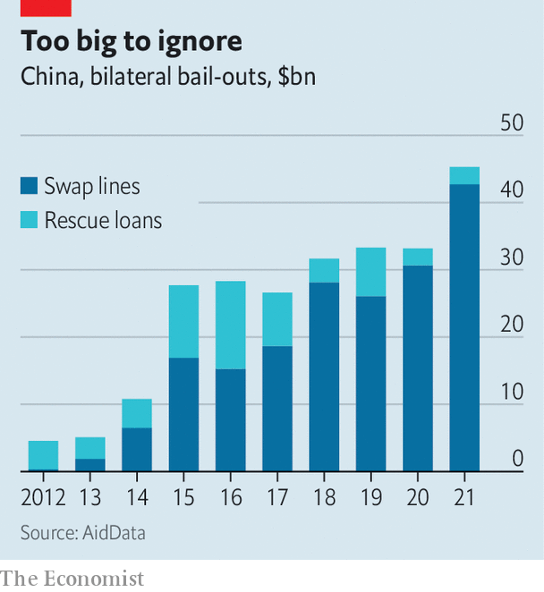
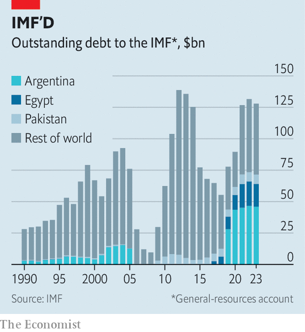
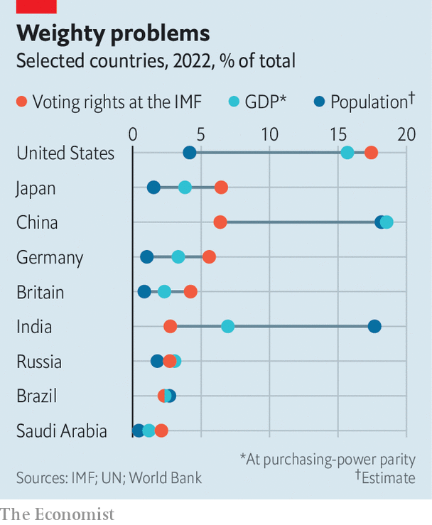

###### Trouble on 19th Street

# The IMF faces a nightmarish identity crisis 

##### The fund is caught between America and China, and its purpose is unclear 

 

> Apr 4th 2023 

During the landmark three-week conference at Bretton Woods in 1944, one delegate contrasted the “extraordinarily beautiful” venue—the Mount Washington hotel—with the “glorious confusion” of negotiations. Yet the bedlam gave birth to the world’s most important international economic institution: the International Monetary Fund (imf), which was founded to ensure global macroeconomic stability. In the nearly 80 years since its creation, the fund has lent $700bn to 150 countries.

When the imf meets for its spring jamboree in Washington on April 10th there will once again be confusion about its purpose. Only this time it will not be glorious but ominous. Like many liberal institutions built after the second world war that could both serve American interests and claim to represent all of humanity, the fund is now ensnared by the Sino-American rivalry. Everyone—including the countries which negotiate and vote on the fund’s governance, the creditors which lend to countries it bails out, and its staff—seems uncertain about the fund’s future. 

This is quite a reversal. Three years ago the imf was poised to orchestrate a grand policy response to covid-19. In reaction to the crisis, the fund boosted by $185bn the amount it could raise from central banks to lend to distressed economies. Commitments from rich countries, the fund’s first source of borrowed capital, doubled to $482bn. The imf brokered a deal at the g20, including China, to freeze interest payments for poor countries. And it doled out $650bn in “Special Drawing Rights”, its own quasi-currency made up of a basket of those of its biggest members, with the hope that the bulk of them would be rechannelled into the fund and then lent on to poorer countries. The imf, it seemed, was fulfilling its modern mission: to backstop countries in distress and, by extension, the world economy. 

The trouble is that, amid what is already the largest debt crisis since the 1980s (judged by the share of world population affected), the imf’s efforts have been variously hamstrung, hesitant or irrelevant. Despite its enormous firepower, its loan book has grown by only $51bn since covid-19 began to spread. The fund has managed to approve just $3.4bn, or 8.5% of the capital it raised for new lending facilities, to tackle everything from climate change to food shortages, and even this money is yet to leave its accounts. Poor countries have struggled through the pandemic, Russia’s invasion of Ukraine and rising interest rates mostly on their own. 

Three factors explain the imf’s enfeeblement. First, the intransigence of Chinese creditors that have lent to poor countries. Second, the parlous state of middle-income countries in perennial distress, for which loans are as much about geopolitics as economics. Third, the imf’s inability to execute a plan, pushed by its leadership, to use resources for purposes that are less diplomatically controversial, such as big-ticket climate loans and health policies.

Chinese creditors cause problems when the imf approaches debt restructuring. Before the fund can lend it must be sure that a country’s borrowing is sustainable. This usually requires an agreement to restructure—jargon for writing down—existing debts. The write-downs were once agreed in smooth imf-led talks between Western countries in the “Paris Club” of creditors. China’s rise over the past 20 years as a big lender has made this all but impossible. At least 65 countries owe China more than 10% of their external debt.

Many are now in trouble. There are at least 21 countries, including Malawi and Sri Lanka, in default or seeking restructuring. Together these owe $1.3trn (on average 93% of local gdp) and are home to 718m people. The g20’s “Common Framework”, a loose accord between creditors including China, agreed in 2020, was supposed to help solve the problem. It has turned out to be a weak agreement, having yielded just one paltry deal in Chad since it was signed. 

Speaking after a visit to China, Kristalina Georgieva, the imf’s managing director, says the country is now engaged with the fund: “The question is no longer ‘Should there be a reduction [in borrowers’ debts]?’, but ‘How much?’ and ‘Through what instruments?’.” Yet China has not cut the face value of its loans and, despite vague assurances to the contrary, has not stretched out repayments to meet the imf’s conditions. 

 


China has two main objections to the way the imf does things. One is that the country’s policy banks, such as China Development Bank, usually count as state lenders not private ones (the latter tend to get off more lightly in restructuring). The second is that multilateral institutions like the fund do not take write-downs, which China sees as the West getting off scot-free. Disagreement between Beijing’s ministries complicates matters. “The people who engage in this issue are not yet necessarily on the same page,” notes Ms Georgieva. 

Without China’s involvement in a restructuring, imf bail-outs might simply flow to Chinese pockets. The result of the country’s absence is thus an impasse. A government seeking restructuring is already in dire straits; typically reserves have run dry, capital is in flight and inflation is spiralling. The longer a restructuring is put off, the more painful it will be eventually. 

At least seven of the 21 troubled countries have been waiting more than a year for a deal since defaulting. Ethiopia has had to wait more than two years for restructuring without receiving a dollar from the imf. Other countries, including Suriname and Zambia, have secured imf packages, but find themselves struggling to unlock the bulk of their funds because China is blocking restructuring. 

“We have worked very hard to get the Chinese leadership to recognise that with more wealth comes more responsibility,” says Ms Georgieva. Success has so far been limited. As Brad Setser of the Council on Foreign Relations, a think-tank, notes, “They’ve had three years, and the arguments have got more and more ridiculous.” 

There is one way to get the fund moving again: its “lending-into-arrears” policy, which was first used after Russia boycotted a restructuring of Ukraine’s debt in 2015. The idea is to circumvent an intransigent creditor, by using safeguards to freeze them out of the benefits of a restructuring. Western countries might lend to a highly indebted country if they were convinced that China would not benefit from their generosity. American officials are thought to be open to the notion. 

Anti-China alliance

The catch is the safeguards’ stringency. Western creditors would want to be sure they are not bailing out Chinese creditors. Countries receiving loans “into arrears” would in effect have to promise to default on Chinese loans today and not borrow from China again anytime soon, on pain of losing access to the imf. It is an idea that could reshape the fund. Although it has always been dominated by America, which holds 17% of voting rights in a system requiring 85% agreement, it is in theory an institution that runs to rules agreed at a table around which all nations may sit. 

 


The fund’s second problem concerns a different set of economies: middle-income repeat-offenders to which it has grown reluctant to lend owing to their inability to follow through on reforms. Since 2000 Pakistan has spent 14 out of 23 years in some form of imf emergency triage, under a total of seven lending programmes, three of which it has not managed to repay. The country is yet to complete a single course of fiscal conditions from any of the deals. Its leaders have been asked to collect local taxes 17 times, and reform the same sales tax in every check-up the fund has done. 

Pakistan is not the only laggard. Egypt has hosted four programmes in under a decade. Argentina, the worst offender, has had to fudge targets in its most recent bail-out, worth $44bn and granted last year. It was once believed the fund could impose the “Washington consensus” on feckless governments with the stroke of a pen. Now it looks like it is being taken for a ride. “There are some programmes,” says Carmen Reinhart, chief economist of the World Bank from 2020 to 2022, “for which one has to have a sense of humour.” 

There are few things more difficult than predicting the path of developing economies. Mistakes are inevitable and the fund’s economists should be forgiven for erring on the side of optimism. But Argentina, Egypt and Pakistan are no mere outliers. The three now make up more than half of lending from the fund’s general-resources account. Add in smaller economies with similar dire records, such as Angola, Ecuador and Jordan, and the figure rises to more than two-thirds. What to do with this gang is a mind-bending conundrum. Your correspondent spoke to a handful of former chief economists at the imf—none wanted to offer the fund’s leadership advice on the subject. 

The result has been an unsatisfying muddle. The fund has made a lot of small loans; it is too afraid to put serious money on the table, and too political to take it off altogether. “The fund’s leadership,” says a former official, “can’t even commit to its own cold feet.” In 2022 Barbados got two rapid-fire deals worth less than $300m. In the imf’s most recent deal with Egypt, agreed in December, it committed just $3bn; puny in comparison with the $30bn that the fund strong-armed Saudi Arabia and the uae into giving. In Pakistan, imf officials are trying to revive a $1.1bn deal, an amount worth less than 1% of the country’s external-debt stock. While negotiations took place, China quietly deposited at least $4bn in Pakistan’s central bank. 

 


“The imf has now landed on the worst of both worlds,” says another former official. The fund is losing its leverage. It has a huge amount on the line from earlier lending. But new packages are small enough that borrowing countries suspect flouting their accompanying orders is better than displeasing Gulf creditors, which are less stingy. The imf often lends at punitive rates, thanks to a surcharge intended to encourage countries to borrow from domestic banks.  calculates that Argentina’s interest payments on a $57bn bail-out, agreed in 2018, come to 8%. The fund could push countries to restructure debts if it did not want to lend more generously, but this would require it to be confident about the process for write-downs, which is in a terrible mess. 

The fund’s third problem is mission creep. Since 2010 it has picked up an array of causes to champion. These range from gender equality to fragile societies. Few are related to the fund’s mandate to help solve countries’ balance-of-payment problems and watch over global economic stability. Until recently, they never became anything more than a few research papers and some lines buried in its reports. 

But in the past few years, as the imf has struggled to do its day job, it has become more serious about its side-gigs. The fund is now banking on them to kick-start lending. Last April it announced the Resilience and Sustainability Trust, a pot of $40bn for countries to spend on long-term climate and health projects. This was later joined by the Food Shock Window, another lending programme for countries, this time to fix food-supply-chain problems. The issue is that the imf’s staff are used to doling out cash to central banks and finance ministries in exchange for reforms, not micromanaging environmental evaluations. So far, the side-gigs have come to little of note. Nearly a year in, the fund has agreed to lend only $3.4bn of the Resilience and Sustainability Trust’s $40bn.

“Turning the imf into the World Bank is not going to work,” says Kenneth Rogoff, the fund’s chief economist from 2001 to 2003. For 70 years, the two institutions have split their work. The imf stabilises the world economy; the World Bank finances global development. The imf lends short; the World Bank lends long. The imf offers liquidity; the World Bank finances things. Climate change and bad health are barriers to growth in poorer countries. They require long-term finance. Thus they should come under the bank’s remit. 

There are only so many people with the skill to make tricky calls on climate finance or poverty reduction. The imf is nabbing staff from the World Bank (who are lured by better pensions and benefits on the west side of 19th street). Yet the fund still cannot get health and climate cash out the door. It is hard to find projects that meet its tough criteria. Setting up green bonds, which the fund has been doing, is handy but hardly tops development wish lists. 

Since the imf will struggle to become a World Bank clone, it therefore faces a choice of two paths. One is to cut China out by labelling it an intransigent creditor, and circumventing it; in the process becoming the emergency-lending arm of a Western-led, democratic sphere, part of a cluster of institutions that tries to tempt emerging powers into a liberal bloc, instead of an autocratic one. The other is irrelevance.

In practice, the first option may simply involve bringing rules into line with reality. The American delegation was at Bretton Woods “for one purpose: to protect its interests”, reported Harry Dexter White, the group’s leader. America’s de-facto veto over the imf board, which has the final say on which countries receive money, means the fund has always been swayed by Washington. In 1995, under pressure from America, the fund pushed Japan to agree to an eye-wateringly generous bail-out for Mexico. In 1999 economists found that voting with America at the un aided distressed countries’ chances of an imf package and granted them leeway to flout conditions. America’s allies also benefit. The fund bailed out Greece, Ireland and Portugal under pressure from France, Germany and the European Central Bank (all of which could have done more instead) with then-record packages in the early 2010s. 

However the imf responds, it and China are already in competition. According to Professor Reinhart, China is building an emergency lender via its central bank (the pboc) and policy banks. Since 2012, distressed economies have accessed $170bn through previously dormant swap lines with the pboc. Researchers at Boston University find that for every 1% of gdp a country borrows from China, it becomes 6% less likely to reach a deal with the imf. From 2016 to 2021, China’s emergency lending came to 130% of the imf’s total.

 


Making Sino-American competition explicit would nonetheless be a watershed for an institution that is supposedly a bastion of liberal universalism. Given the other path is continued stagnation—akin to that facing the World Trade Organisation, an institution frozen by geopolitical conflict—it may also be the best available.

Either way, the fund probably needs to shrink for a simple reason: underlying demand for emergency loans is falling. Big emerging markets such as Brazil and Thailand have spent years building up reserves and swap lines to avoid the fund’s clutches. They have deep domestic markets for local debt to which they turn when they get into trouble, and which the imf cannot restructure when loans go bad. Increasingly, they have friends to borrow from, too. 

In crisis without crises

Therefore the fund looks less likely than ever to have to deal with a widespread emerging-market crisis that threatens global financial stability. Supporting poor countries for humanitarian purposes is considerably cheaper than propping up countries like Argentina. If the imf were to apply a more geopolitical filter to its lending, demand would be smaller still.

Whether the fund could actually shrink, given the interests of its leadership and well-compensated staff, is another matter. In the past, it has chosen to evolve rather than fade into irrelevance. The fund’s initial purpose was to ensure a system of stable exchange rates and the “balanced growth of international trade”. Throughout the cold war, it lent to rich countries to prop up the Bretton Woods system of fixed exchange rates. The imf did not lend to countries just because they were in dire straits until the early 1970s. 

Emergency lending only really got going in the mid-1980s, by which time the Soviet Union was in too much trouble at home to pay attention. Thus the imf has never lent in this manner during a period of heightened competition between great powers, and so never had to confront head-on the contradiction of being an American-born, American-dominated institution that sees itself as the property of all nations. It is a contradiction that now looks impossible to escape. ■


