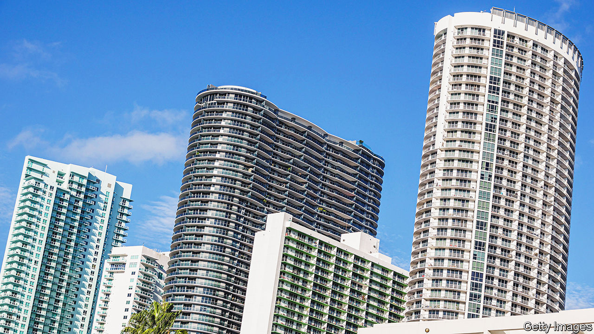
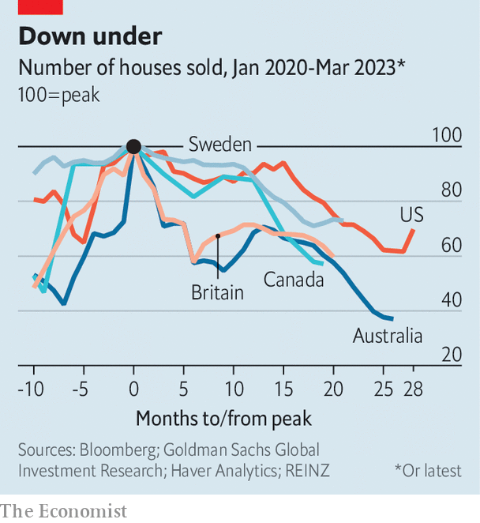

###### Pain to come

# The rich world’s housing crunch is far from over 

##### Markets can be split into three camps: early adjusters, bullet-dodgers and slow movers 

 

> Apr 2nd 2023 

At times during the long boom that followed the global financial crisis of 2007-09, it seemed as if house prices would never stop rising. Sales surged as ultra-low interest rates and supply shortages boosted competition for properties. Things are very different today. In countries across the rich world, from America to New Zealand, sales have cratered, as central banks embarked on the sharpest monetary-policy tightening in four decades. In many markets prices are now heading in the wrong direction, too, at least from the perspective of homeowners. 

Yet with the bulk of central banks’ rate rises behind them, many in the  are starting to wonder if the worst may soon be over. In March both the Federal Reserve and the Bank of England raised rates by a mere quarter of a percentage point. Markets are pricing in at most one more rise from each. The world economy has so far proved resilient to the stress of tighter policy, even as a handful of commercial banks have gone to the wall. This has given investors and homeowners hope that prices may soon hit a trough. Perhaps the  will turn out to be less terrible than expected.

 


Such optimism will probably prove unwarranted. Just as rate rises took time to hit property, so relief will come with a delay. Cushions that have softened the blow are beginning to look threadbare. Although fixed-rate mortgages, which protect holders from increased costs, are more common outside America than they used to be, most are fixed for short periods. In Britain, for instance, nearly half the fixed-rate stock is fixed for no more than two years. Indeed, more than two-fifths of mortgage-holders will move to new terms this year. Meanwhile, piles of excess savings built up during the pandemic no longer provide as much protection, having been drawn down in the years since. Surveys suggest lower-income households in the euro zone have largely exhausted their buffers.

When assessing how far prices still have to fall, the rich world can be split into three. Start with the early adjusters, which include Australia, Canada, New Zealand and Sweden. In many, central bankers were quick to respond to inflation. The countries saw house prices soar in the pandemic, as buyers gorged on cheap credit, taking out mortgages mostly on variable-rate terms. According to the oecd, a rich-country club, prices have dropped by 14% in Sweden and New Zealand since their peaks. In Australia they have fallen by 9%. Its central bank did not raise rates until May, but households entered the period with lots of debt, which averaged more than 200% of net disposable income in 2021, making them more exposed to higher interest rates. Goldman Sachs, a bank, forecasts eventual drops, relative to peaks, of 19% in New Zealand, 17% in Sweden and 15% in Australia, suggesting that a bit more pain is to come in these countries.

Next are the bullet-dodgers. The most prominent member of this group is America, where homeowners are insulated from tightening by fixed-rate mortgages that often last for two or three decades. After the subprime-lending crisis that started in 2007, regulators pushed borrowers towards such loans, which, together with stricter lending rules, are less likely to lead to mass defaults and thus blow up the financial system. According to Goldman, America has already seen half its predicted peak-to-trough drop of just 5%. Meanwhile, France, where prices held up in 2022, is predicted to see an even more paltry drop of 4%. The country benefits from low household debt, which averaged 124% of net disposable income in 2021. 

Last are the slow movers, which have not yet been hit hard, but are unlikely to escape a correction. Although prices in Britain have already fallen by 5%, worse may still be to come: Capital Economics, a consultancy, forecasts a 12% peak-to-trough drop. The country’s homebuilders are sounding the alarm. Many are holding off on new homes; some are dangling cash for buyers. Persimmon, Britain’s second-biggest builder, has even offered to pay mortgages for up to ten months, in an attempt to prop up demand. The German Property Federation, a lobby group, predicts that just 245,000 apartments will be finished in Germany this year, falling well short of the government’s target of 400,000.

Since slumping prices have been driven by higher interest rates, they are unlikely to make housing more affordable. Those who want to get on the property ladder face eye-watering monthly payments. In Canada, an early adjuster, the average buyer of a detached home now needs to spend nearly 70% of their pre-tax household income on mortgage payments, property taxes and utility bills, according to the Royal Bank of Canada, up from 46% at the start of 2020. Falling prices will always make homeowners unhappy. This time around even would-be buyers have little to cheer. ■


