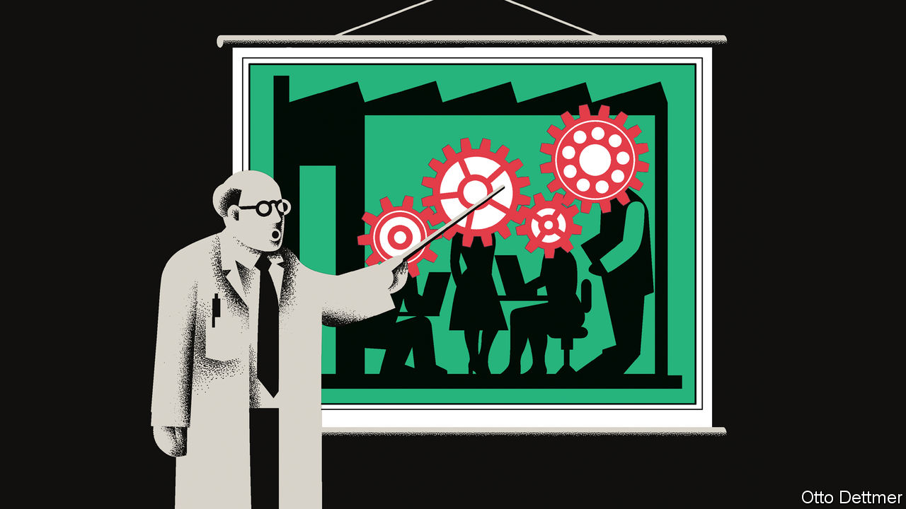

###### Free exchange

# Why economics does not understand business 

##### Dogma gets in the way 

 

> Apr 4th 2023 

It is the mid-1990s and the economics faculty at a leading business school is meeting. The assembled dons are in a prickly mood. Many are upset that business-school fields, such as marketing and organisational behaviour, enjoy a higher standing despite their apparent . That economics ought to command more respect is keenly felt. One professor can barely contain his scorn. Anyone with a good phd in economics, he declares, could comfortably teach in any of the school’s other departments. 

It is tempting to see this as a story about the arrogance of . And in part, it is. The discipline’s imperialism—its tendency to claim the territory of fields adjacent to economics as its own—is a bugbear of social scientists. Yet the professor had a point. In the 1990s economics could plausibly claim to be moving towards a unified science of business. A realistic theory of the firm was in prospect. Alas, three decades on, it is no closer.  has rich models of competition and markets. But its powers still tend to falter once inside the factory gate or office building. 

It is worth asking why. Economics is—or at least is supposed to be—about the allocation of scarce resources. In neoclassical theory, markets take centre stage. The factors of production (land, labour and capital) and the supply and demand of goods and services move in response to price signals from market exchange. Resources go to the most profitable use. 

That is the theory. It has a glaring omission, as Ronald Coase, an economist, pointed out in a paper in 1937. Much of the allocation of resources in economies occurs not in markets but within firms. The prime movers are employees. They are directed not by price signals but by administrative fiat. The theory that firms are profit-maximisers is another clash with reality. They operate in a fog of ignorance and error, noted Herbert Simon, a pioneer of artificial intelligence and decision sciences. No business could process all the information needed to extract maximum profit. Instead firms operate under conditions of “bounded rationality”, making decisions that are satisfactory rather than optimal. 

For years, economics did little to advance along the lines drawn by Coase and Simon. As late as 1972, Coase complained that his paper on the nature of the firm was “much cited and little used”. Yet almost as soon as Coase lamented its absence, a body of rigorous research on the firm began to emerge. It proceeded to flourish over the course of the following two decades. 

A key pillar of this research is the idea of the firm as the co-ordinator of team production, where each team member’s contribution cannot be separated from the others. Team output requires a hierarchy to delegate tasks, monitor effort and to reward people accordingly. This in turn needs a different kind of arrangement. In market transactions, goods are exchanged for money, the deal is done and there is little scope for dispute. But because of bounded rationality, it is not possible in business to set down in advance all that is required of each party in every possible circumstance. A firm’s contracts with its employees are by necessity “incomplete”. They are sustained by trust and, ultimately, by the threat of breakdown, which is costly to all parties. 

Where there is the delegation of tasks, there is a problem of motivation—how to get an employee to act on behalf of the firm, to be a team player, rather than narrowly self-serving. This is known in economics as the principal-agent problem, the source of much illuminating theory in this period. Incentives matter, of course, but often the best approach is for organisations to pay a fixed salary and not to tie rewards to any one task. Tie teachers’ pay to exam results, for instance, and they will “teach to the test”, instead of inspiring pupils to think independently. 

Such avenues of research would earn Nobel prizes in economics for Oliver Williamson, Oliver Hart and Bengt Holmstrom. (Coase had won the prize in 1991; Simon in 1978.) Their work explains in part why, by the mid-1990s, our business-school professor was so confident that economics should rule the study of business. The bestselling books of Michael Porter, an economist-turned-business guru, further fuelled such optimism, as did excitement about the potential for game theory in corporate strategy. Yet today if a firm hires a chief economist, it is for a take on gdp growth or the policy of the Federal Reserve. It is not for advice on corporate strategy. 

Companies excluded

There are reasons for this. One is academic prestige. Economics likes to see itself as a foundational discipline, like physics, not a practical one, like engineering. But most of what makes for a flourishing business cannot be captured in a tight theory with a few equations. Often it is a matter of how well ideas, information and decision-making spread throughout the firm. And pay is not the only motivation. Strong businesses are shaped by shared values and common ideas about the right way to do things—by corporate culture. People take pride in their work and their workplace. These are not natural subjects for economists. 

Nor is economics comfortable with the specificity of business problems. Solving them is more than a simple matter of establishing the right economic incentives. It requires detailed knowledge of technology, processes and competitors as well as social psychology and political trends. Economics is never enough. Many of the influences on any topical business issue—which tech firm will win the ai race, say—lie outside its purview. 

There are economic ideas that business people ignore at their peril. If a firm’s strategy can be freely copied, it should expect its profits to be competed away quickly. A sound business needs an edge. But beyond such precepts, economics has little of practical use to say about what makes a successful company. The study of business remains an outpost of the empire. It now seems unlikely it will ever fully conquer the terrain. ■


