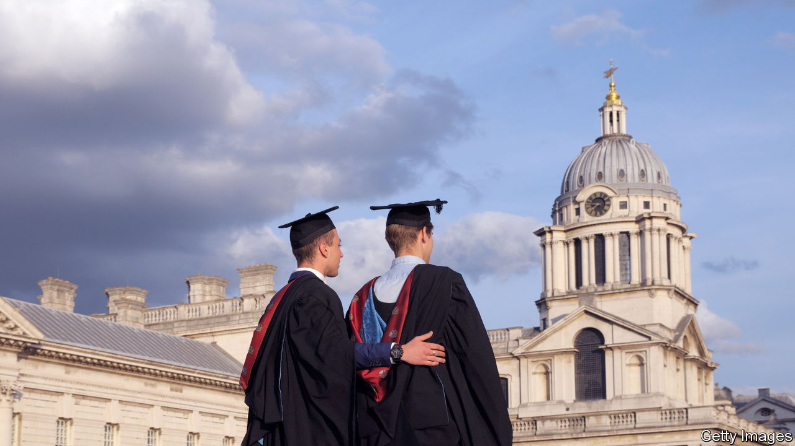
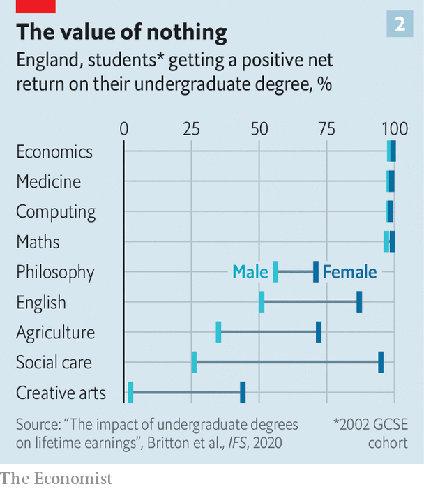
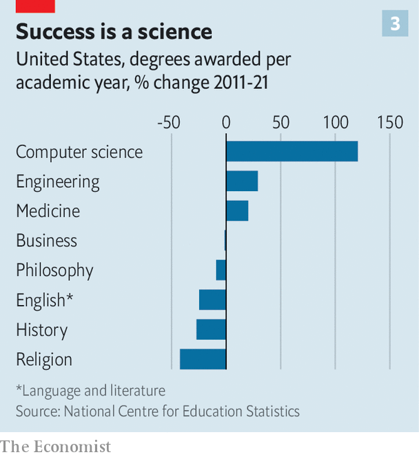

###### Useless studies

# Was your degree really worth it? 

##### Crunching the puny financial benefits of many university courses 

 

> Apr 3rd 2023 

Is university worth it? That question once seemed a no-brainer. For decades young adults in rich countries have flocked to higher education. Governments have touted college as a boon for social mobility and economic growth. Yet as fees rise and graduate earnings stagnate, disillusionment is growing. A poll published by the on March 31st suggests a crisis of confidence has worsened: 56% of Americans now believe a degree is no longer worth the time and money spent on it.

For an average undergraduate, at least, this is not consistent with the facts. In most places, for most learners, the financial returns to higher education remain extremely healthy. Yet undertaking a degree has become riskier. The rewards for the best performers are increasing, but a troublingly high share of students see negative returns from their studies. 

New data sets, such as tax records, are illuminating this dispersion like never before. They can track how much students taking specific courses, at specific institutions, earn in later life. In time that detail will help students avoid the worst pay-offs and seize the best. Choice of subject and timely graduation matter hugely; choice of institution somewhat less so. It could also be useful to governments tempted to crack down on “low-value degrees”.

A boom in graduate earnings began in the 1980s in the rich world. Back then the difference between the salaries of people who gain at least a bachelor’s degree and those who do not—commonly called the “college-wage premium”—began to soar. In the 1970s an American with a university education was earning on average 35% more than a high-school graduate. By 2021 that advantage had risen to 66%.

 


Recently the wage premium in many countries has either stagnated or begun to fall. And in places that actually charge students for their degrees, costs have gone up (see chart 1). Tuition in England has soared from nothing in the late 1990s to £9,250 ($11,000) a year, the highest in the rich world. In America, the out-of-pocket fee paid by an average bachelor’s-degree student increased from $2,300 a year in the 1970s to some $8,000 in 2018, in real terms, according to Jaison Abel and Richard Deitz at the New York Federal Reserve. (Students at public universities often pay much less; those at private non-profits can pay a lot more.)

Yet the average degree remains valuable. In 2019 Mr Abel and Mr Deitz roughly estimated the annual financial return on the money that a typical American invests in a bachelor’s degree. They conclude that the typical rate of return for a bachelor’s degree is around 14%. That has dropped from a peak of 16% in the early 2000s. But it is still a princely sum. And it is well above the 8-9% that American graduates were recouping in the 1970s, before graduate wages, and tuition fees, began to soar. These calculations include not only fees but also the money individuals might expect to earn if they were working full-time instead. 

The average hides a very wide range of outcomes, however. Until recently economists seeking to identify the winners and losers were mostly limited to surveys. The trend now is for governments, such as those of Britain and Norway, to proffer hefty, anonymised databases showing actual earnings for millions of university-goers. That makes it much easier to compare people like-for-like. The disaggregated data reveal that a high share of students graduate with degrees that are not worth their cost.

In England 25% of male graduates and 15% of female ones will take home less money over their careers than peers who do not get a degree, according to the Institute for Fiscal Studies (IFS), a research outfit. America has less comprehensive data but has begun publishing the share of students at thousands of institutions who do not manage to earn more than the average high-school graduate early on. Six years after enrolment, 27% of students at a typical four-year university fail to do so, calculate researchers at Georgetown University in Washington, dc. In the long tail, comprising the worst 30% of America’s two- and four-year institutions, more than half of people who enroll lag this benchmark.

Dropping out without any qualification is an obvious way to make a big loss. Taking longer than usual to graduate also destroys value (because it eats up years that might otherwise have been spent earning full-time). Both these outcomes are common. Across the rich world less than 40% of people studying for undergraduate degrees complete their courses in the expected number of years. About one-quarter still have no qualifications three years after that.

 


Choosing the right subject is crucial to boosting earning power. Negative returns are likeliest for Britons who study creative arts (less than 10% of men make a positive return), social care and agriculture (see chart 2). By far the best-earning degrees in America are in engineering, computer science and business. Negative returns seem especially likely for music and the visual arts. Using America’s available data to guess lifetime earnings by programme is a stretch. But Preston Cooper at freopp, a think-tank, ventures that more than a quarter of bachelor’s-degree programmes in America will lead to negative returns for most enrolled students.

What you study generally matters more than where you do it. That comes with caveats: the worst colleges and universities provide students with little value, whatever they teach. But on average people who enroll in America’s public universities get a better return over their lifetimes than students who go to its more prestigious private non-profit ones, reckon the Georgetown researchers. High fees at the non-profits is one of the reasons why.

Earnings data in Britain call into question the assumption that bright youngsters will necessarily benefit from being pushed towards very selective institutions, says Jack Britton of the ifs. In order to beat fierce competition for places, some youngsters apply for whatever subject seems easiest, even if it is not one that usually brings a high return. Parents fixated on getting their offspring into Oxford or Cambridge, regardless of subject, should take note. But there is also evidence that tackling a high-earning course for the sake of it can backfire. Norwegian research finds that students whose true desire is to study humanities, but who end up studying science, earn less after ten years than they probably otherwise would have.

Men have more reason than women to worry that their investments in higher education will be a bust. That is because they have a higher chance of earning well without a degree. University is a risk for those with mediocre school grades as they often earn less after graduation than better-prepared peers who hold the same degrees. 

In Britain the return from a degree is generally higher for South Asian students than for white ones, as they tend to study subjects such as business, and generally lower for black students (compared with what people of the same race typically earn if they do not go to university). In America, Asian students seem to have the least trouble paying off their student debts, compared with white and black students.

Marks and markets

What are the implications of all this analysis? Already there are signs that the higher-education market is evolving. People are already searching out better returns of their own accord at different educational stages. In America the number of degrees conferred annually in English and in history fell by around one-third between 2011 and 2021. The number of degrees in computer science more than doubled in that time (see chart 3). Others are skipping college altogether. The number of people enrolling has fallen every year since 2011. 

 


Institutions are also shifting by culling humanities. In February the trustees of Marymount University in Virginia voted to abolish majors in nine subjects including English, history, philosophy and theology. Calvin University in Michigan and Howard University in Washington, dc are among those which have abandoned classics. And archaeology’s future at the University of Sheffield in Britain looks precarious. 

Employers are adapting, too. Firms are becoming a bit less likely to demand that job applicants have degrees, according to analysis by Joseph Fuller of Harvard Business School, and others. Tight labour markets and a desire for more diverse workers help explain why. A few years ago some 80% of the jobs that ibm, a tech giant, advertised in America required a degree, says Kelli Jordan, one of its vice-presidents. Now it is about half. “A degree does not have to be the only indicator of skills that someone may have,” explains Ms Jordan.

Should governments amplify these trends? In Estonia one-fifth of an institution’s funding depends on meeting a variety of targets; one relates to the share of students graduating on time. Similar systems exist in Finland, Israel, Lithuania and Sweden. Australia’s government is trying to encourage learners to make socially useful choices. In 2021 it doubled what undergraduates pay to study social sciences, political science or communications and halved the fee for nursing and teaching. Students do not appear much moved yet, possibly because of the generosity of Australia’s student-debt repayment terms. Britain’s government reckons it can alter behaviour by giving everyone in England an online account listing a maximum cash sum that they are entitled to borrow from the state for studies over their lifetime. The idea is to make school-leavers more parsimonious. 

Others still splurge. President Joe Biden hopes that the Supreme Court will soon approve a plan, announced last year, to write off a big chunk of America’s student loans. He also wants a more lenient repayment system. The associated costs could mount to hundreds of billions of dollars over the next decade. Mr Biden also promises an official list of “low-financial value” courses. More compelling is talk of preventing feeble programmes from benefitting from federal student loans. But without an act of Congress this would mainly affect for-profit colleges (which enroll only a fraction of America’s learners).

To many, a growing focus on the financial returns to higher education is crude. Graduates in public service are bound to earn less than those on Wall Street. Many disciplines are worth studying for their own sake. Yet students frequently tell pollsters that improving their earning power is a priority. Good returns are vital to the poorest learners, for whom the financial burden of degrees is highest. Today bad degrees are surprisingly common. A combination of better information, market forces and smarter policy can reduce their prevalence. ■

