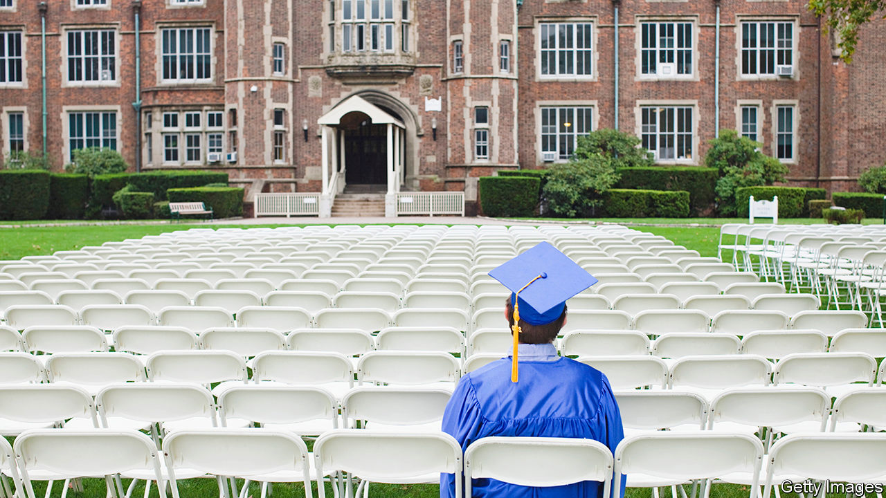

###### Higher expectations

# The university lottery 

##### Students are veering away from dodgy degrees. Governments should help them 

 

> Apr 5th 2023 

IT IS fashionable to be gloomy about the costs and benefits of a degree. In America a majority of people now tell pollsters that they think going to university is not worth it. For the average undergraduate that is far from the truth. In rich countries people who hold a bachelor’s degree earn over 40% more than those who do not. This premium has remained lofty, even as the number of university-goers has soared: some 33m people are studying undergraduate degrees across the rich world today.

Yet those average figures hide queasily . For a shocking share of students, the returns from attending university are puny. About 25% of men and 15% of women graduates in England would have been better off financially had they not bothered. In total, student debt has reached $1.6trn in America, 60% more than is owed on credit cards. Low earnings help explain why about a fifth of  were in default before the pandemic. 

Those who do worst out of higher education attend shoddy institutions, are badly prepared, give up, or  that lead to low wages. Many who do complete their courses are loaded with debt and equipped with a degree of peripheral relevance that has been taught badly. They are being ripped off, not prepared for a better life. 

The good news is that young people are voting with their feet. A dramatic shift is taking place as students switch to subjects that are linked to better earnings. In America, for example, the numbers enrolled in computer science have more than doubled in a decade. Those studying English and history, subjects that are less likely to raise wages, have fallen by about a quarter. Some universities have begun to cull courses.

Governments should seek to accelerate this adjustment in the higher-education marketplace. But all too often their instinct is to throw money at the problem. President Joe Biden wants America’s Supreme Court to approve his plan to forgive a large chunk of the country’s student debts, as a one-off. He also hopes to tweak the rules on repayment, which will make the federal loan system a bit more generous. Together these changes could cost hundreds of billions of dollars over the next decade. The danger is that they will make America’s students less discerning about how much they borrow and what they use the money for. Without a disciplining mechanism, pricey universities will be even more inclined to raise their fees.

A better alternative would be for governments to invest in giving students the information they need to make sensible choices. Britain has pulled together detailed data about how much graduates from thousands of courses at hundreds of institutions go on to earn, but it does a poor job of supplying this to all applicants. America has been working on something similar, but laws that limit federal data-crunching are getting in the way. Some youngsters, often the better-off ones, are already making good use of data. Supplying it to everyone else should be a priority. Modest spending on career counselling in secondary schools could help reduce the billions spent on writing off student loans down the line.

Governments should also be fussier about which courses their cash helps pay for. Programmes at all levels that wish to benefit from state funds should have to clear a basic quality hurdle—for example, that a majority of the students who enroll in them eventually end up earning more than high-school graduates. Mr Biden would like a limited rule of this kind to come to America. But a decade has passed since such talk began.

Some universities and colleges resist these kinds of safeguards. They argue that trying to weed out poor-value courses and to focus government lending will compromise the pursuit of knowledge and penalise poor families and minorities by limiting what they can study. However, the real problem is that the status quo is leading too many people to pursue shoddy but expensive degrees. The goal should be an education system that steadily adapts to the shifting preferences of society and the demands of the labour market—and one that has a low tolerance for degree courses that fail young people. ■

