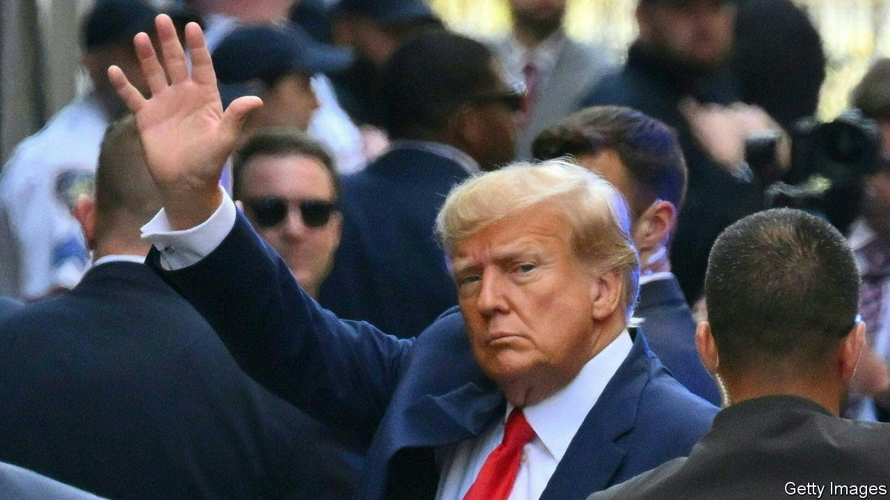

###### An American first

# What America’s friends should make of The Trump Show 

##### Reasons to be both relaxed and worried 

 

> Apr 4th 2023 

YOU HAVE to hand it to The Trump Show. Just when you thought it had little left to offer, back it comes with a blockbuster episode. This week it offered a sensational courtroom drama, as Donald Trump became the first former American president to face —34 of them in all. Those charges, which stem from three sets of hush money, including one to a former porn star, allegedly involved falsifying business records and the violation of campaign-finance laws. They are familiar, but lurid enough to grip an audience. Mr Trump has denied them all. America is, as ever, bitterly divided in its reactions, but united in being glued to the spectacle. What should the rest of the world make of it? Two contrasting  are in order.

One is to be relatively relaxed. All this may be a first for America, but not for other democracies, where taking former leaders to court is pretty common. From France (think of Jacques Chirac and Nicolas Sarkozy) to Italy (Bettino Craxi, Silvio Berlusconi) and Israel (Moshe Katsav, Ehud Olmert and now ), the list of prosecuted former presidents and prime ministers is long. In Taiwan indicting ex-presidents verges on a tradition. Brazil’s president, Luiz Inácio Lula da Silva, is back in office after a 580-day stint in prison. This week a former president of Kosovo, Hashim Thaci, pleaded not-guilty to war crimes and crimes against humanity at a special tribunal in The Hague. Though Mr Trump calls his legal reckoning “an attack on our country the likes of which has never been seen before”, elsewhere such things have not obviously been a disaster for democracy. Often, it is quite the reverse.

True, Mr Trump’s opponents have tried and failed to take him down by means of the political system. The House of Representatives impeached him twice; twice the Senate could not muster the two-thirds vote needed to convict him. America’s constitution deliberately makes the impeachment process hard. Mr Trump survived the made-for-TV hearings of the House’s January 6th committee. Now the effort to punish him through the courts is starting with what appears to be the flimsiest and most convoluted of the various legal cases threatening him. For that reason, the indictment in New York looks like a mistake. But prosecuting a former president at least affirms a core principle of democracy, that no one is above the law.

Serious soap

On another level, however, America’s friends should be alarmed. Many have spent the past two years in blessed relief that Mr Trump is no longer in power, desperate to believe that, surely, given his misconduct after the election in 2020 and his many troubles (from legal jeopardy to electoral setbacks and the rise of rivals), he cannot return to the White House. Such insouciance, always naive, now seems reckless, too. The latest attack has  Mr Trump’s status as the Republican front-runner, with a hard but plausible path back to the presidency . That will start to influence countries’ calculations.

Take Ukraine. Its leaders will conclude that the possibility of Mr Trump’s return to power makes it all the more vital to achieve military gains sooner rather than later. In Moscow Vladimir Putin will draw the opposite conclusion, that he should hold out for a time when Ukraine’s main Western backer might have a commander-in-chief who scorns the country and says Russia will eventually conquer all of it. Or take NATO. Many have feared a second-term Trump would abandon it. Fortunately, Russia’s aggression has strengthened the alliance and expanded it. On the day Mr Trump appeared in court, Finland formally became NATO’s 31st member. All of them now have a greater interest in fortifying the alliance to withstand another Trump shock.

Of course, a lot could happen to prevent a new White House series of The Trump Show. Now that the Manhattan case has created an American precedent for indicting a former president, it becomes more likely that other, stronger cases will follow—on election interference in Georgia, for example, or on his mishandling of classified documents. Legal imbroglios could yet overwhelm Mr Trump. Even if he wins his party’s nomination, thanks to his strength with the Republican base, the broader electorate may punish him in a rematch with Joe Biden. More twists in the soap opera are guaranteed. But America’s friends should remember the awful truth: it is reality, not a show. ■


