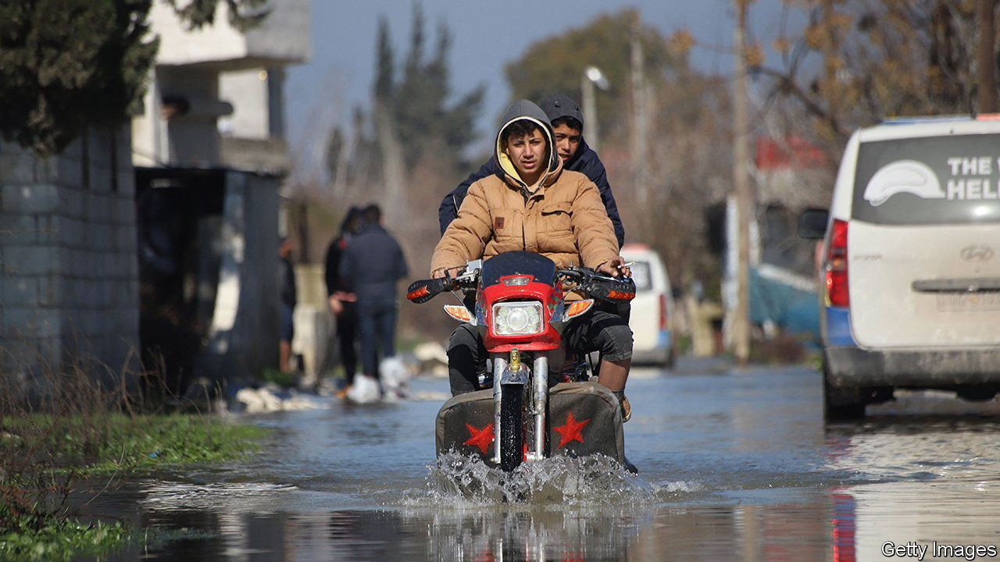
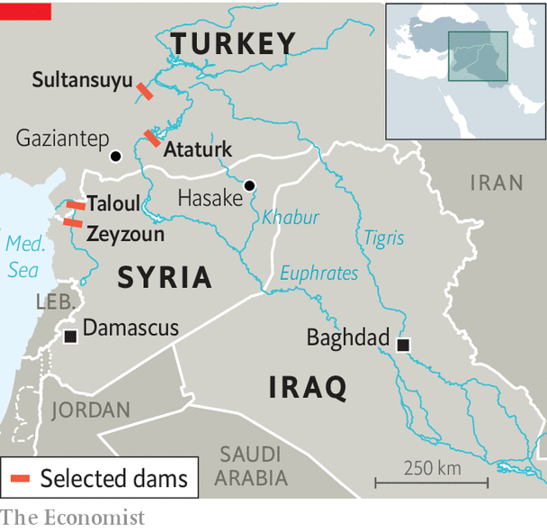

###### Dam-nation

# February’s earthquakes have damaged the Middle East’s dams 

##### They were already in a fragile state 

 

> Apr 5th 2023 

The turkish authorities announced on March 30th that 140 dams had been inspected since  hit southern Turkey and northern Syria in February. None, they insisted, was seriously damaged. Still, many in the Middle East remain fearful about the state of the more than 860 dams along the Euphrates and Tigris rivers and their tributaries.

un officials say that, since the earthquakes, fractures have appeared in eight dams in the region including three in Syria. The Taloul dam in the Syrian province of Idlib, already devastated , was struck by an aftershock and burst on February 8th. The flood washed away this year’s harvest and filled the streets with debris. Thousands fled. Cracks over a metre wide have been seen in the Sultansuyu dam 200km north of the Syrian border, prompting the Turkish authorities to discharge its waters as a “precautionary measure”. Engineers, however, say the dam is damaged beyond repair.

 


Taloul is one of the Middle East’s smaller and shoddier dams and is made of compacted earth. No concrete dam has ever failed as a result of earthquakes, points out Jonathan Hinks, a former chairman of the British Dam Society and an editor of a book on earthquakes and dams to be published this year. Fears that Turkey’s vast Ataturk Dam, the world’s third-largest, had been damaged in the recent quakes proved unfounded. 

Others are less confident. Many dams in the region are made at least partly of earth. In such barriers even small leaks can lead to a build-up of pressure that can wash them away, says Ceyhun Ozcelik, a professor of engineering from Gaziantep, a city near the recent earthquakes’ epicentre. Two decades ago, the Zeyzoun dam in northern Syria crumbled in hours, inundating nearby villages. The region’s high dams (those at high altitudes with high walls) are hundreds of times larger. And years of war mean many in Syria and Iraq are in disrepair. 

The dams themselves can induce seismic activity when the water pressure builds near tectonic faults. About 140 quakes seem to have been caused in this way globally since the 1960s, in at least one case killing thousands. 

After February’s earthquakes and then heavy rains, Turkish officials eased the pressure on dams by lowering water tables. Rivers that had dried up because of the dams turned to torrents. In the city of Hasake in north-eastern Syria the Khabur river ran through parched farmlands for the first time in years. Islands that had surfaced in the Tigris in Baghdad, Iraq’s capital, briefly sank again. It is a sign of the region’s sclerotic management of its waterways that it takes earthquakes to get them flowing.

