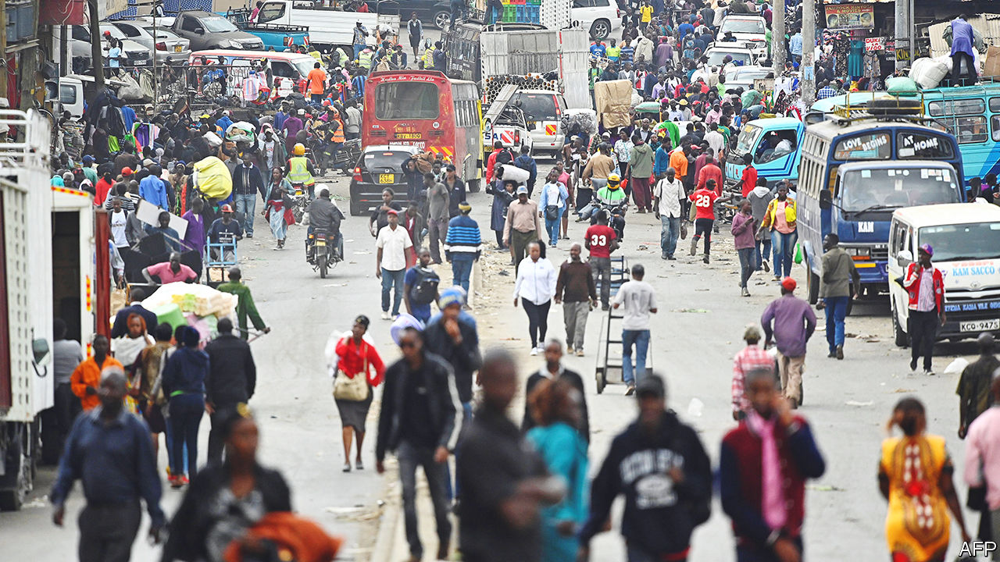
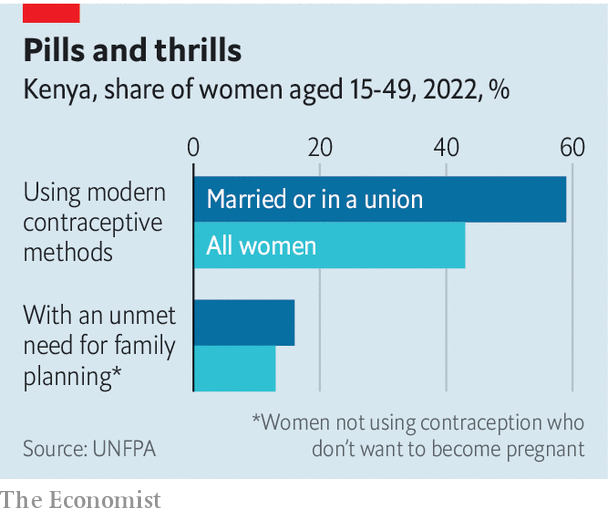

###### African demography

# Kenya’s population growth is slowing in cities and towns 

##### The country has six times the people it did at independence in 1963 

 

> Apr 5th 2023 

Eastleigh, a neighbourhood of Nairobi, Kenya’s capital, is a thrumming hive of hawkers, honking cars, belching lorries, potholed pavements, jostling pedestrians and legions of young men loafing around, clearly out of work. “Too many cars, too many people,” tut-tuts Charles Mwangi, a taxi driver from another part of the sprawling city, which overall has grown in population from 361,000 at independence in 1963 to some 5.3m today. 

Eastleigh is the urban hub of ethnic Somalis, who make up nearly 6% of Kenya’s population and are among its fastest expanding groups. At last count, women in the mainly Somali counties of the arid north-east, many of whom drift into the city, still on average bear more than seven children each. This rate is common elsewhere across northern Kenya, where drought, conflict and poverty dangerously persist. It is also high in some parts of the west, near Lake Victoria, where polygamy among some groups is still common. 

 


Kenya’s population has grown at breakneck speed. At the end of the 19th century, when British colonisers first imposed themselves, the populace may have been as small as a million or so. Kenya’s first formal estimate, in 1921, put it at under 3m. At independence in 1963 it had hit 9m, and it is now close to 55m. At this rate the population could hit 85m by 2050, according to the UN, which would be “completely unsustainable”, laments a conservationist who promotes the co-existence of wildlife and people, particularly dirt-poor pastoralists. 

Yet Kenya’s fertility rate has been dropping sharply, from 6.7 children per woman in 1989 to 3.4 last year, according to a recent demographic and health survey. It also shows a marked difference between town and countryside. On average, urban women are expected to have 2.8 babies each, which is one fewer than the 3.9 of their rural cousins. Among the burgeoning middle class, two children is becoming the norm.

The survey hints at how this is being achieved and at the challenges that remain. Overall 57% of married women use modern contraceptives, with even higher proportions in counties surrounding Nairobi. Yet Mandera county, up against the Somali border, has a fertility rate of eight. Just 2% of married women there use birth control, which is frowned upon by many Kenyan Muslims and evangelical Christians.

A former president, Mwai Kibaki, who stepped down in 2013, regularly spoke out in favour of family planning. But William Ruto, elected to the post last year, has so far been notably silent on it. 

