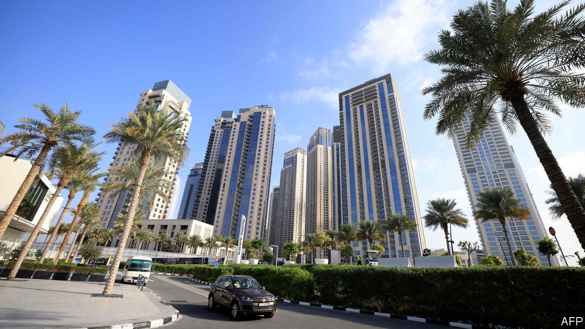

###### A real estate boom in the Gulf

# Russians have helped make Dubai’s property market red hot—again 

##### High energy prices and a Russian influx mean rents and prices are soaring 

 

> Apr 5th 2023 

Too much good news can be a bad thing. Dubai, the commercial capital of the United Arab Emirates (UAE), has had  in the past two years. Lax restrictions during the pandemic lured expats. Russia’s invasion of Ukraine brought another influx of new residents.

High oil prices have . Restaurants and bars are heaving. Rush-hour traffic is back to pre-pandemic levels. Public transport moved a record number of passengers in February.

For some residents, though, the good news is grating. Annual inflation hit a 14-year high of 7.1% last summer, partly due to soaring petrol prices (unlike other Gulf states, the UAE does not subsidise fuel). It has since dropped to less than 5%, below many other rich economies. But the headline number does not tell the full story.

Official inflation figures for 2022 showed just a 0.6% increase for housing and utilities, which make up 41% of the consumer-price index. These track all leases, however, so do not reflect recent rises in rents; many in Dubai are feeling steeper increases. Apartment rents rose by 28% in the year to February, to almost 100,000 dirhams (about $27,200), estimates CBRE, a property firm. 

Three factors explain the surge. One is demand, from Russians and other new arrivals. Many seek to live in Dubai’s most fashionable areas. On Palm Jumeirah, an artificial island in the Gulf, a two-bedroom flat that rented for 100,000 dirhams two years ago can now fetch 215,000 dirhams.

Next is a booming property-sale market. At around 1,200 dirhams a square foot, apartment prices are at their highest in almost a decade. Some investors who bought homes early in the pandemic flipped them, two years later, for profits of 50% or more. Rising prices have made some landlords unscrupulous, asking for rental increases beyond the 20% per year allowed by law.

Dubai’s property market has much to recommend it, from low taxes to a vast pool of would-be renters. But some wonder if the sector, the backbone of Dubai’s economy, is again becoming a bubble. The city has already endured two real-estate crashes this century: an abrupt one during the financial crisis in 2008, when property values fell by half, and a slower one from 2014 to 2020, when they slid by 35%.

Buyers are still piling in, but some rental rates may be peaking. In popular areas like the Palm and downtown Dubai, they were either flat or declined in February, according to CBRE. Instead they grew in less desirable inland areas—suggesting that renters are voting with their feet. 

Other prices are climbing. Annual food and drink inflation was above 6% in February. The UAE imposed price caps in 2022 on a few staples. Petrol prices, though reasonable by global standards, hit a record last summer. Authorities  after it covered the issue. School fees are a burden for expats.

Despite its reputation as a modern-day El Dorado, salaries in Dubai are not keeping pace with rising prices. Cooper Fitch, a consultancy, estimates that they will increase this year by only around 2%.

Some of this galloping inflation should be temporary. Rental prices may drop as landlords temper expectations and new homes enter the market. 

Some economists argue that the uae should try to ease the tax burden on residents and firms. It introduced a 5% value-added tax in 2018, and in June it will start to collect a 9% corporate levy. Even as it introduces formal taxes, it has kept many of the fees that amount to stealth taxes, like a steep housing surcharge added to electricity bills in Dubai. In January the emirate did suspend its 30% tax on alcohol—comfort, perhaps, for residents who want to forget their new rental contracts. ■

