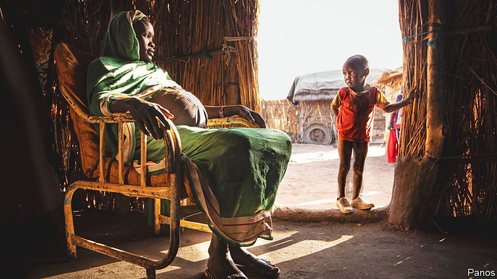
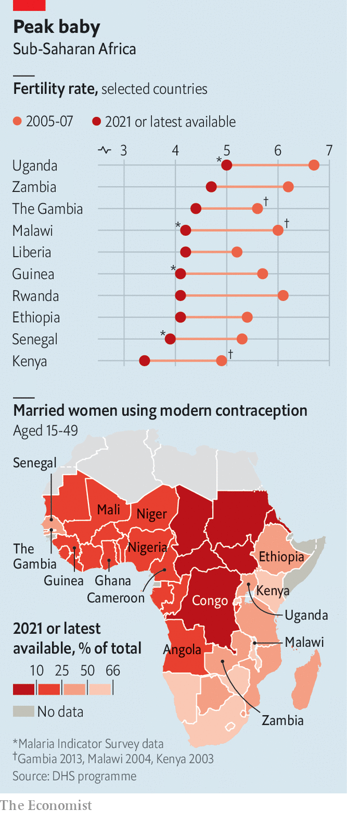

###### Africa’s slowing baby boom

# The world’s peak population may be smaller than expected 

##### New evidence suggests Africa’s birth rates are falling fast 

 

> Apr 5th 2023 

“I have ten children,” says Rahama Sa’ad squatting outside her shack on the outskirts of Kano, the biggest city in northern Nigeria. “It’s the will of God,” she explains, as chickens, children and grandchildren scramble around her. In northern Nigeria big families are easy to find. Abdulkadar Dutse, a local businessman in Kano, is one of 35 siblings split among the four wives of his father. 

Such stories of big families inform much of how the world thinks about sub-Saharan Africa, not just now but over coming decades. At conferences and in cabinet meetings across the continent, politicians and policymakers fret about how to educate, employ, house and feed a population that the UN expects to grow at breakneck speed from around 1.2bn people now, to 3.4bn people by 2100. In southern Europe, populists stoke up fears that hundreds of millions of Africans may try to cross the Mediterranean to escape poverty, war or hunger. Across the rich world, environmentalists fear the impact on the climate and planet of an extra 2bn people.

Yet few have noticed a wealth of new data that suggest that Africa’s birth rate is falling far more quickly than expected. Though plenty of growth is still baked in, this could have a huge impact on Africa’s total population by 2100. It could also provide a big boost to the continent’s economic development. “We have been underestimating what is happening in terms of fertility change in Africa,” says Jose Rimon II of Johns Hopkins University. “Africa will probably undergo the same kind of rapid changes as east Asia did.”

The UN’s population projections are widely seen as the most authoritative. Its latest report, published last year, contained considerably lower estimates for sub-Saharan Africa than those of a decade ago. For Nigeria, which has Africa’s biggest population numbering about 213m people, the UN has reduced its forecast for 2060 by more than 100m people (down to around 429m). By 2100 it expects the country to have about 550m people, more than 350m fewer than it reckoned a decade ago. 

Yet even the UN’s latest projections may not be keeping pace with the rapid decline in fertility rates (the average number of children that women are expected to have) that some striking recent studies show. Most remarkable is Nigeria, where a UN-backed survey in 2021 found the fertility rate had fallen to 4.6 from 5.8 just five years earlier. This figure seems to be broadly confirmed by another survey, this time backed by USAID, America’s aid agency, which found a fertility rate of 4.8 in 2021, down from 6.1 in 2010. “Something is happening,” muses Argentina Matavel of the UN Population Fund. 

If these findings are correct they would suggest that birth rates are falling at a similar pace to those in some parts of Asia, when that region saw its own population growth rates slow sharply in a process often known as a demographic transition. 

A similar trend seems to be emerging in parts of the Sahel, which still has some of Africa’s highest fertility rates, and coastal west Africa. In Mali, for instance, the fertility rate fell from 6.3 to a still high 5.7 in six years. Senegal’s, at 3.9 in 2021, equates to one fewer baby per woman than little over a decade ago. So too in the Gambia, where the rate plunged from 5.6 in 2013 to 4.4 in 2020, and Ghana, where it fell from 4.2 to 3.8 in just three years.

 


These declines bring west Africa closer to the lower fertility rates seen in much of southern Africa. Dropping rates have already been celebrated in places such as Ethiopia and Kenya (see chart). 

Demographers are divided over how much to read into these recent surveys, particularly since the data they produce can be noisy. ”When you see a precipitous decline in fertility, your starting-point is that something is wrong with the data,” says Tom Moultrie of the University of Cape Town. Some point out that survey responses in Africa on desired family size have fallen little, though not all recent surveys ask that question. Other demographers reckon the data point to real changes. Still, many caution against comparing rates across different sorts of polls. Yet even comparing only within iterations of the same survey (as  has done with the figures above), the trend is evident. Comparing across them in the case of Niger, which has the world’s highest fertility rate but few surveys, shows a decline from 7.6 in 2012 to 6.2 in 2021.

Others are also reducing their projections. In 1972 the Club of Rome, a think-tank, published an influential book, “The Limits to Growth”, warning that consumption and population growth would lead to economic collapse. Now it says the population bomb may never go off: it reckons sub-Saharan Africa’s population may peak as soon as 2060, which is 40 years earlier than the UN’s projections. 

Even so, fertility rates are not dipping uniformly. Some countries, including Angola, Cameroon and Congo, are seemingly stuck at relatively high rates. And there are often big regional differences within countries such as . Almost everywhere in Africa, fertility rates are much lower for urban women, who typically have 30-40% fewer children than those in the countryside.

Demographers would be more inclined to agree that these fertility declines are real and likely to continue if they could easily identify their causes. In Ethiopia, Kenya and Malawi, past plunges have been strongly associated with higher use of contraception, often thanks to big government pushes. In Malawi and Kenya well over half of married women use modern contraception such as the pill or injectables, while in Ethiopia about 40% do. The use of such methods is markedly lower in west Africa (see map), but improvements from a low base are probably part of the reason for the fertility drops. In Nigeria contraception use has gone from 11% to 18% in the past five years. In Senegal it has doubled to 26% in the past decade. 

Family planning, especially when promoted by outsiders, has often caught the ire of religious leaders. Yet in some places that may be changing. Clerics talk more often about family planning these days, notes Amina Mohammed, a devout mother on the outskirts of Kano. “There is no verse in the Holy Koran where Muslims are forbidden from controlling, planning or restricting the number of children they have,” says Shuaib Mukhtar Shuaib, one such cleric. The Prophet Muhammad tacitly approved of the withdrawal method, he continues. These days Idris Sulaiman Abubakar, a gynaecologist in Kano’s biggest public hospital, is more worried about the impact of Nigeria’s film industry on contraception than that of religion. “They’ll bring a story-line that the woman’s reproductive system was damaged because she uses pills,” he explains. 

Girls’ education also makes a big difference to fertility rates. In Angola, for instance, women without any schooling have 7.8 children, whereas those with tertiary education have 2.3. Educated women have a better chance of a job, so the opportunity cost of staying at home to look after children is higher and they are more likely to win arguments with their husbands over how many kids to have. 

Research by Endale Kebede, Anne Goujon and Wolfgang Lutz of the Wittgenstein Centre for Demography and Global Human Capital suggests that a stall in Africa’s demographic transition in the 2000s may have stemmed from the delayed effect of cuts in spending on education in the 1980s, when many African economies were in crisis. The rapid falls in fertility rates that now seem to be taking place could be because of the huge push to improve girls’ schooling in the past few decades.

Economists tend to think that poor families have more children to ensure that some survive to look after their parents in old age. But that logic may be changing, too. Zainab Abubakar, a 30-year-old mother wrapped in a blue hijab in the outskirts of Kano, has two kids but does not want any more. “The cost of living is high,” says Ms Abubakar, who sells charcoal.

She is not alone. When the economy in Nigeria soured between 2013 and 2018, the number of women wanting no more kids jumped from 19% to 25%. As the costs of raising children rise, more parents worry about being able to educate them. “We are trying to make our children productive,” explains Ms Abubakar, when asked why she does not want more of them. Even rural Nigerians are thinking about the trade-off between having many poorly-educated kids or fewer ones with better job prospects, says Funmilola Olaolorun of the University of Ibadan.

The end of baby-kissing politics

Leaders may also play a role. In Uganda, President Yoweri Museveni used to tell students: “Your job is to produce children.” Now he tells Ugandan women that lots of pregnancies will “weaken your bodies and many children are not easy to manage and nurture.” President Mohamed Bazoum of Niger made the “fight on demography” the core of his election campaign. In Nigeria, funding for family planning is low but President Muhammadu Buhari recently created a National Council on Population Management, underscoring “the urgency to address Nigeria’s sustained high fertility rate, through expanding access to modern family planning”. 

In the past many African politicians were suspicious that Western eagerness to promote family planning was a ruse to keep African countries from growing populous and strong. Such attitudes are rarer these days. Alas, another form of muddle-headed thinking has taken root among Western environmentalists, who link Africa’s population growth to climate change.

Yet wealthy Westerners cause many times more greenhouse-gas emissions than Africans do. That “we should have fewer Africans so we can drive polluting cars seems to me a really odd ethical position to take,” points out David Canning of Harvard University. Worries about African migration to Europe also seem peculiar, since the EU and Britain are expected to be short of about 44m workers by 2050, even with normal migration flows. 

Misguided Western worries aside, the implications of continued or accelerated declines in fertility rates are enormous. For a start, Africa’s population—and therefore the world’s—would be considerably lower than most current projections. Take Nigeria. If the latest surveys are correct in finding that its fertility rate was 4.6 in 2021, this would suggest that it was already at a lower bound of the UN’s estimates and on a much lower fertility trajectory than the UN’s main forecast. Assuming Nigeria stays on the lower trajectory, then its population would get to about 342m people in 2060. That is some 90m people fewer than the UN’s current base estimate and some 200m fewer than it forecast ten years ago. 

This is good news, though not, as some would have it, because Africa is overcrowded. In fact sub-Saharan Africa has an average of 48 people per square kilometre, which is far lower than Britain (277), Japan (346) or South Korea (531). Of sub-Saharan Africa’s five most populous countries, all are below Britain’s density. There is little evidence of whole African countries being stuck in a Malthusian trap, named after Thomas Malthus, who claimed population growth would outstrip food supply, leading to catastrophe. Trade and global food production, which is rising while the amount of land used for it is falling, means that neither sub-regions nor even countries need be self-sufficient provided their economies produce the wealth to buy it. 

Nor is it because high population growth necessarily means economic growth per head is low. “It’s not very clear that we have the data to be able to say for sure that the population growth rate itself is bad or good,” says Anne Bakilana of the World Bank. Richer places have fewer children and higher savings rates. But teasing out the causality is tricky.

What is clearer is that the transition from high population growth to a lower one can bring a bevy of benefits. Women and children are both more likely to prosper as fertility rates fall. Fertility drops usually mean wider gaps between births and fewer teenage pregnancies: both help reduce risks to a mother’s health. And falling fertility rates mean there are more working-age adults relative to the number of children. With fewer mouths to feed at home, each child is more likely to get enough food, as well as books and uniforms for school. At the national level smaller cohorts could allow governments to spend more per child. 

Falling fertility rates also excite economists because they boost both the working-age share of the population and the number of women in the workforce. More people working should boost prosperity. The faster fertility rates fall, the bigger the impact. A study in 2017 by Mahesh Karra and David Canning of Harvard University and Joshua Wilde of the University of South Florida estimates that lowering the fertility rate by one child per woman in Nigeria could almost double income per person by 2060. Yet for countries to reap a big dividend, those entering the job market need to be able to find productive jobs—a monumental challenge in a continent that must invest trillions of dollars in the infrastructure (such as roads, power lines and ports) needed to generate them. 

Fertility numbers seem dull when set against the drama of elections, conflict and economic helter-skelter. Yet in survey after survey Africa’s biggest story of the future may be quietly unfolding. ■

