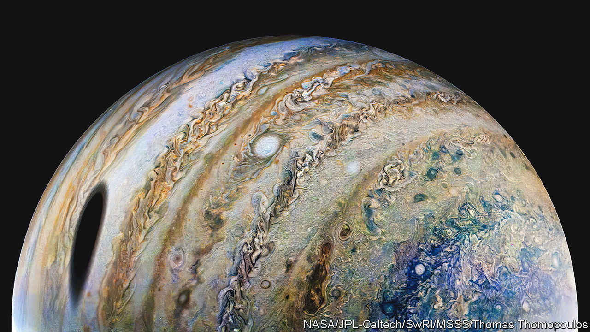

###### Astrobiology

# Icy moons with vast oceans are the latest candidates for alien life 

##### A new mission to Jupiter will examine three of them 

 

> Apr 5th 2023 

Astrobiology is a branch of science that, for now, lacks anything to actually study. Despite this lack of research subjects, however, the search for life beyond Earth has a few rules of thumb. The most important is “follow the water”. The unusual chemical properties of water make it vital for life on Earth. And, since the laws of chemistry are the same everywhere, it is not unreasonable to think that water may play the same role on other planets too.

For most of the space age that insight led scientists to Mars. Although the planet is today a frigid desert, there is plenty of evidence that it used to have oceans on its surface like Earth’s. That is one reason why, these days, Mars is lousy with landers, rovers and orbiting probes looking, among other things, for any ice or patches of liquid that may have survived. 

More and more, though, planetary scientists are following the water to other places—and in particular to the so-called “icy moons” that orbit Jupiter, Saturn, Neptune and Uranus, the solar system’s quartet of giant gas planets. Many of those moons are either known or suspected to have oceans beneath their icy shells, kept liquid by gravitational squeezing from the planets they orbit.

On April 13th, if all goes well, a new spacecraft will blast off from French Guiana en route to Jupiter with the aim of investigating some of those watery moons up close. The European Space Agency’s Jupiter Icy Moons Explorer (given the slightly contrived acronym “”) will slingshot once around Venus and three times around Earth before arriving at Jupiter in 2031.

Jupiter is by far the most massive thing in the solar system besides the Sun itself. Its vast gravity has attracted at least 95 satellites, making the Jovian system a sort of solar system in miniature. Four of its moons are big enough that Galileo Galilei, an Italian astronomer, was able to see them with a rudimentary telescope in 1610. will investigate three of the so-called Galilean moons—Callisto, Europa and Ganymede, all of which are thought to have subsurface oceans. (The fourth, Io, is arid, and so not of interest.)

Ganymede is the probe’s primary target. Despite being a moon, it is bigger than the planet Mercury. Its subsurface ocean may contain more water than all of Earth’s oceans combined. The probe’s cameras will add much more detail to the existing, low-resolution maps of Ganymede’s surface. An ice-penetrating radar will scan several kilometres below the ground.

Wonder if we’ll ever know

A magnetometer will take advantage of the fact that Ganymede, apparently uniquely among the solar system’s moons, has a weak magnetic field that interacts with the much bigger field generated by Jupiter itself. The subtleties of that magnetic field were an early clue for the existence of an ocean, hinting at the presence of a large chunk of conductive fluid—such as salty water—beneath the surface. Better readings of the magnetic field will help scientists estimate just how big the ocean is.

But when it comes to life, water alone is not enough. Life is self-organising chemistry, and on Earth it requires access to several different elements besides the hydrogen and oxygen that make up water. (A common shortlist adds carbon, nitrogen, phosphorus and sulphur.) 

Rocky worlds such as Earth have these elements in abundance. Enceladus, an icy moon of Saturn, has at least some. In 2008 a probe named  detected complex chemicals in plumes of water spewing into space from cracks in the moon’s surface.

Whether Ganymede’s oceans have a similar chemical endowment is one of the biggest questions about the moon, says Leigh Fletcher, a planetary scientist at the University of Leicester, and one of the scientists working on the mission. If the bottom of the moon’s ocean is in contact with its metal-rich core, then other elements may be able to leach their way into the seawater. If it is not—if, for instance, the bottom of the ocean is covered with ice—then that raises the chance that, despite all the water, the moon is sterile.

Nor is the only probe on its way to Jupiter. Next year NASA will launch , focused, as its name suggests, on Europa. Despite its later launch, it will take a quicker route to Jupiter, arriving a few months before . And, because there are limits to what can be discerned from orbit, both NASA and the Europeans are sketching plans for future landers that would descend to the surface of such moons to sample the seawater directly.

It’s the freakiest show

All this effort will have ramifications beyond the solar system, too. The past 20 years have seen the rapid growth of “exoplanetology”, the study of planets around stars other than the Sun. Besides the moons, will also study Jupiter itself. Astronomers now know that gas giants are common around other stars. A better understanding of Jupiter should help interpret data from other star systems too.

And exoplanets are another topic of great interest to alien-hunters. Scientists have already made measurements of exoplanet atmospheres, looking for suggestive signs of life on the surface. The best candidates so far have been rocky, Earthlike planets orbiting their stars in the “habitable zone”, the thin band of space—not too close, and not too far away—in which the star’s heat keeps surface water liquid.

An alien astronomer studying Earth’s solar system would conclude that the habitable zone around the sun stretches roughly from the orbit of Venus to the orbit of Mars, with Earth in the middle. But the growing interest in the solar system’s watery moons suggests that the original definition is far too restrictive. 

All four of the solar system’s gas giants are either known or suspected to have watery moons of their own. There is even some evidence that the same may be true for Pluto, a dwarf planet that orbits in the frigid darkness beyond the orbit of Uranus. 

Assuming that gas giants in other star systems also have moons—and there is no reason to assume they do not—that drastically raises the number of places in the galaxy in which life could have arisen. ■


