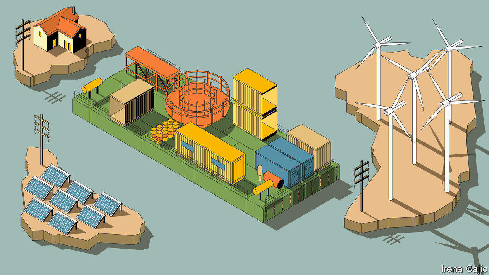

###### Direct delivery

# Electric grids fed by renewables need a different kind of plumbing 

##### And a whole different kind of switch 

 

> Apr 5th 2023 

When you hear the word “transistor”, you probably think of the little on-off switches which sit in their millions on silicon chips. If a name comes to mind it is probably William Shockley, the Bell Labs researcher who invented that particular sort of semiconductor device in 1947, or Gordon Moore, who first spotted the trend for them to get smaller, cheaper and better all at once (and who died in late March).

When a power engineer hears the word, though, they may well think of switches built for brawn, rather than miniaturisation, and of Bantval Jayant Baliga. Born in Chennai in 1948, Mr Baliga applied the principles of semiconductor physics to the control of currents, rather than to calculations. In 1980, while working for General Electric, an American conglomerate, he patented a new kind of semiconductor which is quietly changing the world: the insulated gate bipolar transistor (IGBT). 

Like all transistors, IGBTs are on-off switches controlled electronically. They make it possible to apply fine-grained electronic control to switching high voltages and large currents. This improves the world in all sorts of ways. Mr Baliga is particularly proud of what has been achieved by using them in internal-combustion engines. Estimating, quite reasonably, that their use in ignition systems has made the world’s cars 10% more efficient, he argues that they reduced demand for gasoline by a staggering 42bn barrels between 1990 and 2020. His calculation ignores the fact that with less efficient cars people might have driven less far. But it is hard to begrudge him the oversight, especially since his invention is not yet done helping the climate. 

The alternating currents used in grids have lots of advantages. But they are not good for sending a lot of power over long distances. Long-distance AC lines require booster stations along their length to make good the losses imposed by the magnetic fields that are generated in the process of transmission. Long-distance direct-current (dc) lines have no such losses to make up. This attribute saw people experiment with them all over Europe in the late 19th and early 20th centuries. The technology was incredibly cumbersome and unreliable, and the other advantages of AC grids saw them continue to dominate distribution. But DC connections held out in a few marginal niches, biding their time. 

Converting ac to dc was one of many jobs in which the vacuum tubes used in the first half of the 20th century were replaced by semiconductors in the second half. They offered improvements, but they still had problems—one of which was that it required the full power of an AC grid to get high-voltage dc (hvdc) lines going. When China built HVDC lines to bring solar and wind power from the north and west to the eastern seaboard in the 2010s it had to build coal-fired power plants alongside them to start them up. 

The warp cores

Technology which uses IGBTs does not have that problem. It also offers much more flexible switching, making the conversion process much easier, and takes up less space. That has proved quite the advantage. Mr Holt, the Siemens Energy board member, says that 99% of the HVDC systems now sold are based on IGBTs. And its attractions are also making the overall market larger. hvdc is not just a way to link far-off generators to existing grids, as in China and a number of developing countries with big, remote dams. It can also provide bridges from one part of a grid to another, thus easing congestion. And it can link together grids that could never be united into a single AC system.

By the standards of semiconductors, IGBTs in action are an impressive sight. In the main hall at the Blackhillock HVDC converter station in Aberdeenshire, in Scotland, they hang from the ceiling, mated to other components in great metal banks which are threaded and wrapped with veins of coolant. When Blackhillock is operating, no one can enter the hall lest the enormous voltages flowing through these valves, as they are still called, determine that living flesh is the quickest route to ground. Your correspondent was only able to see them thanks to a maintenance break. 

If the valves look like a cross between a server rack and an outsized engine, the appearance is not all that deceiving; this is where current meets computation. The valves, which Hitachi Energy makes using IGBTs from a specialist manufacturer, use components called capacitors to store small amounts of electric charge for brief periods of time. The igbts control the charging and discharging in such a way as to turn the ac input into a continuous dc output. They can also work the other way round, charging and discharging the capacitors in a way which turns incoming DC into AC.


Blackhillock is the south end of an hvdc link which runs under the Moray Firth to Caithness, in Scotland’s north. The growth of wind farms across Caithness has outstripped the capacity of the local grid; to keep it stable some of the farms are turned off on windy days and their owners reimbursed for the electricity not sold. In 2021 such curtailment payments in Scotland reached £382m. The Caithness-Moray link provides that electricity with a new route south, reducing curtailment and giving relief to the grid.

Linking one point on a synchronous AC grid to another, as the Caithness-Moray link does, is an increasingly popular way to relieve grid congestion without building out new AC capacity (reinforcing the AC grid throughout the Highlands would have been much more expensive). Such links do not just help the operators; they help consumers, too. Before the Alegro interconnector was completed in 2020, grid congestion frequently meant that the cheapest electricity being generated in Germany could not get to Belgium except through the Netherlands or northern France. Providing a direct link has reduced prices in both markets. Many such congestion-relieving schemes are under construction in Europe. 

Another application of HVDC is to connect independent grids that cannot simply be merged into a bigger synchronous system. The North Sea Link, an HVDC cable between Kvilldal, on Norway’s west coast, and Blyth, on England’s east coast, allows energy to flow between Statnett, Norway’s grid operator, and Britain’s National Grid. At 720km (450 miles) it is currently the longest subsea electrical cable in the world. But it won’t be for long. Viking Link, currently under construction between Lincolnshire, farther south in England, and Jutland, in Denmark, will soon take its crown. 

The technology is also being used, as in the past, to plug far-flung renewables into the grid. Even when the sophistication of IGBTs is not needed (for example in links where current will only ever flow one way) their small footprint stands them in good stead; space is at a premium on offshore platforms. Sometimes, though, their sophistication matters. “Multiterminal” HVDC, only possible with the flexibility and control offered by IGBT-based conversion, will allow big offshore wind farms to serve more than one grid, and to act as links between all the grids which they serve. 

The northern converter station of the Caithness-Moray link will eventually become multiterminal. Power will run into (or out of) it not just from Blackhillock to the south but also, via a cable now under construction, from the Shetland Islands to the north and from new wind farms built off the coast. This will mean that on a given day, depending on the needs of the grid, energy can be sent from the Shetlands to Aberdeenshire, or from offshore wind farms to the Shetlands, or a bit of both. Denmark is planning to build two huge “wind islands” equipped with multiterminal hvdc. The turbines on both will be connected not just to Denmark but also to its neighbours, allowing electricity to be sent in either direction. Belgium is building something similar. 

Perry Hofbauer, an HVDC engineer at sse, calls this expansion of the grid demanded by decarbonisation the “biggest change to the power system in history”. But once you complete that great challenge of expansion, you face the wicked job of balancing it. ■

