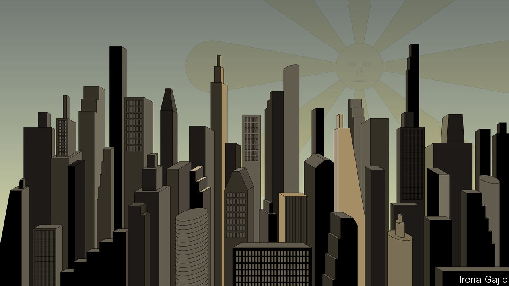
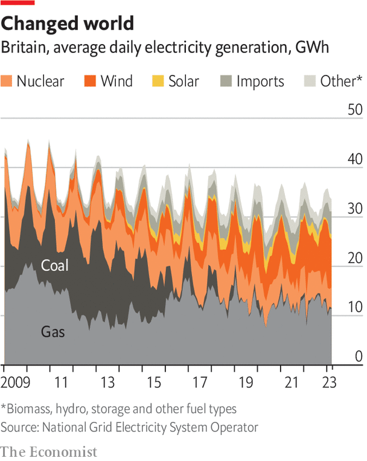

###### Defying Dunkelflaute

# It is harder for new electric grids to balance supply and demand 

##### The sun does not always shine 

 

> Apr 5th 2023 

In Pulheim, a small town in North Rhine-Westphalia, three people are looking after the grid run by Amprion, a German systems operator. Their workspace has a hushed atmosphere, something between a theatre and a church. Both the lighting and walls are soft. A vast screen, five metres high and 20 metres wide, sits concave in front of their desks. It displays a circuit diagram of the grid Amprion manages in Germany and of the other grids onto which it abuts. Amprion’s grid is an integrated part of the Continental Europe Synchronous Area (CESA), which covers 24 countries from Portugal to Poland. All told, it can call on some 900GW of all sorts of generating capacity. 

The operators’ daily routine used to be relatively simple. Twenty years ago, when 65% of German demand was met with fossil fuels and 27% with nuclear power, the predictable increase in demand that came each morning was met by automatically ramping up coal and gas plants. After the evening peak, those plants would be returned to their lowest output levels. It is a bit like trying to ride a fixed-gear bike at a constant speed. On the up you push harder; on the down you provide a little resistance to stop yourself from careening out of control.

Today the nuclear fleet is being shut down and there is more wind and solar on the grid than coal. This means one day may be very unlike the next. In 2021, at 11am on a sunny, windy day in July, the German grid got 72% of its electricity from wind and solar. One month earlier, at 2am on a still night in June, less than 1% of electricity was flowing from the same sources. Keeping the bike at a constant speed has become a real headache. Amprion has become an avid consumer, and indeed producer, of weather forecasts. “If there’s a wind front coming in then we have lots of work to do,” says one of the Pulheim operators. 

Seasons in the sun, and out of it

Over short periods some of the balancing between supply and demand can be done using batteries, typically those which use lithium-ion chemistry to store energy. The cost of Li-ion batteries has plunged thanks to the huge increase in demand provided first by smartphones and then by electric vehicles. They are now cheap enough to be put on the grid in large numbers. In some places the dropping cost of battery storage is allowing it to replace the “peaker” gas plants previously used to deal with over-the-top demand. 

But batteries are no match for the fact that winter is consistently less sunny than summer. Systems in mid to high latitudes will always need to be designed to cope with different average generation levels in different seasons. On top of that there is the challenge of what meteorologists call “anticyclonic gloom” and grid operators have come to know as , a German word meaning “dark doldrums”. Amprion’s Julia Watzlawik says that in January and February the country can see whole two-week periods with almost no wind and limited solar power. Under such conditions the gap between renewable supplies and what the system needs can reach 50GW. That gap, some 60% of peak demand, is filled by burning more fossil fuels and importing electricity of all sorts from elsewhere.

Part of the attraction of CESA is that it makes imports easier. Being part of a continental scale grid provides access to electricity from nuclear plants and renewable resources in other countries. A recent study by Bowen Li and colleagues at the Delft University of Technology found that “ events do not occur at the same time in all the countries surrounding the North and Baltic Sea areas…it may be possible to significantly reduce the adverse effects of  via grid interconnection.” 

That means more long-distance HVDC links between different parts of CESA would be a help. But it is not a complete cure. “I don’t think that we can manage…the European grid so that we always have, at the right time, enough [zero-carbon] energy to serve all Europe,” says Frank Reyer, Amprion’s operations manager. The Bay of Biscay may be blustery while the Baltic is becalmed, but wind turbines off the Atlantic coast of France cannot be expected to make good all of Germany’s shortfall. “France needs energy as well,” says Mr Reyer. 

There are two ways to deal with the problem. One is to require the electricity system to do on a huge scale something that it has done very little of to date: store energy in large amounts. The other is to take more active control over demand.

Storage does not fit easily into the generator/grid/user paradigm on which modern electrical systems are based. In some applications it is like generation—a source of energy for the grid to draw on as and when demand demands. In others it offers a way to shift demand, for example with storage heaters that take on power when it is cheap overnight to provide warmth later on. Either way, though, it is not something the grid can do itself. Some energy is inevitably stored in both electric and magnetic fields around grid components, providing a source of what grid operators call “reactive power”; that power can be drawn on to limit voltage fluctuations. But it is not a store of energy that can be used by consumers. 

 Batteries are increasingly important to help over short time frames; grids relying on renewables are ever more dependent on them. But it would be unfeasibly expensive to use batteries to provide storage on the scale required to make good weeks of serious supply shortfall. 

An uphill challenge

Many grids have access to “pumped-hydro” plants in which water from a reservoir is used to drive turbines when extra power is needed and pumps then refill the reservoir when power is plentiful. If your grid area has the sort of mountains that provide valleys at a significant elevation (think Norway, or the foothills of the Himalayas) this technology can do a lot. But storage far from the cities of the plains is not ideal. And a big pumped-hydro plant can store maybe ten gigawatt-hours of power. When a deficit is in the tens of gigawatts and lasts for weeks, something more is needed. 


The “something more” of choice, according to most analysis, is hydrogen made by electrolysis—the splitting apart of the hydrogen and oxygen in water molecules. Such hydrogen can be stored until extra power is needed, at which point it can be burned in a turbine—a process that, unlike burning natural gas, releases no carbon dioxide. Such stores can provide a lot of energy. The designers of the Advanced Clean Energy Storage Project in Delta, Utah, think that they can store 300GWh of hydrogen in one pair of salt caverns. That alone is equivalent to half as much storage capacity as that which all the world’s Li-ion battery factories provided last year.

Mr Reyer believes that this kind of “power-to-gas” will be crucial for Germany during periods of post-fossil-fuel . What is more, hydrogen made this way could replace fossil fuels in other applications, too, such as steel-making and fertiliser manufacture. But that depends on there being both a lot more renewable, or nuclear, energy available with which to make the hydrogen, and on there being yet bigger grids to move that energy to the places where it is needed. 

 


Battery storage is often located next to the renewables that charge it, and some suggest that electrolysis should be dispersed in the same way, using up surplus energy from renewables or nuclear plants when the grid does not need their power. Luke Johnson, the boss of H2 Green, a British firm that plans to build hydrogen-production hubs, is having none of it. For hydrogen production to be economic, he says, it must be done through the grid. 

One of his reasons is that making hydrogen is best done on an uninterrupted basis, not least because the capital costs are harder to bear if the plant works only some of the time. Another is that he wants his hubs to support trucking, shipping and heavy industry. That is much more easily done in existing industrial centres than in the seas, deserts and distant windy plains best suited to large-scale renewables. And moving hydrogen through newly constructed pipelines is a lot harder than moving electricity through expanded grids. 

Grid hydrogen would not, at present, be as green as that made directly from renewable energy at the point of production. But the greener the grid gets the greener the hydrogen gets. When countries reach the goal of an emissions-free grid, hydrogen made using its power will be emissions-free too. 

If a grid-powered hydrogen industry would be a major source of demand, though, it could also be a new source of balance. Electrolysers don’t like being turned on and off, but they can be ramped up and down. That could make hydrogen production a way to help with the other response to periods of insufficient supply: demand management. 

A lot of industrial load is not particularly time sensitive; give it price signals and it will respond accordingly. Industrial freezers, for instance, can be cooled well below their required temperatures when energy is cheap, then allowed to warm back up towards their maximum safe temperature when it is dear. Consumer load can be raised and lowered too—as long as the consumers are not inconvenienced and don’t have to think about it. 

Octopus, a British utility, is one of the companies trying to make demand management hassle free. Their customers allow the company to control things like the rate at which their electric cars recharge themselves, or at which their heat pumps warm their houses. To minimise the customers’ uncertainties and concerns they are able to set specific expectations, such as how well charged their car will be at 8am. Octopus’s job is to juggle all these obligations in a way that allows it to sell the option of demand curtailment to grid operators at times when they might need it while giving rebates to the customers.

As yet, Octopus is not making much money. It hopes that more electric vehicles and heat pumps alongside a stronger market for demand management will put that right. It also hopes that by making its demand-management platform, Kraken, widely available to others it will encourage demand management to become widespread, a development that will be good for the companies best at providing it. Such a broad shift is clearly necessary. Scenarios from the International Energy Agency which see the world reaching the climate goals set in Paris in 2015 have 500GW of demand-side response installed by 2030. The current total is 50GW.

There is no doubt that, for the energy system as a whole, dealing with the intermittency of renewables is the biggest challenge attendant on decarbonisation. Big grids, interlinks to far-off resources (particularly to sunny lands to the east when people are getting up in the dark, and to sunny lands in the west as they settle in for the evening) and new forms of storage will all be required, as will demand management. 

But for the grid itself, the issue is not just making new sources of electricity more available for more of the time. The nature of the sources matters, too. Grids built up to serve steam generators working at 50Hz or 60Hz have not just become accustomed to the peculiarities of a system powered by huge lumps of spinning metal. They have learned to make use of them to keep the grid stable. Take most of the steam turbines off the grid and you do not just have to replace the power they used to provide. You also have to find new ways to stop the grid from falling over. ■

