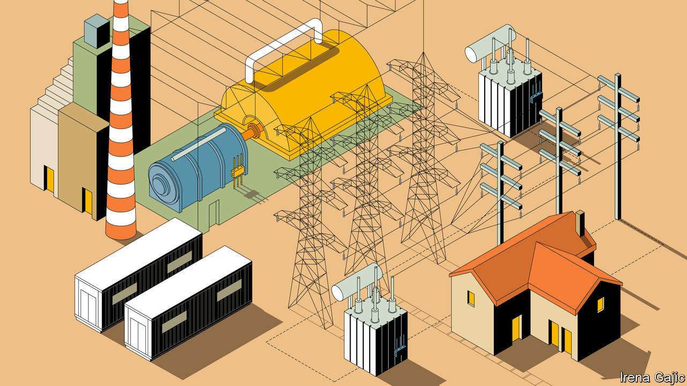
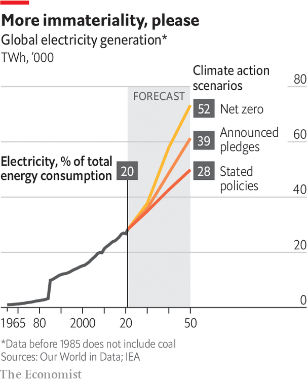

###### The ultimate supply chains

# The electric grid is about to be transformed 

##### The technological and regulatory requirements will be immense, writes Hal Hodson 

 

> Apr 5th 2023 

In the turbine hall at Drax, a power plant in the English county of Yorkshire, sit six monsters of angular momentum. They are massive—2,800 tonnes each—and complex, composed of 28 turbine sub-assemblies. And they spin on their axes 3,000 times per minute. Place your hand on the blue metal casing around one of them and your whole body thrums in harmony. The hall’s floor hums a flattened A three octaves below middle C that numbs the soles of your feet. 

The turbines are driven by high-pressure steam produced in vast boilers that hang from the ceiling. The boilers’ walls are meticulously insulated, but you can still feel the heat of their 1,100°C (2,000°F) bellies at 20 paces. For most of Drax’s life those flames have been fed by a steady stream of coal, tens of thousands of tonnes of it pulverised and blasted into the blaze every day. 

Today, in a sign of the times, most of Drax’s boilers burn biomass instead. The shift is part of the move towards renewables taking place around the world. Removing fossil fuels from electricity generation is universally seen as a necessary, but not sufficient, step towards stabilising the level of greenhouse gases in the atmosphere. The attractions are clear: much of the world already runs on electricity; there are many sources of non-fossil-fuel energy available, some very cheap; and increasing electricity’s share of total energy use by encouraging use of electric vehicles, heat pumps and the like looks comparatively easy. 

To abandon mines and oilfields in favour of energy from sunshine and thin air is not merely good climate policy. It has the appealing feeling, as electrification always has, of progress through dematerialisation. The thrilling, visceral sense of immensities in harness provided by the sights, sounds and vibrations of a turbine hall will become increasingly archaic. But if the production of electricity through motionless glass panels and blades turned by the wind seems effortless and futuristic, getting the gigawatts to the consumer will remain a very physical process. 


Within Drax, energy flows from fuel to flame to steam to spin; but to serve the world beyond the walls a last transformation is needed. The turbines’ driveshafts spin powerful magnets which are encircled by the copper wires of an electric generator. As the spinning magnets’ poles point first this way then that, their magnetic field pushes and pulls at the electrons in the generator’s wires, setting them aquiver with energy. This electromagnetic coupling bleeds off the turbine’s kinetic energy at exactly the same rate as the high-pressure steam replenishes it, thus making that energy available to anything connected to the generator in an electric circuit. 

For Drax, that circuit is Britain’s national grid. The 50 cycles a second (50Hz) alternating current (AC) power available from pretty much every socket in the country is a national expression of the vibrating floors in Drax and other powerhouses. Its pulsations unite the spinning generators which feed it and all the devices plugged into it into a single vast machine. 

In the early days of mains electricity, customers were supplied with power by a generator devoted to their factory or from a single nearby power station. But the advantages of pooling resources soon became apparent. Generator frequencies were synchronised to 50Hz (60Hz in the United States and a few other places) so that high-voltage lines could combine currents from different generators. As high voltages are not good for consumers, transformers—a technology which only works in AC systems—were developed to step those high voltages down to lower domestic ones. The familiar architecture of pylons and substations housing transformers began to appear. 

That physical infrastructure made electricity supply look solid and static, part of the industrial furniture. That appearance can and does deceive. The grid is oddly immaterial and highly dynamic. Its conditions are endlessly subject to change because of a fundamental truth about electrical-power systems: supply has to match demand in real time. 

At any given time the amount of power being drawn out of the grid to do work—the load—has to be matched by what is going in. The amount of power being used by washing machines, lights, smart speakers, air conditioners, heart monitors, fan-assisted ovens and all the other components of modern life has to be the same as the amount being generated. This means that, as the electromagnetic drive train of a machine in which movement at one end—a spinning turbine—and movement at the other—a dishwasher, say—the grid is in constant flux. And so it needs constant supervision lest some sort of imbalance causes it to crash. 

This machine kills carbon

This complexity made increasing the size of grids a challenging task. But the benefits were seen as worth it. Patterns of use among a million users are statistically reliable in the way that the patterns within a single household are not. More predictable demand can be met by bigger, more efficient generators. Bigger grids allow bigger loads. It was the grids which allowed the smelting of aluminium, and thus the building of planes, on a new scale that made America the second world war’s “arsenal of democracy”. They allow economies of scale and geography in generation, too. By the 1960s it made sense to build behemoths like Drax next to Yorkshire’s coal field and distribute their power around the country. 

Now things have to change. At present, 62% of the energy delivered as electricity comes from fossil fuels; that has to come down to more or less zero. A lot of its replacement will be in the form of cheap wind and solar, and that presents a serious challenge to grid operators. It means a lot of new connections, which are troublesome. The problem is exacerbated by the fact that renewable installations typically generate less power than steam turbines do. That means more connections per unit of capacity. 

As well as adding a great many new connections, grids will also have to change shape. The places best suited to the generation of renewable energy in very large amounts are often not the places where today’s generation is concentrated. So new transmission lines will be needed. And because grids are complicated things, some of those expansions will require compensating changes elsewhere as bits of the grid become congested. 

Renewables are also intermittent. An obvious way to lessen this problem is to expand grids so that they can access renewable resources over larger areas. Even if this is done, though, grids in which renewables play a large role will require connections to a lot of new energy storage. Some will be located alongside the renewables; some will not, complicating things further. To ease the storage challenge grids will also need access to demand-management systems through which they can reduce demand on various different time scales. 

Last of all, various ways in which grids are controlled and balanced today are physically rooted in the way steam turbines generate power. They will need to be rethought. In the long run this is a welcome opportunity to make the system cheaper and more reliable. In the short term it is a requirement for yet more investment. 

 


And in the midst of all this change, grids will also have to grow in capacity at a rate the developed world has not seen for many decades. As a lot of the things fossil fuels are used for—such as powering vehicles or heating houses—become electrified, demand will shoot up (see chart). Electricity makes up just 20% of the world’s energy consumption today, but in the future it “will be the backbone of the entire energy system”, says Gerhard Salge, chief technology officer of Hitachi Energy, one of the key suppliers of grid equipment. His firm estimates that by 2050 the world will need four times as much electricity generation as it has today, and three times as much transmission capacity.

The technologies to meet these challenges are for the most part already available, as this report will explain. A revolution in the application of solid-state electronics to power systems, combined with improved technology for building high-voltage direct-current circuits, is easing the connection of far-flung renewables to grids, helping to reduce congestion and making interconnections between grids easier to set up. These technologies should also provide ways of keeping grids stable as many of the huge turbines they have relied on as their pacemakers are retired. 

But fielding them requires a huge amount of investment. A recent study by the Energy Transitions Commission, a coalition of companies and financial institutions, found that $1.1trn must be spent on the grid every year until 2050 if the world is to reach its net-zero goal. That is on top of the cost of new generating capacity. 

It also requires a level of executive determination unprecedented outside times of all-out war. Steve Brick of the Clean Air Task Force, an American NGO, used to work in grid regulation. When he looks at maps showing the expansion of American transmission infrastructure which a decarbonised system is said to require, he says, “I put on my practical hat…and I say that’s not gonna happen.” Local opposition to new infrastructure may be the largest obstacle. It will not be the only one. If he is right, and the grid cannot expand at the rate needed to decarbonise the economy, there will either be a massive move towards decentralised systems, a failure to reduce emissions fast enough, or both. 

A degree of decentralisation in some markets is inevitable and will often be welcome. Roughly 1bn people, a large majority of them in Africa, currently lack any access to electricity. Local renewables can bring them some of its advantages more quickly than grid connections will. But there is good reason to think that modern grids moving copious energy over long distances will bring more energy to more of those who need it. 

If, that is, energy can be delivered to the grid in the first place. Connecting new resources to the grid is a tricky technical matter; it is also a procedure that is vulnerable to delays stemming from regulation, speculation, politics and protest. This is the problem we turn to first. ■

