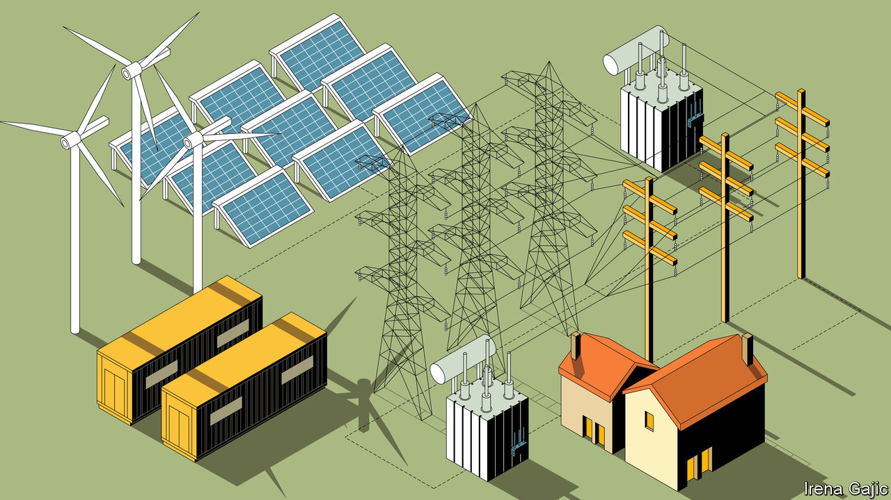

###### Back in black

# The physics of rotating masses can no longer define the electric grid 

##### That will make it better in the long run 

 

> Apr 5th 2023 

Tucked away behind a cash-and-carry in a Liverpool suburb is a 40-tonne cylinder of steel spinning 1,500 times a minute. Its 500 megajoules of kinetic energy are the equivalent of the chemical energy stored in 100kg (220lb) of TNT. To keep the cash and carry and other neighbours safe, the whole contraption is cocooned in steel-reinforced concrete; on one side of the cylinder a rubberised steel pit waits to catch it should the numerous redundant safety systems fail. 

Why store what is, in grid terms, a relatively small amount of energy (140 kilowatt-hours) in such a potentially perilous way? Because a balance of supply and demand is not the only thing needed to keep the grid up and running. Making sure the frequency stays stable, and thus that the rest of the show stays on the road, depends on other factors—things that are provided free of charge when you connect a big lump of fast-spinning metal to the grid, but not when you add on renewables. The “synchronous condenser” at the Lister Drive Greener Grid Park provides some of the spinning-metal mojo that the increasingly renewables-heavy grid lacks. In the future, though, more thoroughgoing approaches will be needed, approaches which obviate the need for any spinning metal at all, and which allow both grids and the people connected to them freedoms which they have never previously enjoyed. 

The synchronisation between the spinning steam turbines of coal, gas, hydro and nuclear plants and the grid they supply is a two-way street: the electromagnetic fields which couple them mean that conditions on the grid reach into the workings of the generators, and vice versa. This means properties of the spinning metal and its connections propagate out onto the grid. One such property is inertia; the turbines’ innate desire to keep spinning limits the ease with which the grid’s frequency can fluctuate. Another is “reactive power”, a drag which the nature of alternating current imposes on the flow of energy through the system, and “short-circuit current”. Reactive power can be used to deal with voltage fluctuations. Short-circuit currents reveal faults and can be used to clear them. Because these aspects of the grid-as-it-is are so useful to its operation, they are referred to as ancillary services.

Tenets and turnstiles

Solar panels, wind turbines and batteries are connected to grids through carefully controlled electronics, rather than through the brute force of electromagnetism. The DC power which solar panels and batteries provide is turned into AC by inverters which mostly use technology like that found in the valve rooms at the ends of HVDC connections. The low and variable frequency AC produced by wind turbines is processed in similar ways. As a result, batteries and wind and solar farms are all referred to as “inverter-based resources” (IRBs) in the trade. 

The problem with this is that, at present, grids in which IRBs provide more than 60% of the power energy start to become seriously unstable without help, according to Ben Koproski of America’s National Renewable Energy Lab in Colorado. The vast majority of today’s inverters are “grid-following” ones, spitting out current with characteristics that match those that the inverters see on the grid. This means that unlike turbines they provide no way of pushing the grid in a preferred direction. Indeed they can worsen conditions by amplifying existing imbalances. 

One way to deal with this is through “spinning reserve”: gas-fired stations in which the turbines are kept spinning while generating very little power. But this is very capital intensive and burns natural gas in a peculiarly inefficient way. So grid operators are increasingly willing to pay for alternatives. The turbines at Drax earn money this way, as do those of Cruachan, a Scottish pumped-hydro facility that Drax bought in 2018. So does the synchronous condenser at Lister Drive, a facility set up by Statkraft, a Norwegian utility. And so does a 100MW battery which Zenobe, a British battery company, has plugged into the grid not that far from Lister Drive. (The closure of Fiddler’s Ferry, a large coal-fired power plant, led to a worrying shortfall of ancillary services in the Liverpool area, which has thus become a place where new approaches are being tried out.)

This installation is special not because of its batteries, but because of its inverters; rather than being grid-following, they are grid-forming. This means that they can be programmed to provide the grid with energy in exactly the form and at the frequency that the grid operators require, making up for the loss of ancillary services. Grid-forming inverters offer a step change away from the world of instantiated electromagnetism and into a realm of code and electronics. 

The hardware which runs grid-forming systems is, for the most part, little different from that in grid-following systems—but the algorithms which shape the current that flows through them are much more sophisticated. And the approach does not have to be limited to batteries. In time all the inverters in front of wind farms and solar plants could all be grid-forming; in some cases, according to Mr Koproski, the change could require nothing more than a software update. In terms of grid stability, this would turn IRBs from a problem into a solution. Mr Koproski sees this as turning an old saw about renewables on its head. With the right electronics, adding renewables and the storage which comes along with them to the grid can make it more stable, not less. 

Grids with ancillary services provided by the inverters in front of renewable sources should in the end, be easier and cheaper to run than those of days gone by. Easier, because the operator of a grid supplied with electricity entirely through grid-forming inverters would not need to put quite so much effort into keeping grid frequency and voltage stable across the system as a whole. With all connections capable of easy adjustment, the consequences of wandering frequency could be headed off. To use the fixed-gear-bike analogy, the algorithms in the grid-forming inverters would simply look at the pedals of the transmission system spinning beneath their feet and gently, with a computer’s perfect timing, start pedalling again in whatever way suited them. 

What limits to growth?

Making things easier has implications for the speed at which grids can be expanded. Leaving aside bureaucracy, speculation and permitting, adding lots of new supply to today’s grids remains an often painstaking procedure. If new resources all come with grid-forming electronics, things should become a good bit more plug-and-play; the new additions will be able to match themselves more closely to what the grid needs at that location, rather than requiring the grid to adapt itself to them.

The fact that they already offer similar capabilities is one of the factors behind the spread of HVDC links. The grid-forming potential of the connection halls on SSE’s Caithness-Moray link have led the company to consider equipping them for the ultimate act of grid formation: a “black start”. Re-starting a grid that has collapsed is a tricky business. The generators attached to steam turbines need to be spun up by auxiliary diesel power to manage it; grid-following inverters are no good at all when there is no grid to follow. Grid-forming services make things much easier—especially when connected to wind turbines generating large amounts of power, like those in Caithness. 

Such added attraction will increase the appeal of HVDC, and as demand increases the technology will become cheaper. That will further drive demand in turn. It will also make ever more ambitious interconnections conceivable. 

It is possible to get ahead of the curve on this. Sun Cable, a company which had plans for a 4,200km cable that would feed Singapore with power from Australian renewables, recently went bust. XLinks, a startup, is promoting a scheme which would bring Britain a constant 3.6GW of power from renewable sources and battery backup in Morocco; its cost is put at £18bn ($22bn), with 3,800km of proposed cable a big part of the total. If XLinks prospers, more such projects will surely follow.

 

That said, such gigalinks bring with them concerns beyond the cost of finance. Even before the bombing of the Nordstream 2 pipeline in the Baltic, the idea of getting a significant fraction of your power from a single vendor through that long an umbilicus raised questions about political risk which are beyond the power of technology to address. Direct connections can bring with them dependency and vulnerability. 

Grids have long been targets in times of war: Ukraine’s has been pummelled by Russian missiles and shells. They are also attractive targets for cyber-attacks. The need for grid balance means that attacking a relatively small component can produce devastating results as the effects ripple through the system. The more firmly a grid is tied to outsiders whose security is beyond your control, the more worried you might have cause to be.

An electronically formed grid, with more need for computation and communication, might make such vulnerabilities worse. And as electricity becomes the primary source of energy for more and more applications, attacks on the grid could become even more frightening. Blackouts that turn off the lights and air conditioning today could cripple heating and transport, too, in a few decades’ time. That said, the possibility of an attack on a single weak point causing a cascading failure across the grid should be reduced by robust electronics. Making grids bigger has benefits, too, if their further-off parts can be robustly defended. Getting the Ukrainian grid synchronised to CESA soon after Russia’s invasion helped the country a lot. 

These potential benefits are all secondary to the fact that the world’s grids have to change if the world is to decarbonise at the rate climate policies demand. That change will necessarily be complex and costly, whatever the technology, with investment measured in tens of trillions of dollars. But it is worth noting that, done properly, this huge and necessary shift will not simply allow the world to continue as it did when burning fossil fuels. By making energy easier to move around than ever before and allowing the most cost-efficient generation to capture more of the market, it will over time make that power cheaper. Robust grids to which cheap generation can be added easily will be able to provide an energy abundance today’s fuels never could.

One of the biggest advantages is that a significant amount of the antagonism between advocates of ever more muscular grids and more decentralised systems may wither away. Grid-forming inverters allow microgrids and macrogrids to be joined together far more easily. They also help consumers attached to grids to build out their own generating and storage systems in a way that the grid can draw on. As long as some standards are adhered to, what happens behind the inverter can stay behind the inverter. But power can get in and out. 

A virtuous circle in which the growth of the grid makes it easier for electricity resources to grow further would not be unprecedented. There was a similar positive feedback loop in the old energy system, too. Better engines and generators made fossil-fuel extraction, distribution and consumption cheaper, which made it possible to feed ever more engines and generators. But that growth faced two sets of limits. One set was imposed by economic and political constraints on fuel supply, the other by the degree to which the environment could absorb the unavoidable waste. Ingenuity, investment and statecraft could be used to move the first limits back; short-sightedness, vested interests and the sheer scope of the problem contrived to have the second set of limits ignored. But neither set of constraints was abolished. And neither applies in the same way to an electricity dominated system fed by renewables and nuclear power, supported by adequate storage, and connected by a flexible, stable, electronically enabled grid.

Nothing can get better for ever. The fossil-fuel-free energy system that new grids will enable will surely face constraints of its own. But they will not take the form of a limit on its fuels, and they will not be found in the damage done when the Earth’s basic cycles are wilfully disrupted. The upfront costs of building out the grid are vast. The challenge of meeting the fossil-free electricity-supply goals required if the climate is to be stabilised are insanely daunting. But once the shift gets well under way, and costs start to tumble, there is no telling where things will stop. ■

