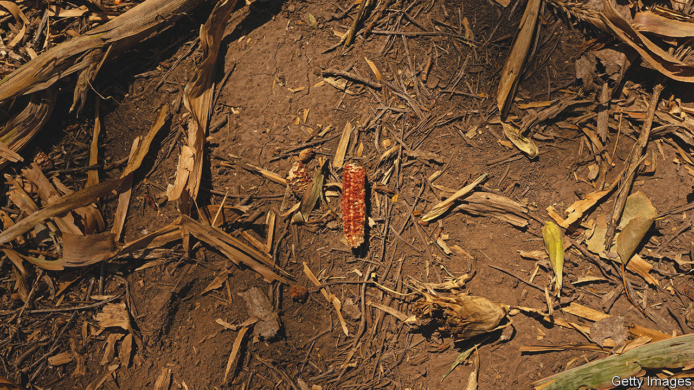
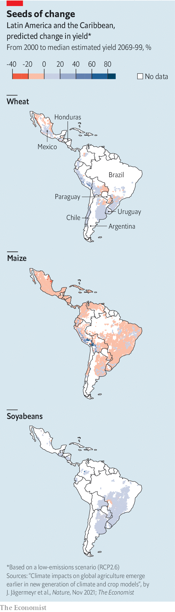

###### When the tortillas run out

# Crazy policies and climate change are hurting Latin American agriculture 

##### Farms will adapt or move. So will farmworkers 

 

> Apr 5th 2023 

When billions of black bugs invaded Buenos Aires in March, locals were mystified. Social media buzzed with queries. They turned out to be thrips, leaf-munching insects escaping from the drought-denuded Argentine countryside for better-watered urban gardens. They pose no threat to people. But the extreme weather that prompted their exodus does. 

Across Latin America, climate change is making it tougher to grow crops. That could have two alarming consequences. It will be harder to ease rural poverty, since small farmers will find it trickier to eke out a living. And it could affect the global food supply, since Brazil and Argentina alone provide a tenth of the world’s wheat exports and a third of those of coarse grains (barley, maize, oats, rye and sorghum). 

No model can reliably predict farm yields, as future changes in technology are unknowable. However, the Inter-American Development Bank takes an average of nine climate models and combines them with crop and economic models to produce some estimates. It projects that by 2050 growth in regional agricultural production will be five percentage points lower than it would have been without climate change. The region’s population, meanwhile, is expected to swell by 14% between now and its peak in around 2056. 

 


Such headline figures disguise enormous variation. The region stretches more than 10,000km north to south, spanning deserts, mountains, rainforests and open pampas. Conditions for growing maize, a particularly heat-sensitive crop, will grow worse nearly everywhere, whereas those for soyabeans, a hardier plant, may improve (see maps). Wheat production may have to move southwards.

Roughly speaking, the hot, dry parts of the Andean countries, Central America and Mexico (the biggest supplier of vegetables to the United States) will probably grow even more arid. This will make life more precarious for the rural poor, and could spur mass migration or even unrest. By contrast the temperate “southern cone” of Argentina, Chile, Paraguay and Uruguay could become more hospitable for crops such as soyabeans and rice, creating an opportunity for big commercial farmers to raise yields. The main obstacle to seizing this opportunity is that Argentina, the southern cone’s largest producer, has some of the craziest farm policies on the planet. Meanwhile in Brazil, the region’s other agricultural powerhouse, the degree of pain will depend to a large extent on what happens to the Amazon rainforest. And throughout the region, the fortunes of big and small farmers will diverge.

“There’s a disorder in the climate. When we expect one season, another comes,” says José Adrián Reyes, a small tomato-and-chilli farmer in the highlands of Honduras. His homeland illustrates a grim truth: that the places most affected by climate change will be those least able to cope, not least because the hottest areas tend also to be the poorest.

Honduras is hot, poor, sandwiched between oceans, lashed by increasingly furious hurricanes and suffering deeper droughts. Average yields of maize are likely to be 9% lower in 2050 than they would have been without climate change, predicts the Inter-American Development Bank. That is a recipe for social upheaval. 

If lower yields translate into higher prices, that will wallop the urban poor, who in Honduras eat maize tortillas with nearly every meal. And tougher growing conditions will hurt small farmers, of whom Honduras has legions. (Some 29% of Honduran workers grow things, double the figure for the region as a whole.) Small, poor farmers find it hard to adapt, not only because they lack capital but also because they are rationally reluctant to experiment. Generations of experience have taught them that if they try something unfamiliar and it fails, they face destitution, so they tend to stick with what they know. 

Yet eventually they will have to adapt, or find another line of work, or join the long queue of migrants trekking towards the United States. So many Hondurans have already emigrated that the money they send home each year is the equivalent of a quarter of GDP.  In the coming decades climate change will spur untold numbers to move from the countryside to cities.

Fear of mass migration is one of the reasons why the United States is backing projects to help small Latin American farmers use water more efficiently. Those who rely on the clouds to water their seedlings are especially vulnerable when the rains fail. In Mr Reyes’s village near La Esperanza, an investment of $260,000 from the UN’s International Fund for Agricultural Development has produced 50km of irrigation pipes, benefiting more than 1,000 families. Farmers are producing more on less land, and shifting from basic crops such as maize and beans to more lucrative ones such as greens and berries. 

Big farmers in cooler parts of the region should find it easier to adapt. Argentina—huge, fertile and mostly temperate—is already the world’s third-largest exporter of soyabeans and second-largest exporter of maize. Climate change will hurt some Argentine farmers—principally those in the north. But higher rainfall should boost yields of soyabeans, rice and irrigated wheat in large swathes of the country, especially in the south. And because Argentine agriculture is dominated by tech-savvy modern farmers, the country should be able to ramp up production. 

Yet the mood among Argentine farmers is gloomy, thanks to the same drought that sent thrips swarming into Buenos Aires. Parts of Argentina received less than half their normal rainfall in the last four months of 2022. A study by World Weather Attribution, an ngo, concluded that this could be natural variability rather than a consequence of climate change, but that very high temperatures, which probably were caused by climate change, had made the drought more painful. 

A group of farmers sit around a table in an impressive farmhouse near Rosario, in the north. Polo mallets hang from the wall. A fine spread of apple cakes greets visitors. But the wide fields are dry, and the wheat crop is down by 65%. The farmers would love to invest in new technology to adapt to climate change. Like most big farmers in Argentina, they have already embraced genetically modified crops, with excellent results. Unfortunately, they must continually react to government policies that arrive as unpredictably as swarms of locusts. “You can’t plan for five years in the future because you have no idea what will happen next month,” says Federico Boglione, whose family owns the farm.

Some crops face export quotas. All face crushing export taxes. There are multiple exchange rates for the US dollar, depending on which crop you export. At the main official rate, exporters must surrender their dollars for roughly half what they are worth. Naturally, they resent this. Last year soyabean farmers hung onto their harvests, hoping that the government would eventually be forced to devalue the local currency. (Inflation in Argentina is over 100%, so even an unrealistic exchange rate must adjust from time to time.)

The government, desperate for hard currency, offered a special exchange rate just for soyabean exports, worse than the black-market rate but better than the official one, and said it would be available only for a month. The aim was to coax farmers to sell their beans. It worked, but only for a month. So a few weeks later the government offered the soyabean rate again; this month a third rate will be rolled out. On March 31st the government also introduced a separate exchange rate for wine exporters, dubbed the “Malbec dollar”. 

In theory farmers can buy imported inputs such as fertiliser with dollars at the official rate. In practice the process for obtaining cheap hard currency is slow and corrupt. Big farmers often have to barter—so many tonnes of wheat for a combine harvester, and so on. 

Sensible policies could boost annual grain output from 140m tonnes today to 215m tonnes by 2032, or by 53%, estimates FADA, a think-tank. That is enough to feed 400m people. Plenty of boffins are eager to help. Bioceres, an Argentine biotech firm, has developed a new strain of drought-tolerant wheat that yields 30-40% more than the conventional sort when rains dry up. Some 50,000 hectares of it have been planted in Argentina; in March it won regulatory approval in Brazil. 

Soya scenes

Latin America’s other agricultural giant, Brazil, has both big dynamic commercial farmers and small unproductive ones. The former generate two-thirds of farm income; the latter account for three-quarters of farm jobs. Big farms are avidly adopting technology to cope with climate change, and to reduce their own carbon emissions. Small ones are less able to do so, and are in places where the impact of climate change is likely to be more severe. 

Farming is also the main driver of deforestation, which, as well as contributing to CO emissions, could affect weather patterns more directly. Each big tree in the Amazon puffs out more than 400 litres of water into the air every day, which is recycled as rain that nourishes both the forest itself and huge tracts of farmland to the south. If more than 20-25% of the original tree cover is destroyed (a fifth has gone over the past 50 years), this water cycle could break down and the rainforest might turn to savannah. That could spell catastrophe for farming across the region. 

Policies can get better. Brazil recently replaced a president who abetted the slashing of the Amazon with one determined to halt it. Argentina has a chance, in October, to replace its big-farmer-bashing government with a more rational one. “The big question”, says Manuel Otero of the Inter-American Institute for Cooperation on Agriculture, “is: are we in time to save the planet, or are we running behind what’s happening on the ground?”■


