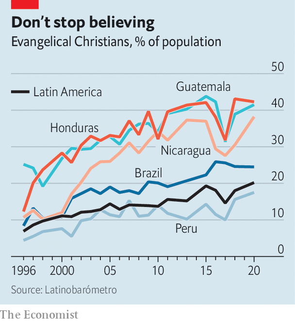

###### Prophets of the ballot box

# Evangelicals may soon rival Catholics in Latin America 

##### A fifth of the region are evangelical. Many now believe the “prosperity gospel” 

 

> Apr 5th 2023 

The cathedral of the Universal Church of the Kingdom of God in Salvador, a city in Brazil’s poor north-east, is so large that it can be seen miles away. Built in the style of a neoclassical temple, it could be a giant conference centre or a casino. On a recent Friday afternoon its annex, which can hold up to 3,000 people, was packed. Such success hints at an increasingly important force in Latin American politics. 

Evangelical Christianity is the fastest-growing religion in the region. Polls on religious beliefs vary widely, but around a fifth of Latin Americans identify as evangelicals, up from a tenth in 2002. In Guatemala and Honduras, they are set to overtake Roman Catholics as the dominant religion by 2030. This could happen in Brazil by the mid-2030s, too. In the past decade, a new church has opened in Brazil almost every hour, of which 80% were evangelical. 

In the 1970s enterprising pastors, inspired by those in the United States, introduced a strand known as neo-Pentecostalism. This preaches the “prosperity gospel”, a radical reinterpretation of the Bible which claims that earthly wealth is a sign of divine blessings. Edir Macedo, the founder of the Universal Church, is thought to be a multimillionaire and owns the second-most-viewed TV channel in Brazil. 

 


Such teachings proved particularly attractive to poor aspirational types who emigrated to cities. (Fully 80% of Latin Americans live in cities, up from 60% in 1975.) In Bogotá, the capital of Colombia, a mega-church runs a financial-literacy course based on biblical teachings. It uses a textbook developed by evangelicals in the United States, teaching parishioners about compound interest, how to save and how to craft a household budget. 

In a region full of social-media-savvy, evangelicals have also spread their teachings online. On Instagram, an image-sharing platform, eight of the ten most-followed Christian influencers in Brazil are evangelicals, including Deive Leonardo, a 32-year-old preacher with over 13m followers (Pope Francis has 9m). “In the old days, churches used to talk about Jesus in the squares, in the streets...Today you talk about Jesus through social networks,” says Pedro Franco of InChurch, a startup that provides software for churches. Nearly all of his customers are evangelicals.

All this is making evangelicalism a potent political force. Guatemala has had three evangelical presidents over the past few decades. Politicians elsewhere court the religious vote. Days before Brazil’s presidential run-off in October, Luiz Inácio Lula da Silva, who won with a slim 1.8-percentage-point margin, published an open letter in which he promised not to close down churches and said he was against abortion. This was directed at the third of the electorate who are evangelical or born-again Christian. His rival Jair Bolsonaro, the incumbent, had dedicated 40% of his pre-campaign visits to activities with evangelical churches. Mr Bolsonaro’s fans had also spread rumours that Lula (as he is known) was in cahoots with the devil. 

Several things explain the rising religious vote. In the mid-2010s Brazil underwent a corruption probe which ensnared dozens of parties in Congress. Economic mismanagement under Dilma Rousseff, the leftist president handpicked by Lula (who was himself president from 2003 to 2010), led to a recession. In 2016 Ms Rousseff was impeached. Evangelicals promoted the idea that Brazil was going through a “moral crisis because of a lack of connection to Christian values”, says Caio Barbosa of the University of São Paulo. In 2018 70% of evangelicals voted for Mr Bolsonaro, a Catholic married to an evangelical. 

Mr Bolsonaro cemented the role of evangelicals in politics. He was the first president to nominate an evangelical Supreme Court judge. Churches got tax breaks. The evangelical group in the current Congress is still forming; but after the election of 2018, some 84 evangelical legislators sat in the lower house, a record. 

Fears over relaxed abortion laws and “gender ideology”, or more liberal views over sexuality, have increased the clout of evangelicals. Many are now forming alliances with conservative Catholics, too. This is a relatively new phenomenon. According to Taylor Boas of Boston University, in Chile’s election in 2000 most evangelical leaders endorsed Ricardo Lagos, a socialist candidate, for the presidency because his rival was part of Opus Dei, a conservative Catholic lay order. But in the 2021 election, evangelicals lined up behind José Antonio Kast, a Catholic, because of his pro-life views and because he is against gay marriage. Evangelicals also recently helped elect an Opus Dei mayor in Peru.

Soul searching

This religious vote is only likely to increase in importance. José Guadalupe of the University of the Pacific in Lima, Peru, notes that across the region evangelicals are underrepresented. He reckons that in El Salvador, only 6% of deputies in Congress are evangelical, compared with more than a third of the population. In Colombia they make up 16% of the population, but have only 4% of seats in Congress. 

Lula’s open letter was not the first time he has cosied up to the religious right. He had a cordial relationship with Mr Macedo, whose TV channel received a growing share of government advertisements to offset the dominance of Globo, Brazil’s main TV channel, which is critical of Lula. Mr Macedo supported Lula’s campaign in 2002, but backed Mr Bolsonaro in 2018 and 2022.

But some evangelicals did not. Last year Mr Bolsonaro’s vote share among them fell to 63%. Even as Mr Bolsonaro campaigned on gender ideology, many parishioners—who tend to be poorer, female and black—were angry about his disastrous handling of the pandemic, in which over half a million died. Politicians cannot rely on evangelicals alone for their salvation. ■

