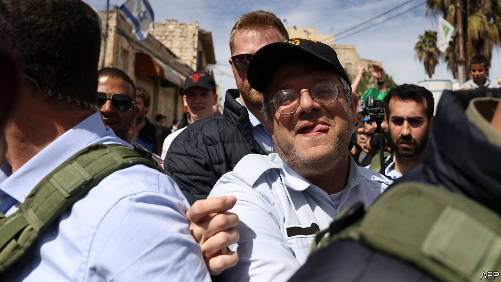

###### The Economist explains

# What to make of Israel’s new national guard 

##### The force will be a publicly funded militia led by an ultra-nationalist 

 

> Apr 5th 2023 

ON APRIL 2ND, at the behest of , the prime minister, Israel’s cabinet approved the creation of a national guard under the control of the national-security minister, . Mr Ben-Gvir, the leader of Jewish Power, a far-right party that forms part of Mr Netanyahu’s coalition government, is a stridently anti-Arab politician. He has been convicted by a court of inciting racial hatred and supporting Jewish terrorist organisations. Many Israeli observers fear that the national guard will act as his own publicly funded militia. Placing operational decisions in the hands of a politician would be a departure from legal norms. Why has the national guard been approved, and what powers will it have?

Conceived as an auxiliary police force, it will have an initial strength of 1,800 officers. Its main role will be to help out the police during emergencies. The government has allocated 1bn shekels ($278m) for its first year of operation. The idea is not new. It gained supporters after rioting in May 2021 between Jews and Arabs in cities where the two groups live together. In June 2022 Israel’s government, then led by Naftali Bennett, announced the formation of an “Israeli Guard”. But by then the government had lost its majority. With the country headed to a general election, the force failed to materialise. 

The complicated politics of Mr Netanyahu’s coalition government, established in December 2022, brought it back in a form that many Israelis regard as dangerous. Mr Ben-Gvir demanded the guard’s creation in return for his participation in the government. Mr Netanyahu sweetened his offer as his . On March 27th the prime minister postponed legislation that would have weakened the independence of Israel’s judiciary, a concession to hundreds of thousands of protesters against that measure. Mr Ben-Gvir had championed the legislation. To placate him, Mr Netanyahu sped up the authorisation of the national guard and gave him personal control of it. 

The plan has provoked opposition from both law-enforcement officials and civilian critics of Mr Netanyahu’s government. Yaakov Shabtai, Israel’s police commissioner, and Gali Baharav-Miara, the attorney-general, have criticised the formation of a unit independent of the police. On April 4th Mr Shabtai warned that “any separation from the police-command hierarchy will cause damage to personal safety, waste resources and break Israel’s police from within.” Arab Israelis and protesters fear that Mr Ben-Gvir, who has called the police response to the recent demonstrations too lax, will use the guard to bludgeon dissent. 

The Netanyahu government has publicly dismissed such criticism, but it may be having an effect. In private Mr Ben-Gvir has agreed that the national guard will be under the operational control of the police commissioner, though he insists that he will define its missions. The cabinet established an inter-agency committee to issue within 90 days recommendations on the guard’s powers. This looks like an attempt to curb Mr Ben-Gvir’s influence. Some observers doubt that the government will actually set up the new force, at least while Mr Ben-Gvir is in a position to run it. But Mr Netanyahu’s offer of a militia is unlikely to be the last concession he makes to his radical coalition partners. ■

