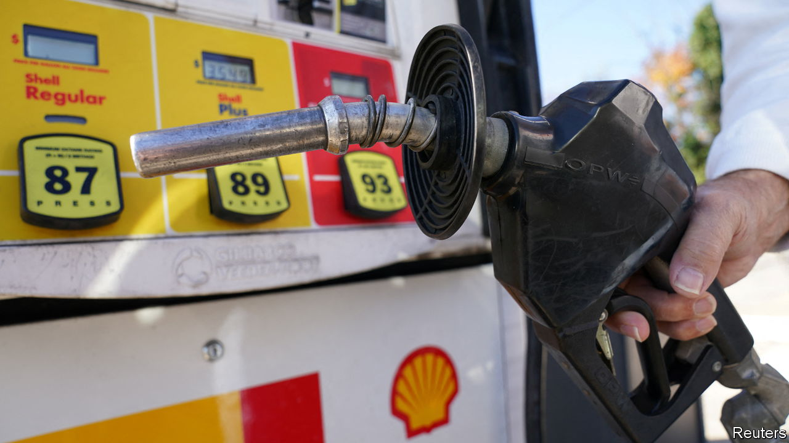
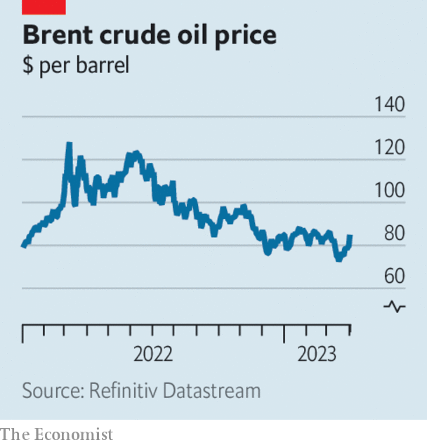

###### The world this week

# Business 

#####  

 

> Apr 5th 2023 

Oil prices rose sharply after  announced a surprise cut to production. The cartel said it wanted to support stability in the market, which is another way of saying it didn’t like the dip in oil prices in mid-March. It also wanted to deter speculators who have been betting on softer oil prices. OPEC+ is lowering output by a further 1.15m barrels per day, taking its reduction in supply to 3.66m bpd, or 3.7% of global demand. 

 


Media reports suggested that may cut up to 30% of the workforce, around 36,000 jobs, in the newly combined bank that emerges from its emergency takeover of . Meanwhile the chairman of Credit Suisse, Axel Lehmann,  at the 167-year-old bank’s last-ever annual general meeting. In his opening speech, Mr Lehmann noted the “bitterness, anger and shock” of shareholders. 

The chairman of , Mark Tucker, faced irate shareholders at a meeting in Hong Kong. Influential investors in the Chinese territory support proposals for HSBC to spin off its Asian business, which provides most of the bank’s profits. The campaign is backed by Ping An, a Chinese insurance company and HSBC’s biggest shareholder. Mr Tucker said the board’s opposition to a split was unanimous. He also pledged to keep up dividend payments that had been cut during the pandemic. 

, an investment bank based in Beijing, suspended trading in its shares and postponed its audited annual results, because the auditors cannot contact Bao Fan, the bank’s chairman and founder, to sign off the report. Mr Bao disappeared in February. It is widely assumed that he has been detained by the authorities and is co-operating with an investigation.

The 11 countries in Asia and the Pacific that comprise the  agreed to let Britain join the free-trade pact. The British government hailed this as a big post-Brexit win, but the gains to the British economy will be small, if not negligible. 

The euro zone’s annual rate of  slowed significantly in March, to 6.9% from 8.5% the previous month. However, core inflation, which strips out volatile food and energy prices and which economists worry about most at the moment, hit a new high of 5.7%. 

 central bank left its key interest rate unchanged at 3.6%, after a round of ten consecutive rises since May. Philip Lowe, the bank’s governor, recognised that “monetary policy operates with a lag” and the rate increases had yet to be felt. But he also said that some further tightening may be needed to bring down inflation.

An obit for Virgin Orbit

 filed for bankruptcy protection in America. The satellite-launch firm, backed by Sir Richard Branson, went public on the Nasdaq stock exchange in 2021 by merging with a special-purpose acquisition company (SPAC). But its business of offering cheap, small-scale launch services to the rapidly growing space industry couldn’t capture a significant slice of an increasingly competitive market. 

 delivered almost 423,000 cars in the first quarter, up by around a third from the same period last year. Its share price fell on the news since markets were expecting even higher sales given Tesla’s recent price cuts for customers. 

, a Canadian mining company, rejected an unsolicited takeover bid from , which wants to spin off their combined coal businesses. Mining coal is still profitable, despite the turn to renewable energy. Teck also owns several copper mines, an attractive asset at a time when miners can’t get enough of the metal, which is prized because of its extensive use in building new energy infrastructure for electric cars, solar, wind and the like. 

Italy’s data-protection regulator temporarily banned ChatGPT because of concerns over privacy violations. Italy is the first country in the West to prohibit the  chatbot. Germany’s data-privacy boss suggested that his country could do the same. Not everyone agrees. Matteo Salvini, Italy’s deputy prime minister, said the decision was “hypocritical” given that virtually everything online raises questions of privacy. 

Get ready to rumble

The companies behind the  and  agreed to merge in a $21.4bn deal. Both organisations are social-media powerhouses, with UFC punching above 15m subscribers on YouTube and WWE pinning down 94m. Conor McGregor, arguably the biggest star in mixed martial arts, suggested that he wants to become the first combined UFC and WWE world champion. 

