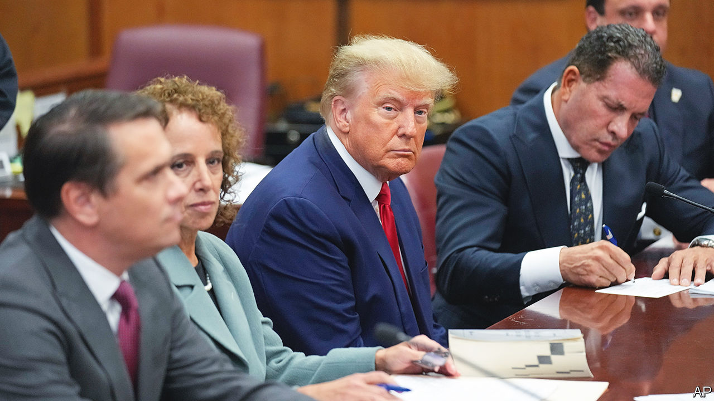
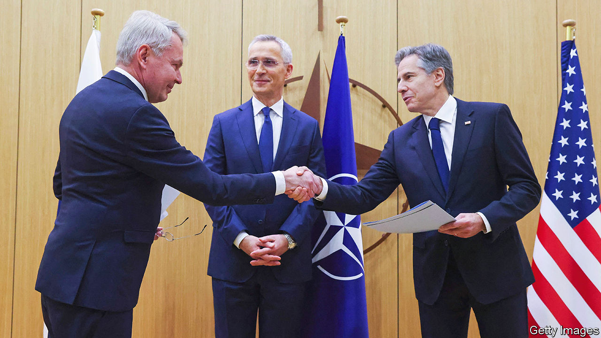

###### The world this week

# Politics 

#####  

 

> Apr 5th 2023 

 appeared before a judge in Manhattan to plead not guilty to 34 charges of falsifying business records. They relate to payments he made before the 2016 election to a pornographic actress as hush money over an alleged fling. The charges were laid by a grand jury after the Manhattan district attorney revived the case. The violence from his supporters that some had feared ahead of Mr Trump’s appearance did not materialise. Mr Trump is the first former American president to be charged with a crime. He described the case against him as a “witch hunt”. 

The left won two big elections in America. Brandon Johnson won  mayoral election; he was backed by teachers’ unions and defeated a law-and-order candidate. And voters in  chose a liberal judge for the state Supreme Court, ending its control by conservatives.

Rahul Gandhi,  opposition leader, launched an appeal against his conviction for defaming Narendra Modi, the prime minister, during a speech in 2019. Mr Gandhi’s conviction has resulted in him being disqualified from Parliament. His appeal starts on April 13th. 

 governing Labor Party won a seat from the opposition Liberals, the first time in over 100 years that an opposition party has lost to the government in a by-election. Aston, a suburb of Melbourne, had been a safe seat for the Liberals until last year’s general election, when it became a marginal constituency. Anthony Albanese, the prime minister, is riding high in the polls, with an approval rating close to 60%. 

Najib Razak, a former prime minister of , lost his final appeal against a corruption verdict for which he has been sentenced to 12 years in prison. Meanwhile, the Malaysian Parliament voted to scrap mandatory , giving leeway to judges to impose other punishments, such as whipping. A moratorium on executions has been in place since 2018. 

 cabinet approved the creation of a national guard under the control of the national-security minister, Itamar Ben-Gvir. Mr Ben-Gvir is the leader of Jewish Power, a far-right party, and a ferociously anti-Arab politician. His opponents fear that he will use the force as his own publicly funded militia. Binyamin Netanyahu, the prime minister, authorised the force in order to prevent Mr Ben-Gvir from abandoning the governing coalition.

 and  agreed to strengthen relations during the first official visit by a Syrian foreign minister to Cairo in more than a decade. It represents the latest effort by Arab states to mend ties with President Bashar al-Assad.

, which experienced two military coups last year, lurched further away from France and America, which have been helping it fight a jihadist insurgency. It expelled two French journalists, one of whom had investigated a video in which Burkinabè soldiers appear to have filmed themselves murdering teenage boys. Burkina Faso also said it wants to buy weapons from North Korea. 

Troops in an east African regional force recaptured the key  border town of Bunagana, which had been under the control of the M23 rebel group. The regional force has been reinforced with a contingent from South Sudan and has received a pledge of soldiers from Angola, after rebels broke a ceasefire deal.

Guillermo Lasso, the conservative president of , denied allegations that he had been involved in graft. Mr Lasso faces an impeachment trial in May. Congress is dominated by left-wingers who are hostile to Mr Lasso, a former banker. 

Sound familiar?

Jair Bolsonaro, a former president of , returned to the country after three months in the United States. Thousands of his supporters stormed government buildings in January in an attempt to overturn his narrow election defeat in October. Mr Bolsonaro faces numerous legal probes in Brazil, including into whether he incited the rioters (he denies all allegations). If found guilty, he could be barred from public office for eight years.

The centre-right National Coalition Party took the most seats in  general election and will try to form a coalition government under Petteri Orpo. It was a bitter defeat for , the outgoing prime minister, whose Social Democrats came third by the number of seats. The right-wing Finns Party came second, and took 20.1% of the vote, its best share ever. 

 


Ms Marin’s biggest achievement in office was steering Finland through the crisis of Russia’s invasion of Ukraine. Finland formally became a member of this week, after Hungary and Turkey became the final two members of the military alliance to approve its application. Those two countries are still holding up Sweden’s bid to join. 

France’s president, Emmanuel Macron,  for a visit timed to coincide with one by the president of the European Commission, Ursula von der Leyen. They hoped to send a unified message to the Chinese leader, Xi Jinping, about how European leaders view ties with . Mrs von der Leyen, however, has sounded more hawkish than Mr Macron, who flew to China accompanied by a large business delegation. 

America’s secretary of state, Antony Blinken, demanded that Russia release , a  with the , who has been arrested and accused of spying for the United States. 

An influential  who supported Russia’s war in Ukraine was assassinated by a bomb in St Petersburg. Russia blamed Ukraine for his death; Ukraine said he was a victim of Russian in-fighting. The authorities arrested a woman on suspicion of being involved. 

The husband of Nicola Sturgeon, former first minister, was arrested in connection with an investigation into party finances. Ms Sturgeon was the leader of the pro-independence Scottish National Party until she announced her resignation unexpectedly in February; her husband, Peter Murrell, served as the party’s chief executive until last month.

A French revolution

In a triumph for pedestrians everywhere, Parisians voted in a referendum to ban rented  from their streets following a spate of injuries. Only 8% of those eligible to vote did so, but the result was 90% in favour of prohibiting the traffic-weaving, pavement-riding nuisances from the city. 

