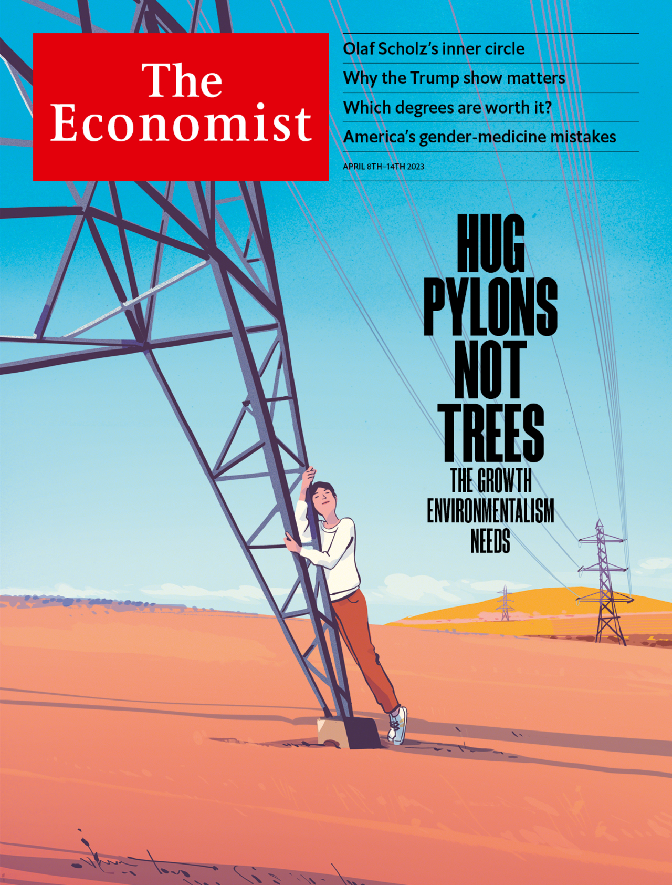
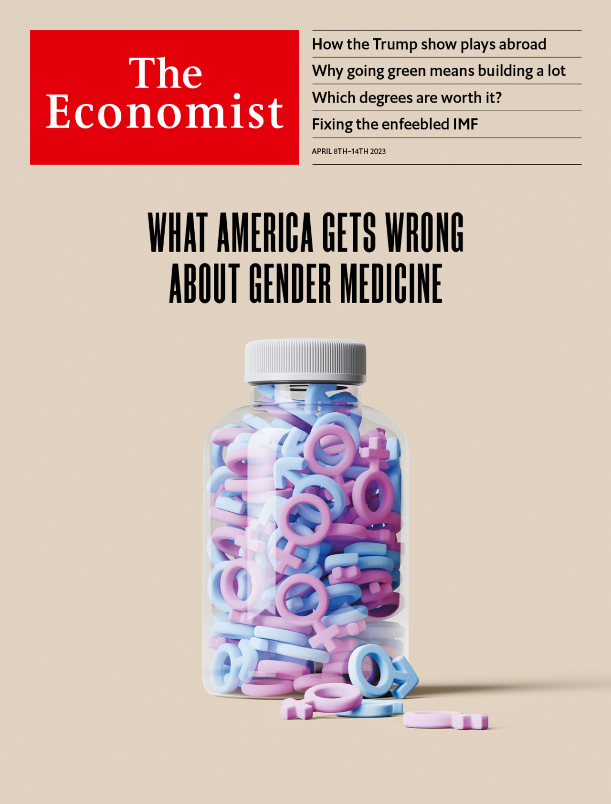

###### The Economist

# This week’s covers 

##### How we saw the world 

> Apr 5th 2023 

Some weeks, including this one, we publish more than one cover. In most of the world, we explore how fighting climate change and pursuing economic growth are interlinked projects, making the case for an environmentalism that builds. 

 


Meanwhile, in the United States we explore the issue of gender medicine, and argue that the evidence to support medicalised gender transitions in adolescents is worryingly weak.

 


.

.

