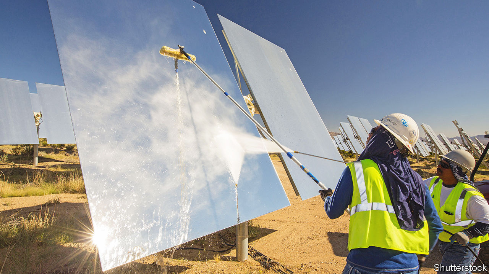
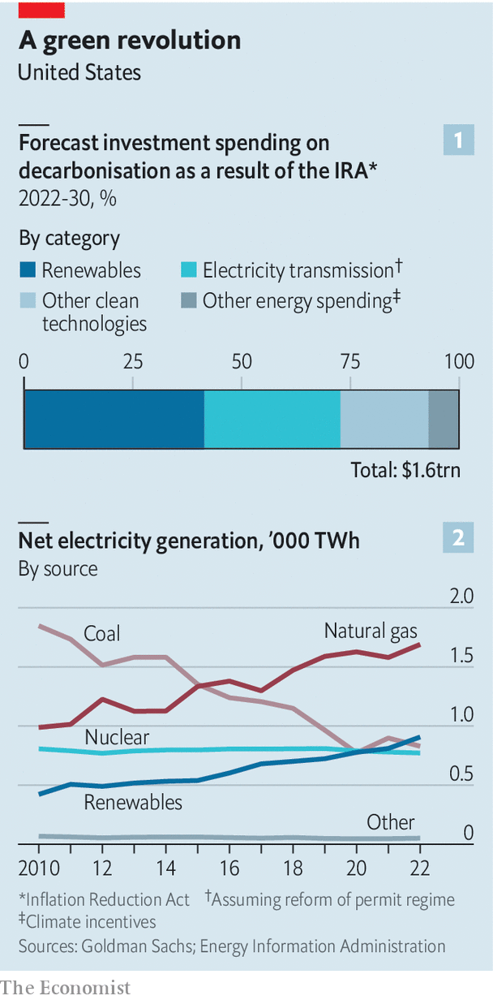
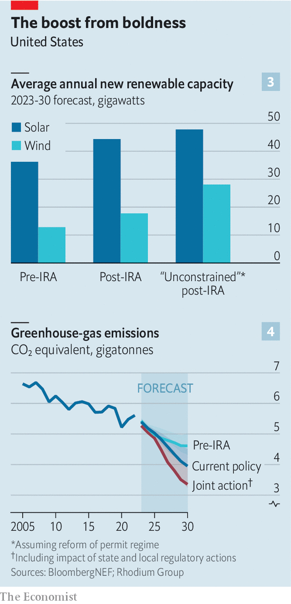

###### The irresistible nation

# America’s chance to become a clean-energy superpower 

##### Getting the most ambitious energy and climate laws in American history through Congress was not easy. Now comes the hard part 

 

> Apr 5th 2023 

THE FUTURE catches you in unexpected places. Drive down Interstate 95, the highway running along America’s Atlantic coast, into south-eastern Georgia and you will find signs and rest stops named after pecans and peaches. Take the local roads to Woodbine, an outpost so far from traditional industrial hubs that a state development officer, a proud Georgian, confesses that: “The nearest civilisation there is Florida.” In this unlikely spot you can get a glimpse of America’s clean-energy future. 

Plug Power, a pioneer in energy technology, provides warehouses operated by Walmart and Amazon with forklifts run on hydrogen. Plug is building one of the world’s largest plants to make liquid hydrogen. When your correspondent visited, workers were removing tarps from giant electrolysers, which will use clean energy to crack water into its constituents, hydrogen and oxygen. Sanjay Shrestha, Plug’s chief strategy officer, says the output will be able to power 10,000 of those forklifts a day. Local officials helped with site selection and permitting, he explains, but the Inflation Reduction Act (IRA), a climate-focused law passed by Congress last August, has had “a transformational impact” on the prospects for clean hydrogen.

Mention of that project gets Ali Zaidi, the White House’s national climate adviser, leaping to his feet in his West Wing office. Pointing to a chart showing clean-investment trends outperforming forecasts, he says: “We’re seeing people make bets on America even ahead of where our ambition might have been.” Since President Joe Biden took office, thanks to three recent laws, the Bipartisan Infrastructure Law (BIL), the CHIPS Act and the IRA, firms have announced about $200bn in investments into everything from batteries and electric vehicles (EVs) to renewables and hydrogen. Some $65bn of that has come just since the IRA was signed into law last August.

Jennifer Granholm, America’s secretary of energy, argues that the country is well on its way to becoming “a global energy superpower”. America’s oil exports, which hit a record high last year, have kept world markets supplied, and its exports of liquefied natural gas helped rescue Europe during the Russia-induced energy shock of the past year. Mr Biden came into office with an anti-fossil-fuel stance, but concerns about energy security have led to a more open posture towards Big Oil.

Witness his approval last month of Willow, an Alaskan oil project that became a  of anti-fossil-fuel activists. Senator Lisa Murkowski, a Republican from that state, credits his “much more pragmatic” approach to the impact of Russia’s invasion of Ukraine on energy markets. That pragmatism is enshrined in the fine print of the BIL and IRA. The laws offer subsidies for decarbonisation technologies well beyond wind and solar to include carbon capture and sequestration (CCS) and hydrogen made from fossil fuels. They are specifically designed to persuade the oil and gas industry to clean up its act.

A year ago Ms Granholm addressed energy bosses in Houston at CERAWeek, the country’s main oil and gas conference, just as America was imposing sanctions on Russia. The oilmen did not respond well to being scolded as climate villains by the administration at the same time as it was asking them to produce more oil to make up for global shortfalls. She returned to Houston a few weeks ago for the same conference but this time her innovation-focused speech “really electrified the audience”, says Daniel Yergin, who chaired the event. 

“We have provided a suite of carrots to make the United States irresistible,” says Ms Granholm. Sure enough, energy firms from around the world are accelerating their investment plans in America, even as they express private doubts about the efficiency of industrial policy. They also worry about the strings Congress has attached, such as woolly social-justice provisions and onerous domestic-sourcing rules. 

 


The IRA’s climate-related provisions provide some $369bn in tax credits and other direct government funding over the next decade for energy and infrastructure. Some of the tax credits (such as the lavish $3/kg production credit on offer for clean hydrogen) are uncapped by Congress, so if investors flock enthusiastically—as early signs indicate they are, from around the world—the IRA’s public climate spending could exceed $800bn. Add in the likely catalytic impact on private capital, says Goldman Sachs, a bank, and the figure soars to $1.6trn in decarbonisation investments over that period (see chart 1).

America’s energy system is at an inflection point. Last year power generated from renewable energy surpassed the total generated from coal for the first time (see chart 2). That trend looks likely to accelerate sharply. The unsubsidised costs of wind and solar are plummeting below the cost of coal generation, and tax credits for their deployment will soon flow freely. 

 


The IRA is unlikely to be overturned by a future Republican Congress. Senator Chris Coons, a Democrat from Delaware, reports that, despite noisy complaints from Republicans in the House of Representatives, he is “not hearing from Republicans in the Senate that they want to completely repeal it in 2024”, in part “because Houston benefits as much as Chicago, if not more”.

A report by Climate Power, an advocacy group, found that over 100,000 new jobs were announced in 31 states between the passage of the IRA and the end of January, with the lion’s share of the 90-plus clean-energy projects in conservative states. Georgia, hardly a liberal stronghold, came top with over $15bn in investment. Bryan Fisher of RMI, a clean-energy non-profit, estimates that more than 75 decarbonisation projects worth $1bn or more are under development in deep-red Texas and Louisiana thanks to BIL and IRA inducements. ExxonMobil, once a highly climate-sceptical company, is now heading a $100bn project for CCS along the Gulf of Mexico.

America’s new approach to energy rightly tackles the climate externality previously neglected by federal policy while mostly leaving the picking of specific technology winners to the private sector. Thanks to the insistence of Senator Ron Wyden, a wonkish Democrat from Oregon, the tax credits for clean power will shift to a technology-neutral approach. A geothermal entrepreneur gushes that his hitherto-overlooked technology will finally get a fair chance. As Mr Wyden explains: “This ties together markets with choice and competition…the more you reduce carbon emissions, the more tax credits you earn.”

New pragmatism

American law requires official support for low-greenhouse-gas (GHG) hydrogen made from renewables, nuclear power and fossil fuels with carbon capture. Some activists are hostile towards carbon-capture technologies, which they believe are giving Big Oil a longer lease on life, but UN climate experts have said they are needed to achieve long-term climate goals. America will support all forms of carbon capture capable of making it the global leader in this nascent area. BloombergNEF (BNEF), a research firm, reckons that merely the projects announced so far will propel America to a six-fold increase in its CCS utilisation by 2030. 

Also encouraging are early indications that the Biden administration wants to soften problematic protectionist provisions written into the new laws. One worry was that the desire to combat Chinese domination of vital supply chains will lead to an overreaction, with stringent tax guidance forcing American firms to domesticate supply chains radically and quickly or risk losing out on subsidies. Proposals are also making the rounds in Congress for an anti-China border tax on carbon that could become a form of protectionism.

But there are further signs of pragmatism. To avoid a tit-for-tat battle over carbon border taxes, European and American trade officials are discussing forming a carbon club of economies that would levy tariffs on steel and aluminium based on the GHG-intensity in their production.

On March 31st the Treasury unveiled rules governing the tax credits available for EVs. If these had been written in the most stringent way, they would have made it much harder to earn tax credits for new EV models. In the event, the proposal widened eligibility such that it would make it easier to source some key inputs from countries lacking the comprehensive free-trade deals long enjoyed by Canada and Mexico. The rules were denounced by Senator Joe Manchin, an influential Democrat from West Virginia favouring much stronger protectionism, as “horrific”.

Weighing against those arguments are three big impediments. The first is bureaucracy. Mr Coons argues that “the next two years are all about implementation before the 2024 election…speed is very important now.” Passing the IRA and its sister laws may have required Herculean efforts, but that pales in comparison with turning those laws into reality. 

Hundreds of billions of dollars of investment hang in the balance as the Treasury, with advice from the Department of Energy and others, decides how squeaky green projects must be to get the full hydrogen tax credit, how exactly to apply environmental and social-justice provisions in determining winners of grants, and other politically fraught decisions. Among energy-industry types, enthusiasm for the coming bonanza is tempered with concerns about the opacity and complexity of the rules involved. And there could be unintended consequences: some environmentalists are abuzz with rumours that investors are already chopping down forests in order to set up subsidised solar projects.

Old obstacles

The second snag is permitting. “We can be the superpower of all energy sources,” says Ms Murkowski, but for that to happen, “we’ve got to have permitting that makes sense.” BNEF reckons that over 1,000GW of power projects are awaiting access to the grid, with  making up the lion’s share of capacity waiting in the interconnection queues. IRA spending could boost annual construction of solar and wind capacity over the next decade by half above the non-IRA baseline, but failure to fix permitting constraints would slash that potential gain in half (see chart 3). The conventional wisdom is that no ambitious reform is possible with a presidential campaign due to start in earnest this autumn.

Yet there are surprising signs of progress. Mariannette Miller-Meeks, a Republican congresswoman from Iowa and vice-chair of the Conservative Climate Caucus, says that “one of our top priorities is permitting” and extends an olive branch: “We need to partner with the other side.” 

A coalition of dozens of business groups led by the US Chamber of Commerce issued a letter on March 27th calling the current permitting quagmire “the single biggest obstacle” to building infrastructure, and demanding that reforms be enacted by the end of summer. The coalition stretches from the American Petroleum Institute to the Solar Energy Industries Association. On March 30th House Republicans passed a fossil-friendly energy bill. It will not succeed (Mr Biden vows to veto it) but its permitting proposals could be carved out with bipartisan support.

The bigger obstacles to reform have typically come from the left, which has armies of lawyers skilled in delaying projects until they become unviable. Yet change may be coming. Congressman Scott Peters, a Democrat from deep-green California, has been pushing his colleagues to accept that “climate action involves building a lot of things…this is a break-the-glass moment.” He dares to say that even the National Environmental Policy Act (NEPA), which is held sacred by many environmentalists, needs to be updated: “You can’t sit on this old law as Biblical.” 

The combination of climate crisis and “policy opportunity” requires a change in approach if the “deployment challenge” is to be tackled, acknowledges Manish Bapna, head of the Natural Resources Defence Council, an influential American environmental group. It wants reforms in the way projects are approved at state and local level, for example through the designation of “go” and “no go” zones. While upholding the need for NEPA, the group accepts the need to implement it more efficiently. “This is not just about playing defence to stop bad projects, but also about going on the offence to build,” says Mr Bapna.

John Podesta, the supremo co-ordinating Mr Biden’s climate and energy efforts, confessed to the CERAWeek audience that “permitting has never been a top priority for senior officials in the past—and I’ve been in three White Houses.” He revealed that the administration plans to invoke provisions added to the Federal Power Act in 2005, but never fully exercised, that allow certain transmission lines to be put on a fast track. Asked about this, Ms Granholm shows off a whiteboard in her “war room” listing the most important transmission lines pending approval: she updates the White House regularly on their progress.

The third potential spoiler is the fact that the IRA is full of incentives but almost entirely devoid of regulatory mandates. Fresh analysis from the Rhodium Group, a research firm, shows that America’s current approach, while better than doing nothing, will fail to achieve Mr Biden’s goals for decarbonisation, which are linked to the UN’s Paris agreement, unless accompanied by federal and state regulatory actions (see chart 4). 

One environmental advocate reckons that enforcing rules rigorously under the existing Clean Air Act would be “the most important thing the administration can do on climate”. Another thinks the absence of federal mandates in the IRA means that “we need the sticks at the state and local level”, such as low-carbon fuel standards. 

America’s potential as a clean-energy superpower may yet be realised. To get there, though, the mighty obstacles to implementation must now be overcome. ■


