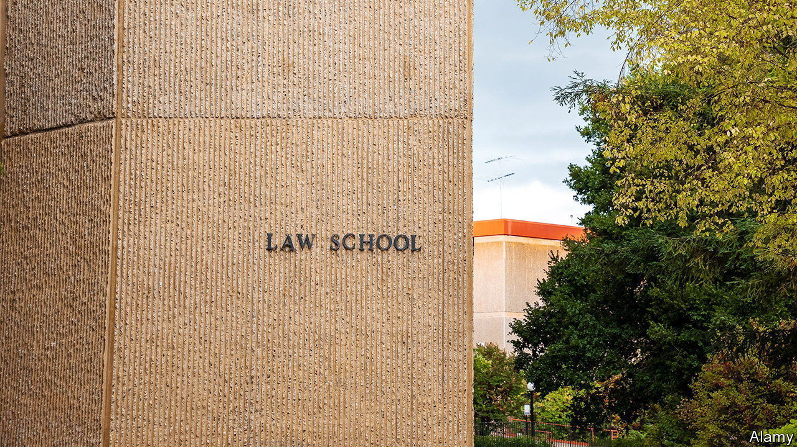

###### Legally bland

# At American law schools, a fresh fuss over freedom of speech 

##### A botched event at Stanford rekindles controversy 

 

> Apr 5th 2023 

“DO YOU sodomise your wife?” When a law student posed this query to Antonin Scalia during a Q&amp;A at New York University in 2005, the audience was shocked. But the event resumed and the impertinent question to the Supreme Court justice was not quite a non sequitur: two years earlier the arch-conservative had written a strident dissent defending the constitutionality of laws banning sodomy. 

On America’s other shore 18 years on, another right-wing judge speaking at a law school encountered a different kind of outrageous question. “Why can’t you find the clit?” a Stanford law student inexplicably asked Kyle Duncan, a judge on the Fifth Circuit Court of Appeals, on March 9th. Judge Duncan, a Trump appointee, faced a chorus of jeers as he tried to deliver his prepared remarks. He gave up after ten minutes of shouts including “we hope your daughters get raped” and “we hate you”.

Why the vitriol? Mr Duncan has issued rulings permitting abortion restrictions and stricter voting rules, and he once acerbically refused to use a transgender defendant’s pronouns. In contrast to Justice Scalia, who gave his interlocutor a stare and carried on, Judge Duncan struck back. “The inmates have gotten control of the asylum,” he told the students. He then penned an op-ed in the recounting his experience at Stanford.

Tirien Steinbach, the law school’s dean for diversity, equity and inclusion, who rose when Mr Duncan called for an administrator to restore order, compounded the tumult. She told the judge he was “absolutely welcome in this space”, before saying his rulings had “harmed” students and she understood “why people feel like the harm is so great” that the law school should “reconsider” its free-speech rules.

The law school’s dean, Jenny Martinez, and Stanford’s president, Marc Tessier-Lavigne, wrote a letter of apology to Mr Duncan. Ms Martinez followed up on March 22nd with a ten-page letter to all at the law school clarifying its commitment to free expression and noting that Ms Steinbach was now on leave. Shutting down speakers “is incompatible with the training that must be delivered in a law school”. To do so creates an “echo chamber that ill prepares students” to be “effective advocates”.

Fallout from the event extended beyond the Bay Area. On March 29th four witnesses discussed the threat to “diversity of thought” on campuses at a congressional hearing. Each speaker—including one invited by Democrats, Suzanne Nossel, the head of PEN America, a free-expression organisation—agreed that meaningful campus exchanges between ideological rivals should be encouraged, not quashed. 

But Ms Nossel was alone in opposing federal legislation to police campus expression, and to caution against state efforts to meddle in university curriculums. States including Florida, Mississippi and Iowa, she noted, had passed laws presenting an “unprecedented threat to open discourse”. By declaring certain concepts off limits, she wrote, these laws “use state power to exert ideological control over public educational institutions”.

In response to the students’ behaviour, Ms Martinez promised a half-day training on freedom of speech as well as a more detailed policy for disciplinary sanctions. That is inadequate, believe two conservative circuit-court judges who pledged last year not to hire law clerks from Yale, where similar disruptions have occurred. On April 1st they extended the blanket boycott to Stanford graduates. Other conservative commentators have argued that the student hecklers should face punishment, not a seminar. 

This hardline approach could backfire, Ms Nossel warns. If today’s progressive students “come to see the cause of free expression as a punitive agenda or a smokescreen for hatred”, she argues, they might come to displace free expression as a “bedrock American principle”. 

Nadine Strossen, a former president of the American Civil Liberties Union, agrees that “overly harsh punitive responses” are no solution. Yet even with “the best free-speech law and policies in the world”, she says, little will change “unless there is also a free-speech culture”. A recent survey found that nearly two-thirds of college students are fine with shouting down disagreeable speakers and nearly a quarter believe that violence may be used towards this goal. 

At Yale last year some 120 students shouted down Kristen Waggoner, a lawyer who has argued for the right of Christian business-owners to refuse to provide services for gay weddings. Ms Waggoner’s reprise visit to Yale in January was a success, according to Ms Strossen, who spoke at the event. Yet the strictures that helped make it go smoothly bothered Ms Strossen. With members of the press and Yale undergraduates barred, and recordings strongly discouraged, the “pendulum swung very far the other way” towards overly tight controls. This made the intellectually robust discussion a “lost learning opportunity” for everyone outside the room. ■


