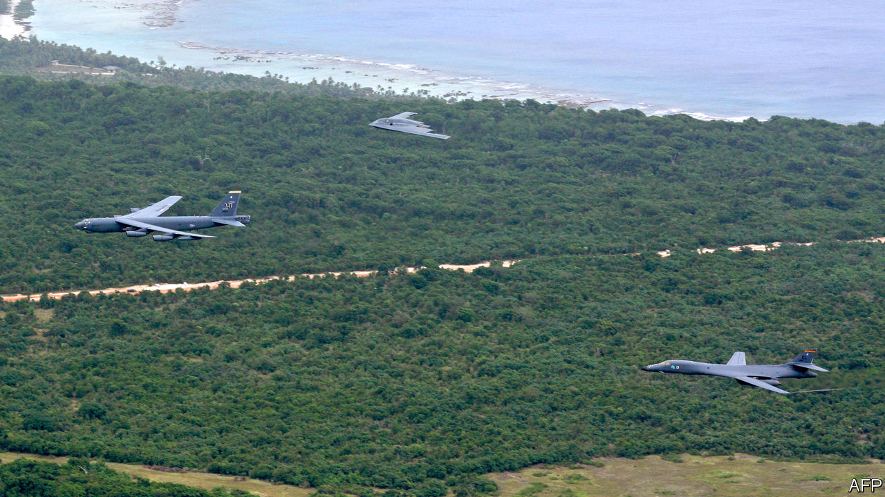
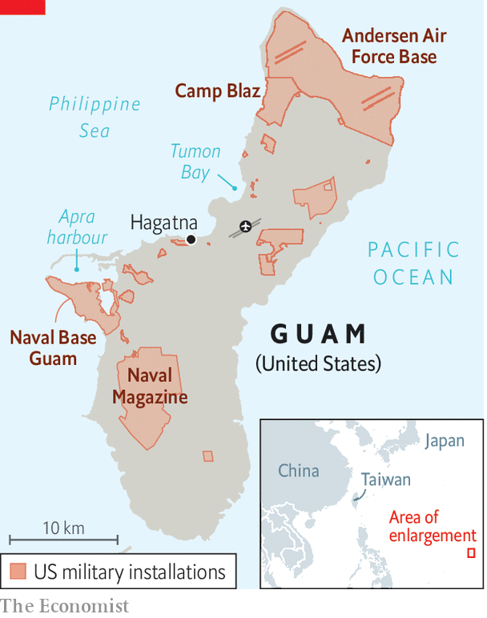

###### Holidays in the unPacific

# Guam, where America’s next war may begin 

##### The tourist island and vital military outpost is surprisingly vulnerable 

 

> Apr 2nd 2023 

LIKE MANY of America’s bases in the , Guam mixes hedonism with war jitters. Japanese and South Korean visitors revel on the sand of Tumon Bay, a coral-reef lagoon. Above,  and B-1 bombers bank to land at Andersen Air Force Base nearby. Below, nuclear attack submarines slip in and out of Apra Harbour. The marines are building a base up the road. Around lie reminders of the Pacific war between America and Japan. The last Japanese soldier surrendered in 1972.

“Where America’s day begins”, as Guam likes to sell itself (incorrectly), is also where a  with China may begin. This westernmost speck of America, just 30 miles (48km) long and with a population of about 170,000, helps it project power across the vast Pacific. As tension over  worsens, war games often predict early and sustained Chinese missile strikes on Guam, and perhaps the use of  against it. 

Startlingly, for such a vital military complex, Guam is only thinly defended. Its THAAD missile-defence battery is not always switched on. It is in any case intended to parry only a limited attack from , not an onslaught from China. Andersen has no Patriot ground-to-air missiles, though they are deployed at American bases in South Korea and Japan. Warships with Aegis air-defence systems offer extra protection, but they may not always be nearby. To judge from the ubiquitous metal traps on fences around Guam’s bases, commanders seem more worried about the brown tree snake, an invasive species, than a surprise Chinese strike.

 


China makes no secret that Guam is in its cross-hairs. The DF-26 missile, with a range of 4,000km, is commonly called the “Guam killer”. In 2020 a Chinese propaganda video depicted an H-6K bomber attacking an undisclosed air base: the satellite image was unmistakably of Andersen. To survive within China’s “weapons engagement zone”, the American air force is developing “agile combat employment”. This involves scattering aircraft to deny China an easy shot, and networking them with distant “sensors” and “shooters” to give battle. It practised such tactics at the Cope North exercise with Japan and Australia on Guam and nearby islands in February. At the end of each day, though, the jets were all parked together in neat rows in the open. The base has no hardened shelters for aircraft, and its fuel is stored in closely packed tanks above ground. 

The vulnerability of Guam is belatedly getting attention in Washington, not least because successive heads of Indo-Pacific Command (INDOPACOM) in Hawaii, in charge of any future war with China, keep pleading for better protection. At last, a plan is emerging. The Pentagon has requested $1.5bn to start beefing up the island’s air defences in the 2024 fiscal year (which starts in October 2023), much of it for the Missile Defence Agency (MDA), which focuses mainly on missile threats against the American homeland, and the rest to the army. INDOPACOM is pushing for $147m more.

“We are playing catch-up,” admits Vice-Admiral Jon Hill, director of the MDA. He says the first step will be to put the ship-based Aegis system on land. Unlike “Aegis ashore” systems in Poland and Romania, the version on Guam will have better radars, and many components will be “distributed”: movable on wheels to improve their chances of surviving attack. There will be several radars to give all-round coverage. Together with THAAD, this will provide more robust protection against ballistic missiles. 

Cruise missiles may prove a bigger menace because of their greater numbers, and ability to fly low and turn. These would be taken on mainly by a combination of army systems: Patriot; its new and more powerful radar, LTAMDS; and a shorter-range system called IFPC. The first elements should be in place by 2024. Future kit will be integrated as it becomes available. It may eventually include weapons to take out hypersonic missiles, which are hard to hit because they fly fast and manoeuvre, and “directed energy” systems (using lasers and microwaves)

All this raises questions. One is the timetable: several of the components are not yet in production, and much of the money is still going on research and development. Another is whether disparate systems from the MDA, navy and army can be fully integrated so that commanders can fight off many kinds of missiles from many directions. A third is whether a polarised Congress will pass a budget on time. And last, many of Guam’s people may well ask: will ever more military hardware on Guam endanger us, or scare away the tourists? ■


