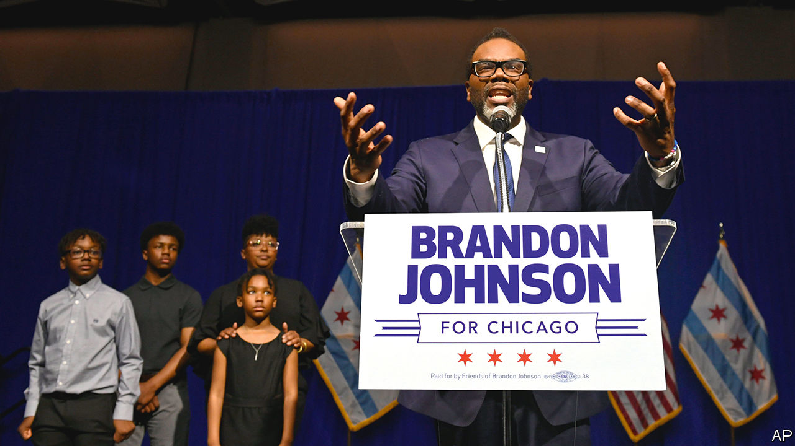

###### Bringing down the house

# The message from the striking elections in Chicago and Wisconsin 

##### Wins for Brandon Johnson and Janet Protasiewicz show the limits of tough-on-crime politics 

 

> Apr 5th 2023 

If there was a soundtrack to Brandon Johnson’s campaign to be mayor of Chicago, it was house music. At his events, a truck blaring it out followed him around. At his election-night party, a dj warmed up supporters with Chicago classics such as “Percolator” by Green Velvet and “Your Love” by Frankie Knuckles. Middle-aged women in union hoodies bopped alongside young men in suits. The queue for drinks stretched across the room. But the most appropriate song played at the event was, oddly enough, by a British band—”You Sexy Thing”, by Hot Chocolate, with its chorus “I believe in miracles”. When Mr Johnson came onto the stage, he began his speech with one word: Hallelujah.

Mr Johnson’s victory, by around three percentage points, was one of two striking wins for left-wingers on the western shore of Lake Michigan on April 4th. The other was in Wisconsin, where Janet Protasiewicz, a left-leaning Milwaukee circuit-court judge, won a vacant seat on the state’s Supreme Court by a margin of about ten points, defeating Daniel Kelly, a conservative former member of the body, and giving liberals a majority on the court in the state for the first time in 15 years. 

The two races were distinct. Chicago is a deeply blue city in a blue state, and voters had a choice between two Democrats, albeit ones from opposite ends of the same party. Wisconsin, by contrast, is a true battleground state in which Republicans dominate the state legislature. Yet in both places the results are a huge boost to the progressive wing of the Democratic Party. They also constitute a challenge to the idea that tough-on-crime rhetoric is a reliable way to win elections. 

Mr Johnson’s victory is the more surprising of the two. Few Chicago politicos expected the former public-school teacher and union organiser even to make it to the second round (the first round of the election was on February 28th). In January Lori Lightfoot, Chicago’s outgoing mayor, mocked the teachers’ union, Mr Johnson’s primary patron, for pouring money into his campaign, saying: “God bless. Brandon Johnson isn’t going to be the mayor of this city.” He had struggled to shake off past radicalism, such as a claim he made in 2020 that defunding the police was a “real political goal”, which many assumed would sink his campaign.

In the event, however, Mr Johnson’s tangible charisma and radicalism drew out a young, left-wing crowd, even as he consolidated the votes of the other progressives he beat in February. And although his leftism probably did cost him some votes, he was also lucky in his opponent, Paul Vallas, a former head of the Chicago public schools. Like Mr Johnson, Mr Vallas spent much of the campaign trying to get away from past comments—in particular, two he made more than a decade ago in which he suggested that he was more Republican than Democrat, and that he was “fundamentally” opposed to abortion. In a city that has not elected a Republican mayor since the 1920s, Mr Vallas was arguably the more controversial candidate.

In Wisconsin, the liberal Ms Protasiewicz also won in a race in which her opponent attempted to paint her as weak on crime. Mr Kelly spent much of the campaign pointing to rapists she had apparently not jailed. Yet his own extremism cost him more. Ms Protasiewicz campaigned on her “personal values” of supporting abortion rights, which are popular but are also currently non-existent in Wisconsin, thanks to a law from 1849 brought back into effect by the United States Supreme Court last year. Mr Kelly was associated with a far less popular cause: that of the attempt to overturn the results in Wisconsin of the last presidential election, by having fake electors cast votes for Donald Trump. Though Mr Kelly tried to argue that he was merely an impartial lawyer advising a client, rather than a fully-fledged participant in the plan, evidently few voters in Wisconsin bought it.

The question now is whether in governing—or judging—they can satisfy their voters. Mr Johnson has promised radical changes to end Chicago’s “tale of two cities”, including tax rises to pay for social spending. But he will take over a government struggling with a black hole in its pension funds and a hostile police department. Similarly, Ms Protasiewicz, as part of the new liberal majority on the Wisconsin Supreme Court, will face demands from the base that elected her to make controversial decisions on law, such as throwing out the state’s abortion ban, or imposing new election maps that are more favourable to Democrats. Both could end up disappointing at least a few of the people who propelled them to victory. ■


