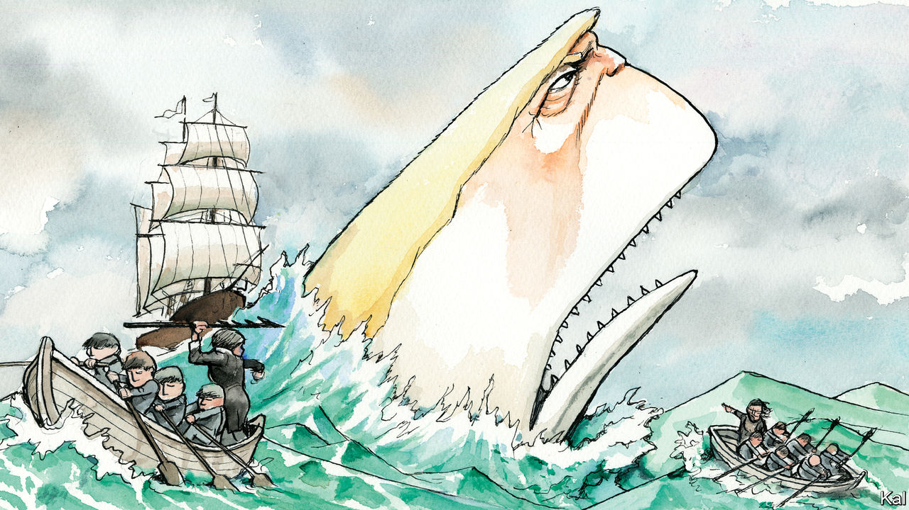

###### Lexington

# Why do Democrats keep helping Trump? 

##### The charges in Manhattan have boosted his political prospects by restoring him to his favourite role 

 

> Apr 5th 2023 

“I bring out the worst in my enemies,” Roy Cohn, a ferocious red- and gay-baiting lawyer, once told William Safire, a conservative columnist, “and that’s how I get them to defeat themselves.” Donald Trump, for years Mr Cohn’s client and ardent pupil, has outdone his mentor: Mr Trump brings out the worst in everyone—enemy, ally and onlooker alike. 

How else to explain the ecstasy of news-media speculation and vamping as Mr Trump’s arraignment approached on April 4th, the historic and unprecedented use of the words “historic” and “unprecedented”, the online tracker CNN created so that panting viewers could follow along as Mr Trump’s plane delivered him from Florida to New York City? 

And how else to explain the indictment itself? Democrats and their sympathetic commentators had been predicting that when the charges were unsealed, they would prove far darker than the familiar accusations that Mr Trump orchestrated a scheme in 2016 to pay hush money to smother embarrassing revelations and enhance his chance at the presidency. They said the indictment would show that Alvin Bragg, the Manhattan district attorney, was not relying on an unusual gambit to bootstrap what are misdemeanours under state law—falsifying business records—into felonies by linking them to violations of campaign-finance law. They predicted that Mr Bragg would not be counting heavily on the testimony of Mr Trump’s former lawyer, Michael Cohen, whose integrity might not impress a jury since he has already pleaded guilty in the scheme and to lying to Congress. 

Yet in the end the surprise was that the indictment held none. Of course, as Mr Bragg’s defenders say, no American should be above the law. No principle of good governance could immunise former presidents from being prosecuted for committing crimes. There is also rough justice in Mr Trump, who has so often called for opponents to be jailed, finding himself in the dock. But in choosing to charge this former president with these crimes, Mr Bragg has done less to vindicate the rule of law than to put it at risk. He has smoothed Mr Trump’s path back to the Republican nomination and thus to the White House. 

Not long ago, Mr Trump seemed to be waning as a political force. Even some of his supporters worried that, as he whined about the 2020 election and his brace of impeachments, he came across as obsessively pursuing stale personal grievances rather than championing Americans’ concerns. Fox News had turned its cameras away from him and trained them on a seemingly formidable, likely challenger, Governor Ron DeSantis of Florida.

But this indictment is transforming Mr Trump from Ahab back into the great white whale. With all eyes once more upon him, he is again bearing down on America’s democracy. Mr Bragg has returned Mr Trump’s litany of grievance to the present tense and him to his favourite role, as the target of obsessed leftists. “They are not coming after me,” Mr Trump likes to tell his crowds. “They are coming after you, and I am just standing in their way.” After the indictment, he delivered a particularly vicious speech at his Florida club. “The only crime that I have committed”, he said, “is to fearlessly defend our nation from those who seek to destroy it.”

Mr Trump has denied the charges and any affairs, but he has admitted paying hush money to protect his reputation, without regard for any campaign. Past sex scandals involving President Bill Clinton and Senator John Edwards suggest voters and juries have a high tolerance for political chicanery to conceal intimate matters.

Maybe Mr Bragg will persuade a jury in the end. But with Mr Trump not due back in court in this case until December, even Republicans who are determined to stop him are accusing the prosecutor, a Democrat, of playing politics. Senator Mitt Romney of Utah said Mr Bragg had set “a dangerous precedent for criminalising political opponents”. Mr Trump has surged in recent polls, and he claims to have hauled in millions of dollars in donations with his pleas for support against the prosecution in Manhattan.

In the clearest index of broader Republican sentiment, Mr Trump’s opponents for the nomination have felt it necessary to fall in behind him. (One noble exception is Asa Hutchinson, a former governor of Arkansas, who said Mr Trump should withdraw out of respect for the justice system and the presidency.) In mid-March Mr DeSantis mocked Mr Trump for “paying hush money to a porn star”. But he soon joined the chorus, pandering with an empty vow not to “assist in an extradition request”.

Dopes and prayers

The White House apparently regards this as good news. Joe Biden, who is all but certain to run for re-election, is said to believe Mr Trump is the easiest Republican to beat. Other, more threatening indictments are probably headed Mr Trump’s way, over his attempts to overturn the election and to make off with classified documents. The publication  reported on April 4th that Mr Biden’s advisers believe the swing voters who deserted Mr Trump in 2020 will not return to him, given all the furore he creates.

What dangerous assumptions. Mr Trump may have lost the 2020 election by 7m votes, but he was just over 40,000 votes away from tying Mr Biden in the electoral college. In a general-election campaign, Mr Trump can count on polarisation to rally doubting Republicans behind him, and Mr Biden’s approval ratings remain low by historic standards. Who knows what may happen with his health or the economy. The indictment in New York may help Mr Trump demean any other legal action against him.

It could be hoped, once, that the challenge to decency posed by Mr Trump would bring out the best in America. Instead, Mr Trump has made zealots and quislings out of Republicans while inflaming and dumbing down Democrats and polarising, which is to say corrupting, the news media. He promises to make America great but he keeps making it worse, and he is far from done. ■


