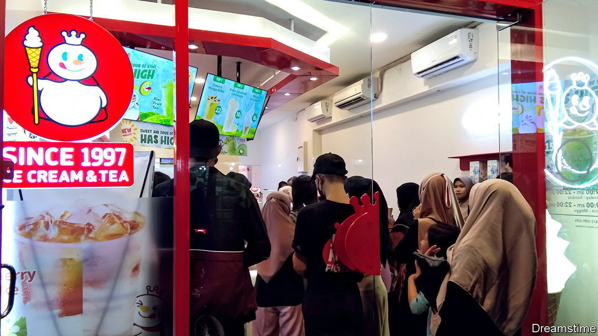

###### Boba life

# Chinese bubble tea chains go viral in South-East Asia 

##### The favourite drink of rising Asia is milky tea with tapioca balls 

 

> Apr 13th 2023 

OPPOSITE a university campus on the outskirts of Jakarta, motorbikes line the front of Ricky Salim’s ice-cream and tea store. One of thousands of Mixue franchise owners across Asia, Mr Salim says his business is so good he hopes to open more outlets this year. Mixue, a Chinese firm which built its brand selling flavoured teas and soft-serve ice-cream in smaller Chinese cities with relatively modest average incomes, is exporting its model across South-East Asia. Its nearly 22,000 franchised stores worldwide, by early last year, made it the fifth-largest fast-food chain in the world by outlet, behind McDonald’s, Subway, Starbucks and KFC.

Part of the reason for Mixue’s success is that it sells rising Asia’s favourite drink: bubble (or “boba”) tea, a milky tea containing chewy tapioca balls. In China, the market for these newfangled, flavoured teas was twice that for coffee in 2021, with a $20bn turnover, according to Momentum Works, a research firm in Singapore. As growth has slowed in China, bubble-tea brands have set their sights on South-East Asia, where the market was worth $4bn. Several other large, Chinese, ready-made tea brands, including HeyTea, Nayuki Tea, ChaGee and Happy Lemon, have also moved into the region.

Yet no bubble-tea chain has spread faster than Mixue, which opened its first store in Vietnam in 2018. By March it had around 1,500 stores in Indonesia; the firm wants to double its presence there by the end of this year, says Andy Meitri Hartanto, Mixue Indonesia’s franchise manager. The brand’s bright red signage and snowman logo can already be found in malls, along dusty side streets and on shophouses across Indonesia. Many branches stock board games, magazines, picture books and soft toys. On weekends Mr Salim’s outlet fills with parents taking their children out for ice-cream, while during the week his main customers are students and office workers looking for an affordable, comfortable place to study or work. An ice-cream costs just 8,000 rupiah ($0.50). 

Almost all Mixue branches are franchises. Around 95% of the firm’s 10.3bn yuan ($1.5bn) in revenue in 2021 came from selling ingredients, packaging and equipment to franchise-holders. Huge factories and extensive supply chains let it keep down the store-price of ice-creams and teas, according to Zheshang Securities, a Chinese broker. Around 90% of Mixue Indonesia’s products are imported from China. But the company’s Indonesia operation has grown to such an extent that it plans to start making ingredients locally, says Mr Hartanto. Mixue has also adapted to local conditions. The Indonesian Ulema Council, a religious body, declared Mixue halal in February. In a country with 230m Muslims, “this decision was a big deal”, says Mr Salim.

Mixue dates from 1997, when its founder, Zhang Hongchao, started selling shaved ice and drinks at a roadside stall in the central Chinese province of Henan. Yet it wasn’t until videos of its mascot, a chubby snowman, singing the Mixue theme song went viral on Chinese social media a few years ago that the brand became a household name. Short videos on Mixue, which means “honey snow” in Mandarin, have been viewed more than 17bn times on Douyin, TikTok’s Chinese sister app.

Unlike fancier bubble-tea brands, Mixue markets itself as cheap and cheerful, rather than trendy, both in China and South-East Asia. Its viral song has been translated into 20 languages and is often played relentlessly in its franchises. “What it took our China team ten or 20 years to figure out, we’ve been able to perfect in just one year by learning from their experiences,” says Mr Hartanto.

Mixue’s biggest ambitions for growth are in countries with rapidly growing economies and many young people, such as Indonesia, the Philippines, Thailand and Vietnam. Yet over the past year Mixue stores have also opened in Australia, Japan, Singapore and South Korea, and the firm has registered its trademark in markets from Europe and America to Kyrgyzstan and Uzbekistan. It has announced plans for an initial public offering on the Shenzhen Stock Exchange. The singing snowman is coming your way. ■

