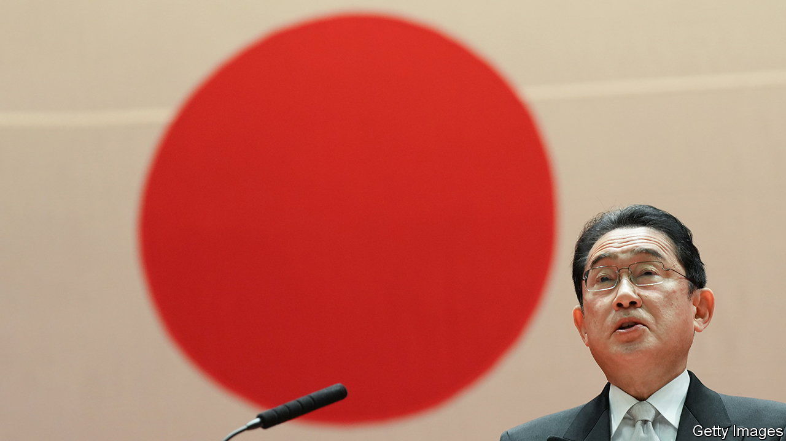

###### Kishida in the clear

# Japan’s prime minister has recovered from a rough patch 

##### The ruling party’s victory in local elections will help quell doubts about Kishida Fumio’s grip 

 

> Apr 13th 2023 

Kishida fumio, Japan’s prime minister, should not to have to worry about his grip on power. His Liberal Democratic Party (ldp) has ruled with only two brief interruptions since 1955; the main opposition parties are a shambles. After winning a party ballot to head the LDP in late 2021, Mr Kishida led it to a thumping victory in Upper House elections in the summer of 2022. He does not need to face another leadership contest until late 2024 and the next national parliamentary election need not be held until 2025.

And yet, doubts about Mr Kishida’s standing have dogged his administration throughout his 18 months in office. They became especially acute late last year, when his approval ratings dipped below 30% after the assassination of Abe Shinzo and subsequent revelations about the LDP’s links to the Unification Church, a cult-like group, that had inspired the former prime minister’s killer. Party insiders began to grumble about Mr Kishida’s leadership. Whispers started circulating that if the LDP stumbled in its next electoral challenge—a quadrennial and nationwide contest for prefectural offices—then Mr Kishida might be ousted, perhaps soon after he is due to host a G7 summit in his hometown of Hiroshima in May. 

The results from the first batch of the local elections, held on April 9th, have largely quelled those doubts. The LDP won 51% of seats in prefectural assembly elections. Along with its coalition partner, Komeito, it took six of the nine gubernatorial posts up for grabs. “Voters have recognised our achievements,” declared the LDP’s election chief, Moriyama Hiroshi. Political analysts now expect a similar triumph on April 23rd in the second round of elections, which includes five special elections for seats in the national parliament. Mr Kishida is “riding high and feeling very confident,” says Toshikawa Takao, editor of , a political newsletter.

The LDP’s latest electoral success in part reflects an upswing in public attitudes toward Mr Kishida. His approval ratings have steadily ticked upwards, and are now comfortably above 40% in most recent polls. The prime minister’s recent trip to Kyiv, the first time a post-war Japanese leader has visited an active conflict zone, proved to be immensely popular. Voters also credited Mr Kishida with patching up relations with South Korea, whose president, Yoon Suk-yeol, visited Tokyo for a long-awaited summit last month.

Yet the good news for the LDP also masks more troubling signs about the health of Japan’s democracy. Voter turnout, which has been steadily falling over the past decade, hit a new low for prefectural assembly elections at 42%. Mainstream challengers to the LDP, such as the Constitutional Democratic Party, successor to the last opposition group to hold power nationally, continued to flounder; the most successful challenger was the Japan Innovation Party, a populist outfit that made inroads beyond its traditional base in Osaka. Japan’s shrinking, greying population is also making it hard to find candidates: races in about 40% of electoral districts were uncontested. A lack of competition, rather than great enthusiasm for LDP policies, thus explains a lot of the party’s ongoing dominance. “Kishida doesn’t have much colour—it’s hard to tell what he’s thinking or what he wants to do,” says Kimura Mariko, who voted for the LDP in elections in Chiba, near Tokyo, all the same. 

Nonetheless, Mr Kishida will feel reinvigorated as he heads into the G7 next month. Having dispelled questions about his immediate future, he will be able to engage with his global peers without them wondering if, like so many previous Japanese prime ministers, he will be gone before they have a chance to meet again. Mr Kishida looks well-placed ahead of next year’s LDP leadership contest. His next move may be to call for a snap lower-house election, a tactic favoured by the late Abe as a means of reasserting prime ministerial control over his party. On March 29th, Mr Kishida denied rumours that he was already planning such a move. ■

