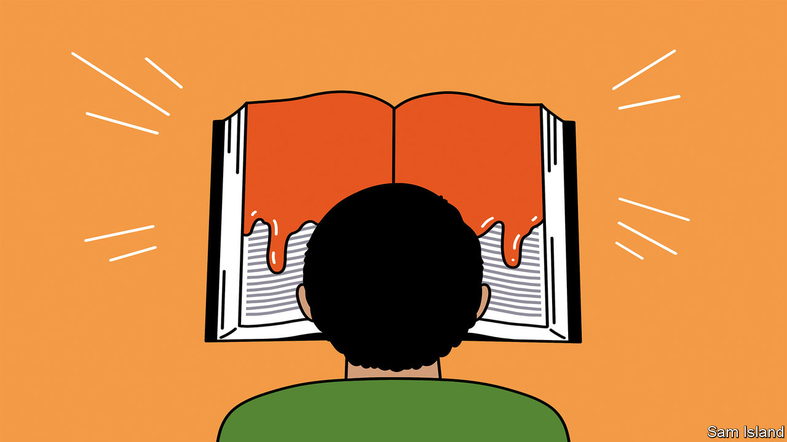

###### Banyan

# Narendra Modi is rewriting Indian history 

##### The prime minister is retrofitting his country’s past to control its future 

 

> Apr 13th 2023 

At the start of the academic year this month, 12th-year students of history and politics at tens of thousands of schools across India returned to a syllabus and textbooks that had been significantly altered. Tweaks are good when they reflect new thinking in a discipline or correct blind spots. Those overseen by the National Council of Educational Research and Training do not do that. Rather, they reflect the strident vision of nativism, known as Hindutva, adhered to by the ruling Bharatiya Janata Party (BJP) and its leader, Narendra Modi. Disdaining the actual record, it imagines India as a purely Hindu land. 

Consider the abuses of history that flow from this fever dream. It is impossible to understand the Indian story without appreciating the immense role of the Mughal emperors. Invaders from Central Asia, these Muslim dynasts ruled much of India—often illustriously, sometimes with bigotry—from the 16th to the 18th centuries. India’s built heritage is thick with Mughal work—think of the Taj Mahal and, perhaps sweetest of all, Humayun’s tomb in Delhi. The Mughal administrations employed Hindus in eminent positions. That one-seventh of India’s population of 1.4bn is Muslim today is a Mughal legacy. Yet in Mr Modi’s new textbooks, chapters on the Mughals have been shortened or scrapped.

Key excisions uncovered by the newspaper have also been made to the history attending modern India’s birth pangs, among them the assassination of Mohandas Gandhi. Textbooks used to teach that “Gandhi’s steadfast pursuit of Hindu-Muslim unity provoked Hindu extremists so much that they made several attempts to assassinate [him].” It has been cut. So has a description of Gandhi’s assassin, Nathuram Godse, as belonging to the Brahmin caste (an important BJP constituency). Textbooks no longer say Gandhi “was particularly disliked by those who wanted India to become a country for the Hindus, just as Pakistan was for the Muslims.” Gone is the fact that the Rashtriya Swayamsevak Sangh (RSS), Hindutva’s paramilitary wing, was banned after Gandhi’s death. 

More recent history also gets a rinse. In 2002 in Gujarat, over 1,000 people died, most of them Muslims, in vicious sectarian violence. Mr Modi was the state’s chief minister at the time—and strikingly silent over the activities of Hindu lynch mobs. Students were previously taught that “Instances, like in Gujarat, alert us to the dangers involved in using religious sentiments for political purposes. This poses a threat to democratic politics.” This has also been stripped from the latest edition.

The education council’s head says the changes are an act of kindness: reducing “content load” for kids who have had a tough time during the pandemic. BJP stalwarts did not get that memo. One, Kapil Mishra, tweeted triumphantly that the Mughal emperors are “not in the history books, they are in the dustbin”.

Mr Modi himself had previously complained of a “concocted” historical narrative—all that guff about immigration from Iran and elsewhere at key moments over the millennia and about India as a place of diverse multitudes. In 2017 he established a committee—containing no Muslims, Christians or women—to rewrite India’s early history. Its aim, members say, is to prove Hindus are direct descendants of India’s very earliest inhabitants and (for why stop there?) that Hinduism’s ancient scriptures are not myth but fact. One committee member says that Hindus have been around for millions of years—apparently predating the rest of the human species.

This politicised assault on Indian history is a mirror image, notes Mukul Kesavan, a writer, of next-door Pakistan’s attempt to retrofit its past to match an exclusionary present. It may seem as risible as the image, long ridiculed by Indian liberals, of RSS officers strutting about in their erstwhile uniform of khaki shorts, like so many overgrown boy scouts. But it is also, like the RSS, which took inspiration from early 20th-century European fascist movements, extremely dangerous. Hindutva entails above all, as Mr Kesavan puts it, a “ferocious hatred for the Other”.

Expunging non-Hindus from Indian history and oppressing them in reality are related consequences of that exclusionary creed. It is lamentable that millions of students will not be taught to understand India as the great and inspiring story of diversity, contestation and accommodation that it is. The increased persecution of non-Hindus that Mr Modi’s warped history will invite is more worrying still.■


