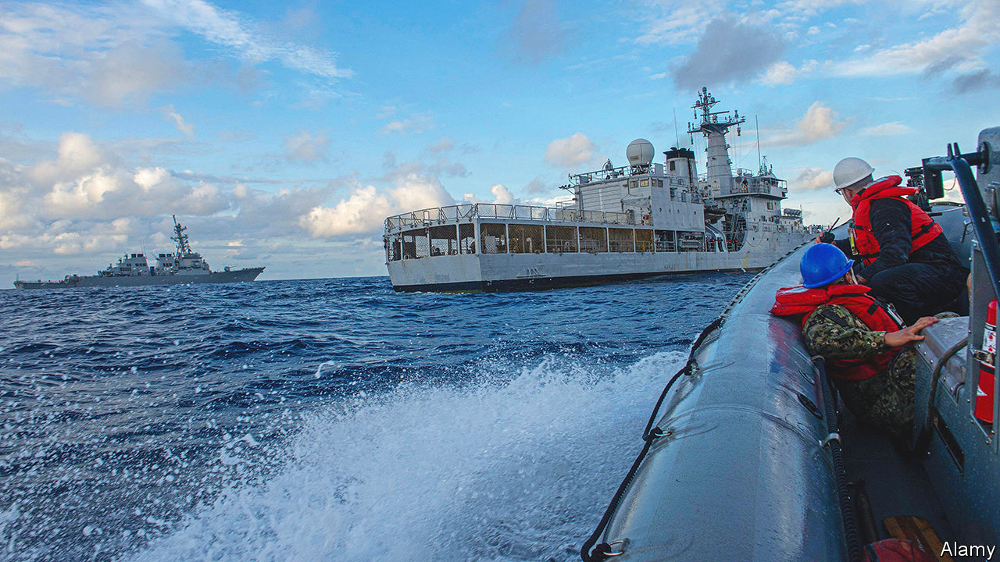
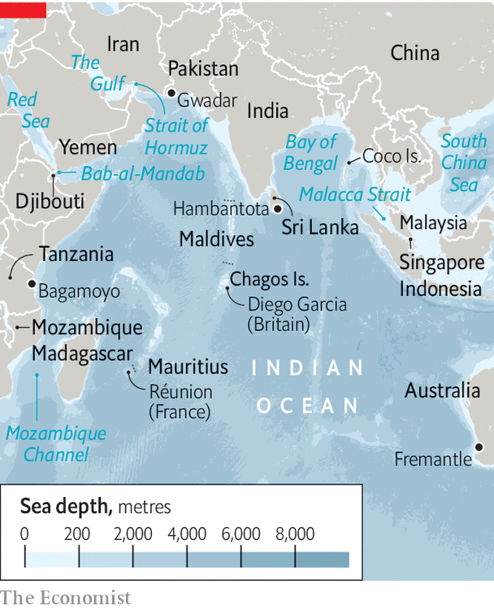

###### Putting the Indo into Indo-Pacific

# Rivalry between America and China has spread to the Indian Ocean 

##### The world’s most powerful navies are swarming to a long-neglected maritime region 

 

> Apr 10th 2023 

A“FREE AND open Indo-Pacific”, intended to encompass both the Indian and the Pacific Oceans, is the hottest geopolitical slogan. When strategists talk about the Indo-Pacific, however, they often mean just the Pacific, and then only the far-western part, around the South China Sea and the East China Sea. It is there that a struggle for primacy is at its fiercest between America, dominant since the second world war, and a resurgent China. Yet the Indian Ocean, relatively neglected until recently, is now having a moment.

The economic dynamism of its rim and great importance of the ocean as a hub for trade in goods and energy have long been recognised. Now its strategic significance is catching up. No single power holds sway in this ocean, and perhaps never will. Yet China is making inroads into its waters and other navies also jostle there for influence. A new oceanic era shaped by great-power rivalry has begun. Smaller Indian Ocean countries wonder whether they will be victims of it, or beneficiaries.

 


The Indian Ocean stretches from the southern tip of Africa to the Malacca Strait between Malaysia, Singapore and Indonesia; and from the Persian Gulf to far south-western Australia: over 80 degrees of latitude and 100 degrees of longitude (see map). It encompasses three dozen continental and island states accounting for 12% of world gDP. Around its rim live more than 2.6bn people, in countries with a dizzying array of topographies, cultures and economies. On its waters are islands such as the Maldives at the crossroads of strategic shipping routes. Though tiny, they have exclusive rights to huge expanses of ocean.

Signs of sharpening rivalry are everywhere. The navies of America, Australia, Britain, France, India, Japan and Singapore have all patrolled in the Indian Ocean this year. In March the navies of China, Iran and Russia exercised there together.  recently announced more details of a plan to base next-generation nuclear-powered submarines in western Australia. Last month Japan’s prime minister, Kishida Fumio,  to promise $75bn of investment across the Indo-Pacific. Also in India there is wild speculation about a Chinese radar installation in Sri Lanka and a Chinese listening post on Myanmar’s Coco Islands.

The transport of oil and gas across the Indian Ocean from the Middle East is vital for the vibrant economies of East and South-East Asia. Most of these shipments pass through at least one of three geographic choke-points. The first is the Strait of Hormuz, the narrow exit from the Persian Gulf through which two-fifths of the world’s traded oil passes. Another, the Bab-al-Mandab Strait, lies between the Horn of Africa and the Arabian peninsula, with Eritrea and Djibouti on one side and Yemen on the other. It is the gateway to the Red Sea and the Suez canal. The third area of acute concern is the Malacca Strait, the main shipping channel between the Indian Ocean and Pacific. Just 1.7 miles (2.7km) wide at its narrowest point at Singapore, it sees a fifth of global maritime trade.

Any malign force capable of throttling the choke-points and other crucial entrances to the Indian Ocean would cause immense harm. Bab-al-Mandab and the Strait of Hormuz look especially vulnerable. The Horn of Africa is notorious for piracy and Islamist militancy. As for the , in recent years a hostile Iran has seized or attacked merchant vessels and threatened to close the strait. The Iranian navy is converting two merchant vessels into carriers for kamikaze drones. 

The Malacca Strait is better defended than the other two choke-points, yet still has the highest incidence of piracy in the world. In the event of a regional conflict, control of the strait would assume huge importance. With four-fifths of its oil passing through it, China has for years obsessed over how easily a hostile power such as America could close the strait.

In this context, it is important that states with the naval capability to ensure that choke-points remain open not only protect their own interests but provide a global good. These countries are today’s Indian Ocean powers. And there are proliferating consequences to their growing naval presence. Reconnaissance missions around choke-points and other vulnerable places increase awareness of what is on the water and under it—including the submarines of potential adversaries. As a result, strategic rivalries among naval states can sharpen even as they co-operate to maintain open sea-lanes, a shared naval objective. That is happening now.

Some of the ocean’s former colonial powers remain influential. The tropical island of Réunion is an overseas department of France, which also owns remote islands in the Mozambique Channel. They make France an Indian Ocean power with interests to defend. Britain makes much of its regular Indian Ocean deployments, including by a new aircraft-carrier. Its ships join French ones on patrols and exercises.

Having neglected the Indian Ocean for years, the American navy has increased “freedom of navigation exercises” there. It is also conducting more exercises in the ocean with, among others, Australia, India and Japan, fellow members of the “Quad” security grouping intended  in the Indo-Pacific. America’s navy intends to resurrect its First Fleet, which was disbanded half a century ago, and base it in the Indian Ocean.

Although India sees its chief threats, Pakistan and China, as mainly land-based, it has the strongest naval presence in the northern part of the Indian Ocean. It has increased naval co-operation with America because of concerns about China’s growing clout in the region. It is also striving to fill many gaps in its naval capacity. 

Australia has been an Indian Ocean power at least since it opened a submarine base in Fremantle during the second world war. Its presence is about to get a huge boost from AUKUS, a defence-technology pact between America, Australia and Britain that will see nuclear-powered submarines based near the same port-city. AUKUS is meant to counter Chinese military expansion in the Indian Ocean as well as the Pacific. Singapore, despite being a small city-state, packs a naval punch, too. And in tiny Djibouti, eight outside powers maintain naval bases, including America, France, Japan and, since 2017, China.

China is the new kid on the Indian Ocean block, with Djibouti its first ever overseas military base. China’s naval capabilities have grown fast. Gordon Flake of the Perth USAsia Centre, a think-tank, says it came as a shock to Australia when in 2014 a self-sustaining Chinese naval force appeared in the southern Indian Ocean to help search for the missing Malaysian Airlines flight 370. China’s navy has since become the largest in the world by vessel numbers. In Beijing a debate about establishing an Indian Ocean fleet is under way.

The new Indo-China

China wants more bases for support and resupply. Yet, Djibouti aside, it has been slow to secure them. Persistent rumours that the Chinese navy is establishing bases in Hambantota port in Sri Lanka and Gwadar in Pakistan have not been substantiated. China’s plans for a commercial port at Bagamoyo in Tanzania are sparking speculation about a naval base there, too. According to Kate O’Shaughnessy, a former Australian high commissioner to Mauritius, “It is in really out-of-the-way places where China is playing a long game in building up its core infrastructure and access to the Indian Ocean.”

The smaller countries of the Indian Ocean view renewed interest by stronger powers with both satisfaction and alarm. They suffer more than anyone from the instability caused by rogue-state or non-state actors (such as pirates, Islamists and drug smugglers) and so welcome naval patrols. Growing strategic rivalry is also to their advantage when countries woo them with development goodies, such as infrastructure projects.

But, as Darshana Baruah of the Carnegie Endowment for International Peace, a think-tank in Washington, points out, small states fear being suborned by big ones for use in projecting power—as happened during the cold war. Strategic rivalry between an American-led camp and China, if it does not take into account the interests of small countries, would be disastrous, says Abdulla Shahid, foreign minister of the Maldives. “That would seriously undermine our security and our prospects.” 

Conceivably, rivalry between the West and China could hurt smaller countries’ relationships with both camps, especially if big powers ignore the different security priorities of smaller countries. They care much less about military competition than climate change; illegal, unreported and unregulated (IUU) fishing; plastics pollution; and oil spills threatening tourism. Small states, Mr Shahid concludes, must preserve their independence of action. That will mean doing business with China even if America and its allies disapprove.

By recognising small countries’ priorities, Western powers—and India—could help counter China’s advances. On climate, rich countries have promised cash and other help for adaptation. But most small states have yet to see it. Helping them protect their fisheries would be another easy win. Relatively small steps by big countries can be big wins for small ones.

The increasing rivalry in the Indian Ocean does not preclude areas of partnership. The navies of America and China co-operate in patrolling sea lines of communication off the Horn of Africa, for example. Still, the regional security dynamic is growing more complex, multilayered and prone to miscalculations. That is the Indian Ocean’s emerging new reality. ■

