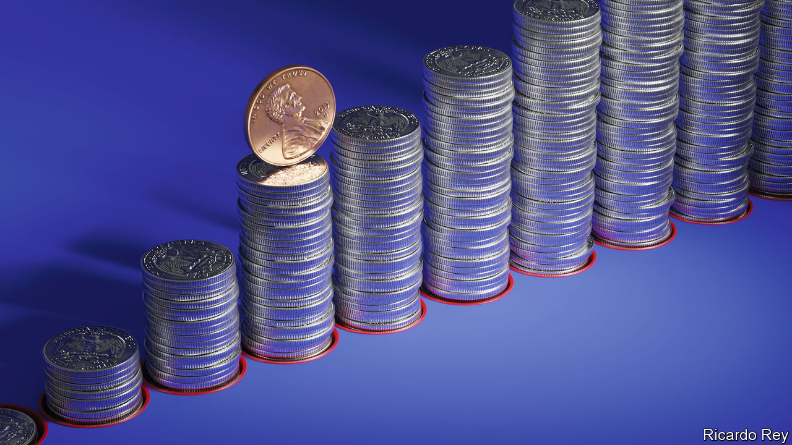
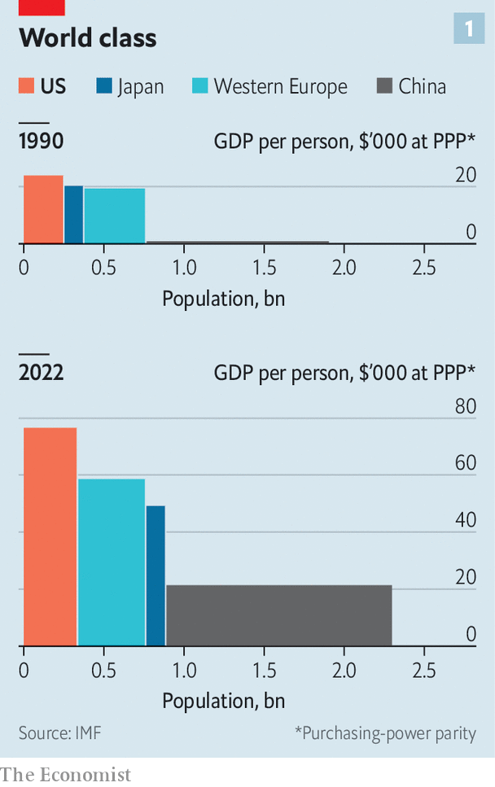
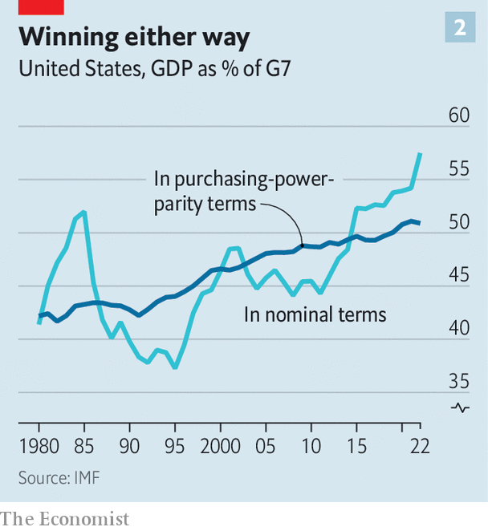
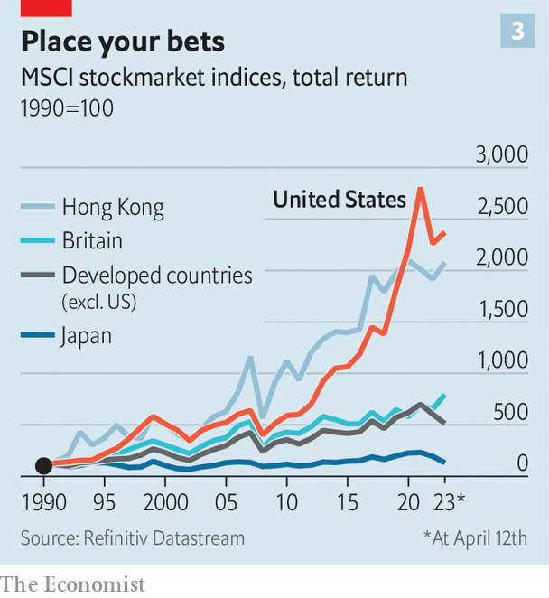
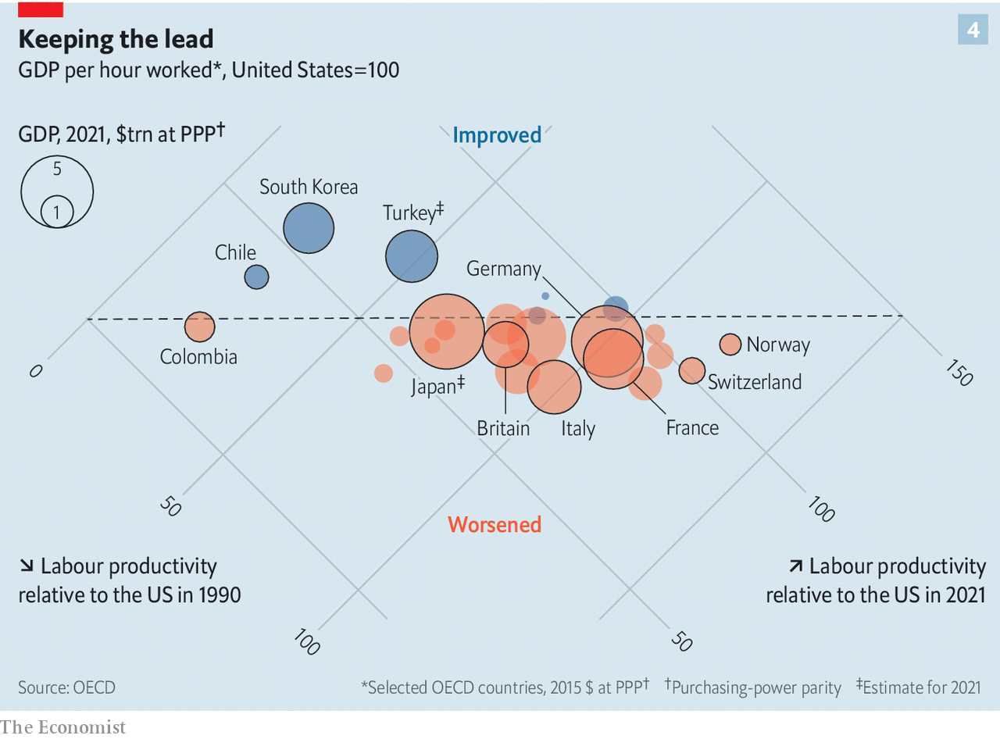

###### From strength to strength

# America’s economic outperformance is a marvel to behold 

##### But the country could still undercut its own success 

 

> Apr 13th 2023 

American economic declinism is a broad church. Voices on the right claim that big government has stifled the frontier spirit and that soaring debt has condemned future generations to poverty. The left worries that inequality and corporate power have hollowed out the economy. In a rare display of unity, all parts of the ideological spectrum bemoan the death of  and the crushing of the middle class.

There is just one snag. On a whole range of measures  remains striking. And relative to its rich-world peers its lead is increasing.

 


It is true that, by one measure, America is no longer the largest economy in the world. Using currency conversions based on purchasing power—that is, on what individuals can buy in their own country—y has been larger than America’s since 2016. Today China represents 18% of the world economy calculated in terms of purchasing power and America just 16%, whereas in 1990 the shares were 4% and 22% (see chart 1). 

But though purchasing-power parity (PPP) is the right metric for comparing people’s well-being in different economies, in terms of what those economies can achieve on the world stage it is exchange rates set by markets that count. And looked at this way, American pre-eminence is clear. America’s $25.5trn in GDP last year represented 25% of the world’s total—almost the same share as it had in 1990. On that measure China’s share is now 18%. 

 


More astonishing, and less appreciated, than its ability to hold its place in the world as a whole is the extent to which America has extended its dominance over its developed peers. In 1990 America accounted for 40% of the nominal GDP of the G7, a group of the world’s seven biggest advanced economies, including Japan and Germany. Today it accounts for 58%. In PPP terms the increase was smaller, but still significant: from 43% of the G7‘s GDP in 1990 to 51% now (see chart 2). So much for a declining power.

America’s outperformance has translated into wealth for its people. in America was 24% higher than in western Europe in 1990 in PPP terms; today it is about 30% higher. It was 17% higher than in Japan in 1990; today it is 54% higher. In PPP terms the only countries with higher per-person income figures are small petrostates like Qatar and financial hubs such as Luxembourg. A lot of that income growth was at the top end of the scale; the ultra rich have indeed done ultra well. But most other Americans have done pretty well, too. Median wages have grown almost as much as mean wages. A trucker in Oklahoma can earn more than a doctor in Portugal. The consumption gap is even starker. Britons, some of Europe’s best-off inhabitants, spent 80% as much as Americans in 1990. By 2021 that was down to 69%. 

Money is obviously not everything. It is often argued (and not just in Europe) that Europeans make a trade off between extra pay and a nicer way of life. Instead of clogged roads and overstuffed wardrobes, they have longer holidays and generous maternity leave. What is more, they devote a lot less of their income to health care. 

At a personal level such trade-offs may make perfect sense: there is much else to life besides income and shopping. But they are hardly new. Can the long-standing cultural difference on which they are based really account for a gap that continues to grow today? What’s more, America has been devoting a little more of its national treasure to helping its people. America’s social spending was just 14% of GDP in 1990 but had risen to 18% by the end of 2019, thanks in part to more medical insurance for its poor and elderly. That hardly makes it Sweden, which has spent a quarter of its GDP on social programmes for decades. But the gap is narrowing, not widening.

Fortunate sons

Americans are getting richer because they are getting more productive more quickly than workers in other rich countries. That advantage comes with real costs. America’s economy permits extreme volatility in individual livelihoods. Unemployment soars during downturns. Vast numbers end up chucked to the side: a combination of drugs, gun violence and dangerous driving has led to a shocking decline in average life expectancy in America. This suffering is concentrated among the country’s poorest, most marginalised communities. Money could mitigate most of these problems, and outperforming America has money aplenty. But this is not what it is spent on.

 


The fact that America has problems hardly sets it apart. All economies do. The striking thing about America’s is that they have not noticeably slowed down its growth. Investors are gratefully aware of this. A hundred dollars invested in the S&amp;P 500, a stock index of America’s biggest companies, in 1990 would have grown to be worth about $2,300 today. By contrast, if someone had invested the same amount at the same time in an index of the biggest rich-world stocks which excluded American equities they would now have just about $510 (see chart 3). 

Past performance is, of course, no predictor of future returns. Since America became the world’s largest economy in the 1890s its lead has waxed and waned. But three decades in, its current period of outperformance has gone on long enough to merit a closer look.

There are two things that matter to an economy in the long term: the size of its workforce and the productivity thereof. A higher fertility rate and a more open immigration system have long given America a demographic advantage over most other wealthy countries, and that continues. America’s working-age population—those between 25 and 64—rose from 127m in 1990 to 175m in 2022, an increase of 38%. Contrast that with western Europe, where the working-age population rose just 9% during that period, from 94m to 102m.

That said, a higher proportion of those Europeans actually work. America’s labour-force participation rate has been , largely because of men dropping out of the workforce. But this American oddity is not large enough to make up for the country’s advantage in raw numbers. Even with lower participation, the past three decades have seen America’s labour force grow by 30%. In Europe the number is 13%, in Japan, just 7%. 

And this growing workforce is also becoming more productive. The Conference Board, a think-tank backed by American business, has found that between 1990 and 2022 American labour productivity (what workers produce in an hour) increased by 67%, compared with 55% in Europe and 51% in Japan. Add on to that the fact that Americans work a lot. An American worker puts in on average 1,800 hours per year (a 36-hour work week with four weeks of holiday), roughly 200 hours more than in Europe, though 500 less than in China.

Some of America’s productivity growth comes from more investment. But total factor productivity (TFP), which strips out those effects in an attempt to show increases in efficiency and the adoption of new technology, has also increased. According to the Penn World Tables, a database for cross-country comparisons, TFP in America increased by about 20% between 1990 and 2019. The G7 as a whole averaged less than half that. 

How to account for this higher productivity? For starters it is useful to identify where America is at its most productive. In 2019 Robert Gordon of Northwestern University, the dean of growth studies in America, and Hassan Sayed of Princeton divided the economy into 27 different industries to pinpoint the stars. They found them in the flourishing information and communications technology industry, and saw that they shone brightest from the mid-1990s to the mid-2000s. But the rapid growth of the bit of the economy making and connecting computers was only part of the story. The rest of the economy busied itself in using the new technology productively. Productivity growth of American businesses doubled to more than 3% annually during that magical decade, whereas their European counterparts managed less than 2%. Since then American productivity growth has fallen back towards its long-run average of about 1.5%. But it is still faster than in most other rich countries, and still driven by the technology sector. 

The roots of America’s success as a technological innovator go deep; Silicon Valley was generations in the building. The reason why its wares were put to such productive use, though, are more easily seen, and still apply today. Simply put, they are skills, size and spunk. 

Big wheel keeps on turning

First, American workers are, on average, highly skilled. This might seem jarring given conventional wisdom, not least in America, about the failures of its schools. But America spends roughly 37% more per pupil on education than the average member of the OECD, a club of mostly rich countries. When it comes to post-secondary students it spends twice the average. 

There are good reasons to question the efficiency of some of this spending: test results in science and maths for 15-year-olds could be better. But good—often privileged—students thrive. As a share of its working-age population, roughly 34% of Americans have completed tertiary education, according to data compiled by Robert Barro and Jong-Wha Lee of Harvard and Korea University. Only Singapore has a higher rate. The Penn World Table’s human-capital index, which is based on years of schooling, currently has South Korea in the lead; but America has, on average, been first among major economies since 1990. 

America is home to 11 of the world’s 15 top-ranked universities in the most recent  table. Along with educating many of the brightest Americans, they have long served as conduits which deliver the world’s smartest young people to the country. Some of them go on to join the 200,000 foreign students who enter the labour force through the “optional practical training” programme every year—a figure which stayed high even under Donald Trump.

 


America’s economy makes good use of its highly educated workforce. Spending on research and development across the public and private sectors—a useful, though not infallible, token of future growth—has risen over the past decade to 3.5% of GDP, well ahead of most other countries. Evidence of America’s innovative prowess is furnished by the number of its patents in force abroad, an indicator of international recognition: America’s share of such patents globally increased from 19% in 2004 (the first year for which data is available) to 22% in 2021, more than any other country.

A second set of explanations is tied to America’s size. A large single market always gives a country a leg-up; the rewards to scale seen in technology have amplified this effect in America. Europe has tried to craft a unified market, but linguistic, administrative and cultural differences still pose barriers to businesses such as e-commerce platforms. As India is not yet rich enough for its size to offer benefits on such a scale, China is the only country that can truly rival America in this regard. That helps to explain the vibrancy of its consumer-tech sector—at least until Xi Jinping got his fingers on it.

Size has other advantages. Covering almost 40% of the world’s third-largest continent means the United States has access to a wide variety of geological riches—some of which it has become newly adept at winkling out. In the first decade of the 2000s America imported more than 10m barrels of oil per day in net terms. But around the same time, a revolution was under way as energy firms perfected the techniques of hydraulic fracturing and horizontal drilling to release the mineral riches in shale formations that dot the country from North Dakota to Texas. Gas and oil production soared; America now meets most of its energy needs from domestic production. In 2020 it became a net exporter of oil.

Come on the rising wind

That has both expanded the economy and diversified it, adding new resilience. And because the boom in gas came at the expense of coal, it has reduced greenhouse-gas emissions. Despite having had little federal climate policy worth speaking of until recently, America’s industrial carbon-dioxide emissions are 18% below their mid-2000s peak. Now that America is deliberately turning its attention to other resources which its size provides in abundance—such as sunshine and windy plains and coasts—it should accelerate that trend. 

What makes American skills and size that much more potent is the third element in the mix: dynamism. This is often the attribute mentioned first by people trying to explain America’s success. It is also the one where definitions are sketchiest. But there are some clear correlates. 

One is mobility. The ability and willingness of Americans to get up and go when opportunity calls is not what it was; but it is still impressive in international terms. In 2013 a Gallup survey found that about one in four adult Americans had moved from one city or area within the country to another over the past five years, compared with one in ten in other developed countries. About 5m move between states each year. William Frey, a demographer at the Brookings Institution, finds that the most educated are over-represented among these interstate movers, heading presumably to the most productive jobs. 

America also has far and away the world’s deepest and most liquid financial markets, providing efficient, if occasionally unstable, channels for financing businesses and sorting the winners from the losers. Stockmarket capitalisation runs to about 170% of GDP; in most other countries it comes in below 100%. Funding for potentially high-growth startups is particularly bountiful: about half of the world’s venture capital goes to firms in America.

The hunger for starting something new, though, predates the world of tech and extends far beyond it. And the aftermath of covid-induced confinement has fired the American drive for reinvention as never before: 5.4m new businesses started in 2021, an annual record and a 53% increase from 2019. Many will not make it, but the founders will not be hurt as badly as they would be elsewhere: an OECD measure of the personal cost of failure for entrepreneurs consistently puts America and Canada at the bottom. 

Odd as it may sound for a country that created both Mr Burns, the vulture capitalist of Springfield, and Dilbert, the quintessential office drone, the quality of corporate management is another source of dynamism. Since 2003 John Van Reenen of the LSE and Nicholas Bloom of Stanford have been attempting to provide analytical rigour to international comparisons of management by means of their World Management Survey. America sits at the top of their ranking. Fierce competition, the researchers believe, helps to explain America’s corporate culture. Bosses are more comfortable with firing employees (and more easily able to: America has much weaker employee-protection law than other large economies). Markets are readier to reward companies for evidence that they are well run. America’s managerial strength, their survey finds, explains as much as half of the productivity lead that it has over other developed countries.

It can be hard to square America’s incredible wealth with its failings in other areas. Even after taxes and transfers it has the most unequal income distribution in the G7. The earnings gap between rich and poor, which grew in the 1990s and early 2000s, was stabilised by a tight labour market over the better part of a decade. Recent pay bumps for low-wage earners have seen them starting to catch up with the middle tier, but the gap between top- and middle-income workers has persisted. 

Run through the jungle

Even more jarring is its harshness of life: on average Americans born today can expect to live to 77, about five years shorter than their peers in other countries at similar levels of development. For the poor, with less access to medical care and more violence around them, the deficit is particularly obvious. A certain sort of Pangloss might argue that the harshness, distasteful as it is, is part of America’s recipe, impelling people to strive to get ahead. 

Another interpretation is that the country lacks neither the wealth nor wisdom to make people’s lives much better, but chooses not to—and pays little by way of an economic price for that choice. “Economics is not a morality play,” says Adam Posen of the Peterson Institute for International Economics, a think-tank. “It would be nice if we could design policies that solve inequality and promote growth at the same time, but regrettably there are only a few policies that do both. Cruelty does not prevent an economy from growing.”

 


If cruelty doesn’t, what else might? What might see America’s decades of economic outperformance draw to a close? One possibility would be for its rich-world peers to do more to catch up. Europe has failed to produce giant tech firms like America but its robust anti-monopoly rules have fostered a more competitive market, especially for consumers, which might yet bear fruit. Japan has struggled to shake up its sluggish economic model, but it is not done trying yet. China is intent on sustaining rapid growth, despite evident structural challenges. Meanwhile, India’s rise will surely tilt the world’s economy ever more towards the Pacific.

But there are also ways for America to undercut its own success. Take . Though America’s working-age population has grown more than Europe’s over the past 30 years the fertility rate has now drifted close to European levels. With lower fertility, America needs higher immigration to maintain its demographic advantage. But a rising current of nativism pushes against this. President Donald Trump tried, unsuccessfully, to pick apart America’s visa programmes for welcoming in high-skilled foreign workers and began building a wall to block lower-skilled arrivals. Even if he fails to win election again in 2024, he has set the tone for more suspicion of and hostility towards migrants. President Joe Biden has kept many of Mr Trump’s border policies in place. Border authorities have expelled at least 2m illegal migrants on his watch.

The ugly turn in America’s politics also threatens other pillars of success.  are starting to endanger the country’s vast unified market, forcing companies to face new choices. Texas, for instance, has banned financial firms from doing business with the state if it deems them unfriendly to the oil industry. Ron DeSantis, Florida’s governor and a likely candidate for the Republican presidential nomination, has used his office to try and humble Disney in response to the company’s “woke agenda”. California is attacking from the opposite end, with a new law that could force oil firms to cap their profits.

The potential for a greater act of political self-sabotage also looms uncomfortably large on the horizon. In the next few months a protracted stand-off between Democrats and Republicans may render Congress unable to lift the federal government’s debt ceiling, which would trigger a sovereign default. That would shake the faith of investors in American markets. It also may make funding costs for the government permanently higher, a big risk given the steep rise in public debt during the covid pandemic.

Is the end coming soon?

On trade policy, one area where politicians from both sides of the aisle do see eye-to-eye, the consensus is deeply worrying. Its embrace of globalisation was a crucial background condition for America’s long run of strong growth, as a rising trade-to-GDP ratio in the 1990s and 2000s makes clear. Foreign competition pushed American companies to make their operations more efficient; opportunities abroad gave them a bigger canvas for growth. 

Now, though,  is a dirty word in Washington, DC. A focus on national security and industrial policy has taken over. Take semiconductors: although America long ago lost its mantle as a major manufacturer, it is home to firms, such as Qualcomm and Nvidia, that design the world’s most sophisticated chips. That has worked well for America, letting it capture the highest-value segments of the global semiconductor industry.

But it is no longer enough. The government has started to throw billions of dollars at bringing chipmakers to America—in effect trying to hoover up lower-value parts of the industry in the name of supply-chain security. And it is trying to do much the same for electric vehicles, wind turbines, hydrogen production and more, potentially spending $2trn, or nearly 10% of GDP, to reshape the economy. These are aggressive interventions that run counter to America’s post-1980s stance; they may end up costing it productivity as well as money.

The overarching irony is that most of these potentially self-harming policies have their roots in a declinist view that, economically at least, simply does not reflect the facts. The diagnoses are that China is getting ahead, or that immigrants are a menace, that large corporations are bastions of woke power and free trade a form of treachery. Their folly is all the more striking because it betrays a lack of appreciation for the bigger economic picture, and just how good America has it. ■


