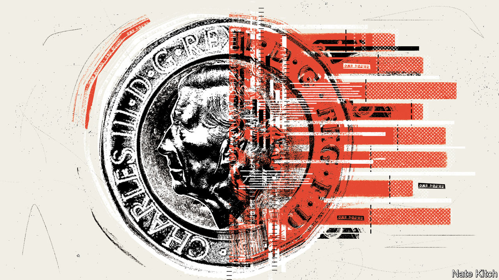
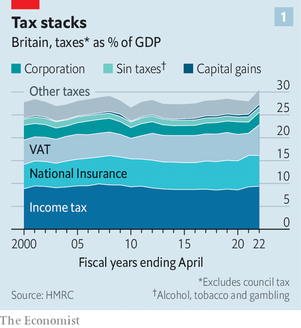

###### Tax brakes

# Britain’s tax take is getting bigger but not better 

##### From VAT to income tax, distortions and complications proliferate 

 

> Apr 11th 2023 

The 2022-23 tax year ended on April 5th. The dates are the simplest aspect of the British tax system. People in England, Wales and Northern Ireland pay a basic rate of income tax of 20% on annual earnings over £12,570 ($15,612); Scotland has its own rates. Britons must also pay national-insurance contributions (NICs) of 12% of weekly earnings over £242, unless they are over the pension age or self-employed. 

Recent university graduates with student debt must pay an additional 9% on anything they earn over £27,295. A 40% income-tax rate kicks in at slightly over £50,000, which is when parents also begin to be taxed on a welfare payment known as child benefit. The result can be a 60% marginal tax rate for those with two children and a 70% rate for those with three. For every £1 earned above £100,000, you lose 50p of the £12,570 tax-free allowance; the allowance falls to zero if your income is £125,140 or more. That means at least a 60% marginal tax rate for high-earning taxpayers—rising to over 100% for parents who start losing tax-free child-care benefits as well. And so it goes on—and on, and on.

No country has a perfect tax system. The deficiencies in Britain’s, however, are becoming more obvious. Partly that is because the state is taking more out of citizens’ pockets. The Office for Budget Responsibility (OBR), a fiscal watchdog, forecasts that from 2025 the government will rake in about 35% of gdp in tax, the second-highest level since the aftermath of the second world war.

But the principal problem is a profusion of exemptions that distort the economy, confuse taxpayers and deprive the exchequer of revenue. The goal of tax policy should be to raise funds efficiently and fairly. Tax should, as far as possible, encourage productive activities but discourage harmful ones, such as pollution. Fairness not only means ensuring the overall system is progressive, so that those with the greatest resources contribute more, but also that people in similar circumstances are treated equally.

 


Britain’s tax system is flawed on all these counts. Start with the three main taxes: income tax, nics and value-added tax (vat). Together these three levies account for about half a trillion pounds of government revenue per year, two-thirds of the total tax take (see chart 1). They are infested with complications. Income tax and NICs both apply to salaries, but a portion of NICs is also paid by employers. The self-employed pay NICs at different rates. Those over the state pension age do not pay NICs. Income tax is levied on investment income; NICs are not.

Such differences incentivise chicanery. The self-employed pay less in national insurance; so do those who set themselves up as a “company” and take their salary as a dividend, which counts as investment income. Businesses can collude with their staff to pretend they are not really staff at all, lowering the tax bill for both. That rewards those who tinker with employment structures instead of doing something more productive. The solution to such problems is simple: fold the two taxes together into one streamlined income tax. The benefits would be substantial. An analysis by the OBR found that a change in the rules in 2021, forcing firms to check whether their contractors were genuine businesses, had raised £1.5bn for the exchequer. 

Value-added tax, which accounts for £140bn in revenue (around 5% of GDP), is similarly full of holes. The tax is levied at a 20% rate on most final purchases by consumers. But a range of goods, from food to domestic air travel, are zero-rated; others, such as domestic energy, attract a rate of only 5%. Companies with a turnover of less than £85,000 a year do not have to register for VAT at all. Such exemptions are forecast to cost the exchequer £67bn in the 2022-23 tax year, about half the total actually raised through VAT.

These exemptions reflect a variety of well-meaning motives. Excluding goods that are more likely to be bought by the poor is designed to ensure that VAT is progressive. The exemption for smaller companies, meanwhile, is meant to spare them from the administrative burden of registering for the tax. 

Both rationales are misguided. Although the overall tax system should be progressive, not every individual tax needs to be. And the VAT exemptions for food and the like are poorly targeted. Exempting children’s clothes from the tax, for instance, is more beneficial for the rich, who might be buying designer brands, than for those who rely on hand-me-downs. A more efficient way of redistributing funds would be to scrap the exemptions and use the extra funds to raise the level of benefits, which do target the poor. 

 


In principle, the exemption for smaller firms makes sense; VAT returns are indeed burdensome. But the threshold incentivises companies to stay below a certain size. They are duly piling up at the £85,000 mark (see chart 2), which has been frozen in cash terms since 2018. By the time the freeze ends in the 2025-26 tax year the OBR expects the number of firms remaining just below the threshold to have nearly doubled, from 23,000 in 2018-19 to 44,000.

This is not only bad for the public purse, which misses out on VAT receipts payable by larger firms, but for the economy as a whole, since bigger businesses tend to be more productive. A lower threshold would make staying small a less viable option. It would also move Britain more into line with the European norm—German companies only need revenues of €22,000 ($24,050), for instance, to start paying VAT.

The same sorts of problems stalk other taxes. Britain has some of the highest taxes on property of any country in the OECD, a club of rich economies: it raises 3.8% of national income in this way. That sounds sensible on the face of it: property cannot be shifted offshore and owners often gain a windfall through no effort, just by being located in rich areas. Taxing such gains would be justified on grounds of both efficiency and fairness. 

Unfortunately, Britain’s property taxes are poorly designed. They include stamp duty, a tax on the sale value of a property that is payable by the buyer, and council tax, which is levied on the resident but is based on the valuation of the property in 1991 (when it hastily replaced the poll tax). 

Stamp duty distorts the housing market. As it is only levied when a property is sold, the tax discourages moving house, and therefore a sorting of people into places where they can be more productive. Council tax, meanwhile, is regressive and arbitrary: present-day valuations have only a loose connection to those of over 30 years ago. That favours owners of property in London, where prices have risen faster, at the expense of the rest of the country. A land-value tax, based on up-to-date valuations, would be fairer and more efficient, encouraging landowners to put the space to its best use. 

The Treasury deserves a lot of the blame for this situation. Britain’s finance ministry is extremely powerful, combining as it does the functions of economic planning, tax collection and budgetary management. Its control over the purse strings gives it a veto, in effect, over how other departments spend their money. But the Treasury itself sits outside the normal policymaking process. Annual set-piece budgets, highly theatrical affairs in which the chancellor of the exchequer announces all changes to fiscal policy, are prepared in secret and without consultation. Many newspapers judge the budget by whether the chancellor manages to pull a “rabbit out of a hat” and deliver a popular surprise. 

This arrangement encourages year-to-year tweaking and gimmicks rather than coherent strategy. It has led to a proliferation of tax reliefs over time, since cutting the tax on some categories of spending allows the chancellor to announce something popular at the budget. Any transport minister proposing subsidising domestic passenger flights, say, would get short shrift from the Treasury; an equivalent VAT exemption gets no such scrutiny. 


One solution is to get rid of the theatrics. If taxes need to be changed, there is no reason to wait for a piece of parliamentary drama. And if they do not need tweaking, then no budget speech means one less opportunity to fiddle. Taxes should also be indexed to inflation, so chancellors would not need to get MPs’ backing to keep fuel taxes, say, the same in real terms. A failure to uprate petrol duty for over a decade has cost the Treasury a cumulative £80bn. 

Other countries involve relevant departments as well as the finance ministry when making fiscal plans. In Britain collective cabinet agreement with the budget package is assumed rather than earned through negotiation. One adviser says that Tony Blair, a former prime minister, begged Gordon Brown, his chancellor, for a “hint” of what was in the 1998 budget. 

Making tax policy in the open would mean lots of lobbying, but getting people on board before announcements are made is better than U-turning under pressure. An attempt by George Osborne, a former chancellor, to get rid of a VAT exemption for hot takeaway food in the budget of 2012, raising the paltry sum of £110m, was immediately dubbed the “pasty tax” by the press and quickly rescinded. Kwasi Kwarteng’s mini-budget in September was a far more dramatic illustration of how budget surprises can lead to disastrous outcomes.

Making changes to the tax system can be politically difficult. The losses from eliminating exemptions would be concentrated on just a handful of groups; the benefits of simplification and efficiency would be diffuse. But as the tax take gets ever bigger and more confusing, and Britain’s productivity problems show no sign of easing, these benefits matter more. Any serious effort to reform the state would change both the way Britons are taxed and the process by which those taxes are set. ■


