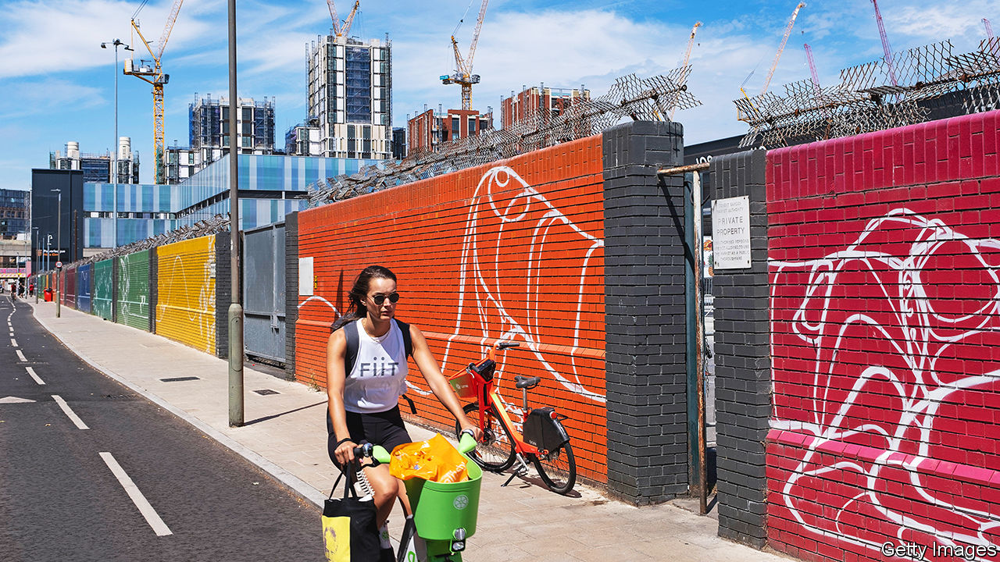
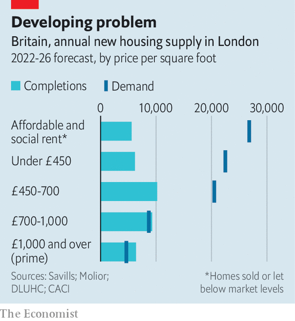

###### Vertical limits

# Can high-rise buildings solve London’s housing problems? 

##### Costs, commuting and culture suggest not 

 

> Apr 12th 2023 

Britain badly needs more homes. In the past two decades its population has grown by nearly 8m; another 2m people will be added by 2030. Many will be drawn to cities, the engine-rooms of the economy. Yet the supply of new housing is not keeping up. London alone needs an estimated 83,000 new homes each year, according to Savills, an estate agent, but is building only half that. The biggest shortfall is at the cheaper end of the housing market—anything costing less than £450 ($560) per square foot, or £4,840 per square metre, to buy. This segment accounts for nearly three-fifths of demand but less than a third of forecast supply in London (see chart).

 


Strict planning rules, which protect the green belt around cities, are effective at stopping urban sprawl. Too effective: just 6% of the land in Britain has been built on. The Countryside Charity claims there are enough vacant or derelict brownfield sites in London to build nearly 400,000 homes there. But brownfield sites can be unappealing places to live and often require costly clean-ups. For cities looking to accommodate more homes on less land, there is another way: up. 

Residential skyscrapers are the norm in cities such as New York and Seoul, which squeeze almost the same number of people as London onto less than half the land mass. Britain’s other cities are not that dense, either. Places such as Manchester, Bristol or Sheffield rank below a number of European cities of similar size, according to Centre for Cities, a think-tank. 

Density offers many benefits. Packing people into tall buildings uses space more efficiently, leading to shorter commutes and lower carbon footprints. More than a third of Londoners commute to work by car, compared with only 7% of Hong Kongers. Denser cities are more productive, too: some economists reckon that density can explain more than half of the variation in output per worker in American cities. That means higher pay for skilled workers. 

Even so, the chances that building skyward will solve London’s housing problems, or those of other British cities, are slim. One reason for that is the economics of high-rise construction sit uncomfortably with demand for affordable housing. Tall buildings do not come cheap. The value of land in England has risen by more than a third over the past ten years, according to Knight Frank, another estate agent; the cost of building materials across Britain jumped by a similar amount between 2019 and 2022 alone. Lifts are expensive. 

Maintenance costs also add up. Demolishing a tower block is often cheaper than refurbishing it if something goes wrong. This is a particular risk in London, a city almost entirely built on clay, which leaves structures more prone to cracking and damage. Soaring cities like Manhattan and Hong Kong are built on more solid ground, according to Yolande Barnes of University College London. Unforeseen costs can hit. In the wake of the Grenfell Tower tragedy, a blaze that killed 72 people in 2017, developers face repair bills to fix dangerous cladding and calls for second staircases to be included in all new residential buildings over 30 metres tall. 

Affordable housing quotas also weigh on developers’ profits. In 2021 London’s mayor, Sadiq Khan, unveiled targets calling for 50% affordable housing on all new sites, higher than the 35% threshold set in 2016. Greater numbers of residential sites are being turned over to commercial uses (such as warehouses) as a result, says Emily Williams of Savills, or are concentrated in areas with higher property values such as Canary Wharf. 

Where high-rise projects succeed, they often do so by sidestepping affordability targets in favour of cash handouts to local communities or promises to build cheap homes elsewhere. Nearly 200 new towers have been built in London over the past decade but many of them have been filled with luxury flats, and boast gyms, private cinemas and rooftop lounges. Buyers are often investors; apartments are frequently left empty. In Tower Hamlets, in the east of the city, high-rise development has contributed to more housing being built than in almost any other borough in the capital since 2015. But more than 6,100 homes in the area—around 4% of the total—are classed as second homes. 

Infrastructure is a second obstacle to building up. Making the case for ambitious new towers is a lot easier when public transport puts residents within easy reach of offices, shops and other amenities. The Elizabeth Line, a new train route in London, is expected to unlock 180,000 new homes along its path by 2026; the extension of the Northern Line on the London Underground acted as a catalyst for the development of Nine Elms, a cluster of towers in south London. Sketchier transport links impede large-scale development in outer London boroughs such as Bromley, which is set to build among the fewest new homes in the capital over the coming years. The challenge is greater still in cities beyond London, where transport networks are less well developed. 

Britain’s planning system throws up another set of hurdles. New schemes in London must adhere to stringent restrictions on height and must not obstruct certain views of landmarks such as St Paul’s Cathedral. There is often resistance to high-rise developments from local residents: planning applications for new schemes have been dismissed for being too bulky, too strange or just plain ugly. 

The good news is that high-rise buildings are not the only, or even the best, way to achieve greater density, because very tall buildings normally require lots of space around them. Hong Kong’s unique density comes from fitting lots of tall towers onto narrow streets, which puts enormous strain on the city’s transport networks, sewers and energy grids, and also sends buildings’ carbon emissions spiralling. 

Elsewhere, smaller developments in closer proximity can achieve comparable density on the same amount of land and at a lower cost to the environment. Maida Vale, an affluent part of London, is the densest square kilometre in Britain because of its mid-rise mansion blocks, typically between five and ten storeys high. Centre for Cities estimates that if just 5% of London were able to match Maida Vale’s density levels, the capital could accommodate an additional 1.2m people.

Yet even mid-rise blocks have to overcome perhaps the biggest barrier of all: Britons’ cultural dislike of flats. Research from YouGov, a pollster, shows that Britons are much more opposed to moving into tower blocks than the citizens of other countries. Around half are against living in apartment blocks only three or four storeys high, whereas their peers in countries such as Sweden and Spain are mostly in favour. Although 53% of Britons support the idea of building more housing, that proportion drops to 25% if it means either smaller homes or taller buildings. 

A lack of privacy and a presumed unsuitability for children help explain this aversion. So does the history of high-rise living in British cities, which was kick-started by the need to provide lots of council housing quickly after the war. Crime waves and maintenance problems gave the tower blocks of the 1960s and 1970s an image problem; several have since been bulldozed. More recently the pandemic has not helped: weary of commuting and liberated by the rise of hybrid working, plenty of Londoners have traded flats and maisonettes for larger properties further out with gardens and home offices. 

It is not all gloom. The pandemic is prompting the conversion of some underused offices into residential property. At least 109 new tall buildings are in the works in London. But that barely dents the capital’s housing shortage. And across Britain new high-rise construction is down by 15% on the five-year average; planning applications have fallen for a third straight year. Lots more have to get off the ground. ■


