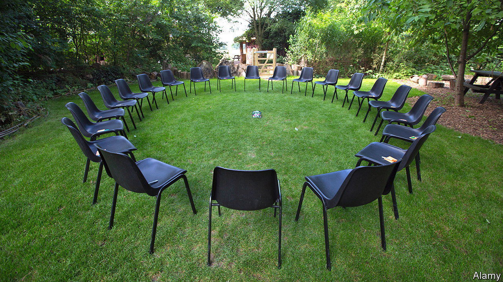

###### Talk talk

# Private therapy in Britain is booming and largely unregulated 

##### Would tighter rules make sense? 

 

> Apr 13th 2023 

IF A QUACK sets up shop in Britain, calls himself a doctor of medicine and is reported, he is likely to end up regretting it. “Doctor”, along with other professional health titles from “art therapist” to “hearing-aid dispenser”, is protected in law. Pretenders face unlimited fines. Yet “therapist” (including the “psycho-” sort) is not. Anyone can do a weekend counselling course—or not bother with one at all—and take paying patients.

Regulating this field is difficult since therapy covers so many practices, from crystal healing to psychoanalysis. But calls for the government to try are growing, because private therapy is booming. It is tricky to quantify the size of the market but two things indicate speedy growth. 

One is the long queue for treatment on the National Health Service (NHS). Mind, a charity, says 1.6m people are on waiting lists for mental-health treatment (and 8m with lesser problems would benefit from treatment). Many who can afford it instead go private. Glenys Parry, a clinical psychologist and psychotherapist and an emeritus professor at the University of Sheffield, says it is likely that “more people with significant depression, anxiety and distress in personal relationships are now seeking private therapists”.

Another sign is growing demand for therapy for personal development—to help people become happier or more successful—which is wholly met by private supply. More companies are offering access to therapists as a perk to employees. The jargon of therapy (“boundaries”, “triggers”, “trauma”) has entered everyday language. The increased use of online meeting platforms during the pandemic made talking therapies more accessible.

Many private therapists are registered with respected bodies like the British Association for Counselling and Psychotherapy, which has training requirements for its members and a complaints procedure. But the onus to check that a therapist is on such a list is on the patient—who may be too upset or trusting to think of it. The lack of regulation anyway limits the protection such associations can provide. If someone is ejected from a register, there is nothing to stop them continuing to practise and rake it in.

Helen Ritzema, a child and adolescent psychotherapist, says it is difficult even for some professionals to decipher what training someone has had. She is concerned that some schools and NHS trusts have employed therapists to work with children though they have been trained only for adults. There is a danger this may lead them to misinterpret children’s behaviours, confusing them with those of adults with personality disorders. 

What might regulation entail? There is a limit to how many hoops, if any, a lifestyle therapist should have to jump through. But Dr Ritzema believes the titles “psychotherapist” and “child psychotherapist” should be protected in law (as titles used by psychologists, including “clinical” and “educational”, already are). The Netherlands, Sweden and Switzerland insist on six years of training before someone can call themselves a psychotherapist. The title is also protected in Finland and France. 

Tighter regulation would not guarantee better outcomes, however. Some forms of treatment do not work for everyone. Miguel Farias, a psychologist at Coventry University who has researched the adverse effects of mindfulness meditation, says about 8% of those who undergo it end up in worse mental shape. He describes mindfulness groups (one of the practices that are provided by the NHS) as being like “a mental-health assembly line”. People with mental-health issues often need one-to-one care, he says.

Bad experiences can also stem from simple mismatches between therapist and patient. A business owner describes going for therapy after a startup failed. The therapist was recommended by a friend. “I was in a terrible, anxious state, with insomnia and panic attacks that were getting worse,” he says. “I described all this to the therapist, who said: ‘Tell me about your relationship with your father.’ I told her it was great, thanks, and never went back.”■


