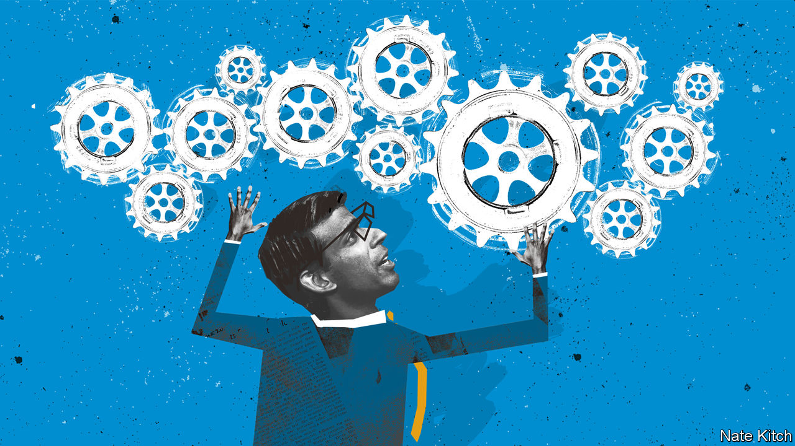

###### Bagehot

# Rishi Sunak, a very Tory kind of technocrat 

##### The prime minister’s problem-solving expertise is in service of political ends 

 

> Apr 13th 2023 

Think of it as the political equivalent of a flight to safety. Just as investors trade equities for government bonds when markets tank, so British voters have developed an appetite for technocracy after years of chaos. Bobby Duffy of King’s College London runs the British leg of the World Values Study, a global survey of public opinion. In the 2022 version some 61% of Britons said that “having experts, not government, make decisions” would be a good system, up by 20 points from 1999. A similar trajectory can be seen across the rich world but Britons’ liking for technocracy is the highest in the G7, and just below that of Moroccans and Nigerians. 

Hence the appeal of Rishi Sunak, Britain’s prime minister, whose personal polling is much better than that of the Conservative Party (and comparable to that of Sir Keir Starmer, the Labour leader). Asked to sum Mr Sunak up, officials cite a photograph of him buried in a folder of notes which was taken on the deck of a retired aircraft-carrier during a recent visit to San Diego. The message is clear: Mr Sunak is a workaholic and a problem-solver, undistracted from his homework even by the toys of the Pacific Fleet. Yet his is a strange form of wonkery. Mr Sunak offers technocracy but with Tory characteristics. 

His elevation to Downing Street was technocratic. After losing to Liz Truss in the Tory leadership election last summer, he was hurriedly drafted into the top job six weeks later after she had blown up the gilt market. Think of him as Mario Monti to her Silvio Berlusconi. “Mistakes were made,” he said of her time in office; his job was “to fix them”. His approach to government since then has resembled a turnaround programme for a failing enterprise. He has laid out specific targets and timetables—reducing inflation, bringing down health-service waiting lists and curbing small-boat migration. He has been quick to patch up international ties strained by Brexit.

He brings a technocrat’s discipline to Downing Street. Officials cite a remarkable work rate; his mantra is “to run as fast and as hard as we can”. Whereas Boris Johnson’s red box of papers was said often to sit outside his flat unread, Mr Sunak calls up reams of data and analysis from the civil service and interrogates the footnotes. “He’s much more into the cooking,” says one official of the policy process. His speeches are short on memorable lines; anthologies of political quotations will contain few Sunakisms. 

Such traits would appear unremarkable to any mid-level executive in a large firm; in the Conservative Party they mark him out as a marvel. David Edgerton, a historian, wrote that Brexit was one symptom of the Tories’ estrangement from modern British capitalism. Another is that the practices of high-performing businesses can seem so exotic. Mr Sunak, a graduate of Stanford University’s business school, is the first prime minister to attend university abroad since Lord North in the 18th century, and the first to hold an MBA. That he is regarded as a curiosity by his colleagues for using terms such as “Q1” and knowing how to operate a Bloomberg terminal says less about him and more about Westminster, a sleepy place of threadbare carpets and jam roly-poly with custard. 

But even if Mr Sunak stands out from the average politician, he is also not your typical technocrat. He made his political career by dissenting from the weight of expert opinion. As a young backbencher he backed Brexit not out of romance but as if it were an investment. “I wasn’t ideological about it…somewhat analytically I sat down and looked through the numbers,” he has said. As chancellor of the exchequer, he opposed a further covid-19 lockdown that was favoured by government scientists after reading a rival analysis on infection data prepared by J.P. Morgan, a bank. His methods may be wonkish but his conclusions have mirrored the instincts of less bookish Tory colleagues. 

Although Mr Sunak is styled as a “fixer”, his government shows an appetite for gimmicks. If Mr Sunak succeeds in curbing cross-channel migration, it will not be because of eye-catching plans to deport migrants to Rwanda or to house them on a barge. Neither will make a dent in the number of crossings this summer. His offensive against anti-social behaviour—higher fines for fly-tippers, making thugs pick litter in jumpsuits, banning laughing gas—is the political equivalent of the jazz standard. Just as there is a point in the evening when every bar pianist plays “Round Midnight”, so every British prime minister announces a crackdown on yobs.

Worst of all, in many areas Mr Sunak offers no fixes at all on the ground that they are politically off-limits. Relations between the prime minister and his regicidally inclined parliamentary party are unusually smooth. That is partly because Tory MPs have come to appreciate competence, but also because he has let them have their way on house building, online regulation and migration as the price of stability. It matters little how much data Mr Sunak orders up from the civil service if a dozen backbenchers end up being able to provide their own answers.

Political fixer 

Michael Gove, a long-serving cabinet minister, is remembered for claiming before the Brexit referendum in 2016 that Britons had “had enough of experts”. His supporters say their man was misquoted; Mr Gove had objected to “experts from organisations with acronyms saying that they know what is best and getting it consistently wrong”. This was not a denunciation of expertise per se, but a call to harness it and subordinate it to political control. 

This is the best way to understand Mr Sunak’s premiership. He is a man of technocratic habits, but those habits serve the political ends of holding power and taming a ruthless party. Tim Bale, the author of a new history of the contemporary Tory party, warns against seeing Mr Sunak as a centrist passenger in Mr Johnson’s wayward government. He was, Mr Bale notes, an active participant in that regime. Mr Sunak has many talents. His greatest may be how well he hides his ambition beneath a technocrat’s exterior. ■


