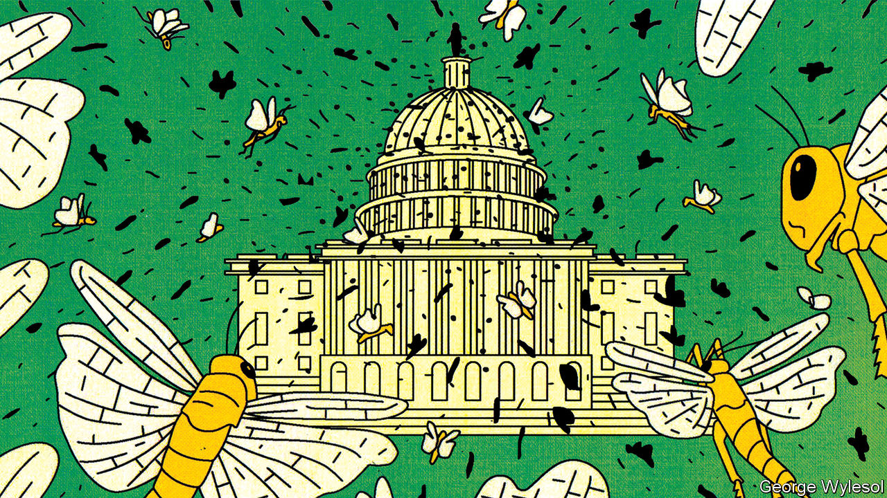
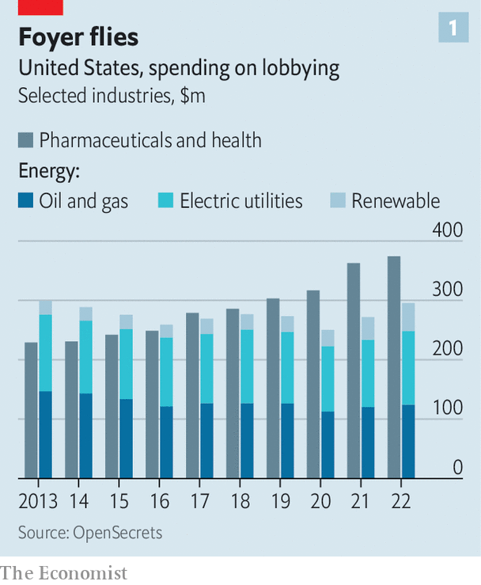
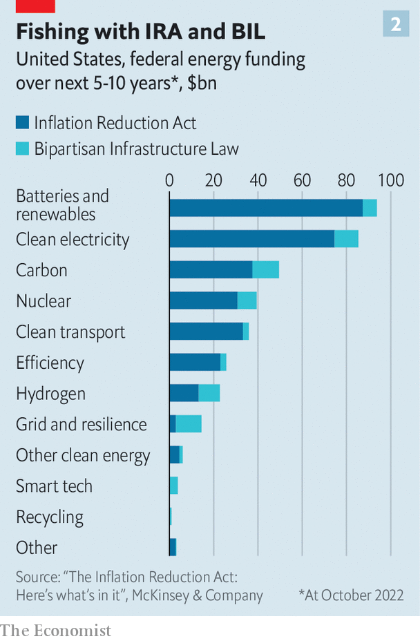

###### Welcome to the green swamp

# America’s $800bn climate splurge is feeding a new lobbying ecosystem 

##### A new breed of advisers is helping corporate supplicants get their share 

 

> Apr 10th 2023 

DAVID, WHO runs a well-trafficked shoe-shine stand at a huge convention centre just outside Washington, was in a good mood as he surveyed the delegates at a recent event there. They were attending the ARPA-E summit, an annual pow-wow put on by the Department of Energy (DoE), and were tipping well. A few weeks earlier, when Donald Trump spoke at that same venue at a gathering of conservative Republicans, David was forced to shut down his stand and lost business. It is not his only grumble about Mr Trump: “When he ran for office he promised to drain the swamp, but he turned out to be the biggest crocodile of them all.”

David is right. During Mr Trump’s presidency, lobbyists for every corporate interest went into high gear to try to influence the unorthodox administration of Beltway outsiders. Lots of unfamiliar swamp creatures turned up, too, when they realised that having the ear of the last person to speak to Mr Trump before he made a big decision was lobbying gold. They have since slithered away. But, with up to $800bn in clean-energy handouts now up for grabs over the coming decade, another invasive species is taking their place.

 


The energy industry as a whole spent nearly $300m last year on lobbying, the most since 2013 (see chart 1). Big oil and electric utilities, which had been reducing their spending on influence-seeking before 2020, have ; spending is growing in line with that of the biggest lobbyists, big pharma. Renewables firms went from spending an annual average of around $24m between 2013 and 2020, to $38m in 2021 and $47m in 2022. “We’ve now got an interesting new ecosystem of swamp creatures here,” says the government-relations man at a giant renewable-energy company.

 


The reason is the passage last year of the  (IRA). The law funnels at least $369bn in direct subsidies and tax credits to decarbonisation-related sectors (see chart 2). It came on the heels of the , which also shovels billions in subsidies towards clean infrastructure. Some of the provisions offer generous tax credits, with no caps on the amount of spending eligible for the incentives. A mad investment rush, should it materialise, could lead to public expenditure of $800bn over the next decade. An official at a big utility says her firm has projects in the works across America that, if successful, will secure a staggering $2bn in funding from the two laws. “We stopped counting…we just have a big smile on our faces all the time these days,” confesses the renewables firm’s government-relations man. “There is a lot there for a lot of people,” sums up a business-chamber grandee. And, he adds, “A lot of lobbyists are interested in the spending.” 

The green influence brokers can be spotted in all the usual places, starting with Capitol Hill. A long-time lobbyist-watcher reckons that the IRA “is the most targeted bill of the last 20 years”. More than 2,000 groups had officially declared their interest in the congressional sausage-making that produced the gargantuan law last year. The IRA and the infrastructure law are now on the statute books, of course. But buttering up congressmen and senators may still be worth the effort. “The administration still has to present budgets and members of Congress still have their say,” explains one senior DoE official turned adviser. And, adds a lobbyist for a rising climate-tech investment firm, “A member of Congress can always ask a question in a hearing or send a letter of complaint to the White House.”


The White House itself is another target. A partner at a top lobbying firm explains that for potentially lucrative but politically explosive issues, “people in the White House want to be looped in.” These include local-content requirements for electric-vehicle manufacturing and the maximum carbon intensity for hydrogen to be considered “clean”. On such matters, the partner says, John Podesta, President Joe Biden’s wrangler for all things climate and energy, “makes the final call”. Love Mr Podesta or hate him, says one energy operative not in the loving camp, “he has a reputation for being practical, and focused on getting things done.”

Two executive-branch agencies rank high on the green lobbyists’ hit list. The DoE’s experts will decide which sectors and technologies to prioritise; just its Loan Programmes Office, which aims to provide “debt financing for commercial deployment of large-scale energy projects”, now has $400bn to lend out, for example. Another target is the Treasury Department, and in particular the Internal Revenue Service (IRS), whose tax experts are fleshing out the rules for green tax credits.

The DoE is the more welcoming of the two. “Of course you can lobby the DoE,” says Brian McCormack, a former DoE chief of staff. “Companies go there all the time to talk about what they’re doing.” One challenge now, Mr McCormack says, is that many government employees are still not going into the office regularly. It is harder to make your case on the phone or via video conference, he reckons.

It is harder still at the IRS, which, the clean-tech-investment lobbyist says, “is immune to direct lobbying”. Getting through to the taxmen is possible but requires a more subtle approach. A law firm renowned for its tax expertise has secured a coveted meeting with officials on behalf of a client in part, says one of its partners, by submitting “really good comments” and clever technical papers on the relevant subject. Many IRS officials know their tax law inside and out but have little understanding of energy. “You have to have credibility for them to see you and you have to bring them solutions,” she explains.

For the lobbyists’ corporate clients, such considerations put a premium on certain sets of skills. One group in high demand is experts in finance and accounting, especially in niche areas such as tax-equity transactions (in which investors agree to fund a project in return for the right to claim a tax benefit) or the ins and outs of whether tax credits can be transferred or stacked on top of each other. One clean-energy lobbyist observes that the new climate-related laws are more complicated than anything in the past, yet the number of people working on them in industry and in government has not changed. “With so much more complexity,” he says, “it is worth paying for your service if you can parse through something in half an hour that takes someone else eight hours.” 

Another sought-after group is energy nerds. A long-time advocate of upgrading the power grid gleefully reports his sudden popularity, as electrifying industries struggle to work out how to get transmission lines and other power infrastructure built. Specialists in nascent technologies on which the new laws shower subsidies, such as carbon removal, which prevents emitted CO from entering the atmosphere or sucks it back once it is out, are also in demand. “We are Treasury whisperers,” boasts the top government-relations expert at a climate-tech fund. The fund’s bets on things like carbon capture and hydrogen electrolysis have given it deep expertise in these areas, which it is sharing with the tax bureaucrats. It is also sweet-talking environmentalists, whose “ignorant and aggressive positions early on” were often caused by unfamiliarity with either the new technologies or the tax code.

The billions of dollars going out through grants, meanwhile, has raised the stature of advisers with experience in writing grant applications. Many firms are baffled by having to pen 30-page proposals and working out things like who exactly counts as a “non-federal partner”. Some of the grants now on offer “can make or break a business model”, notes Mr McCormack. Take a company going after half a dozen DoE grants worth $10m apiece, he says. “Isn’t it worth $100,000 to get a professional to help you put together a proposal, identify which offices on Capitol Hill you should visit and get a strategy together?”

Ecological niche

Specialised consultancies are stepping in to provide corporate IRA supplicants all these newly prized skills in one place. Boundary Stone Partners, a prominent example of the trend, employs many former DoE officials. Like Mr McCormack, Boundary Stone’s co-founder, Brandon Hurlbut, served as DoE chief of staff. Jeff Navin, the other co-founder, says that the firm’s aim is to act as a translator between clean-energy policymakers, technologists and investors: “The three groups did not talk the same language.” Boundary Stone claims to have helped ease the passage of a demonstration programme for next-generation nuclear reactors (to the benefit of one of its clients, a nuclear-energy startup backed by Bill Gates called TerraPower) and to have assisted various solar-panel manufacturers in securing lucrative tax credits for domestic production.

How much influence the green lobbyists actually wield in Washington is open to debate. Their clients clearly think they are doing some good. More surprisingly, so do parts of officialdom. A lobbyist for an influential environmental group says that critical staff either fled government or were expelled during the Trump era, leaving agencies “struggling to get work done”. Against this backdrop, many bureaucrats see thoughtful lobbyists as helping “get things right”. Rich Powell, head of ClearPath, a climate-innovation advocacy group influential among Republicans, believes that they can help strike grand political bargains, of which the energy transition will need plenty. “Swamps may be the most vital ecosystem,” he says. ■


